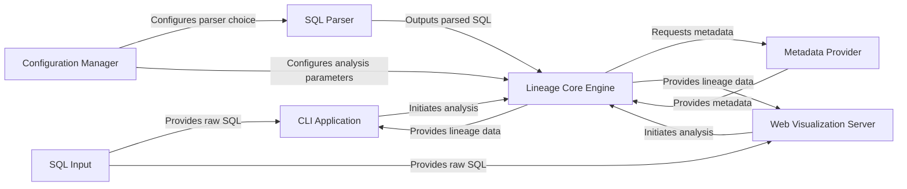

## Details

The `sqllineage` project is structured around a core lineage analysis engine, supported by configurable components for SQL parsing and metadata provision, and exposed through both a command-line interface and a web visualization server. The `SQL Input` component, representing the raw SQL query, is fed into the system primarily via the `CLI Application` or potentially the `Web Visualization Server`. The `Configuration Manager` plays a crucial role in setting up the environment for the `SQL Parser` and the `Lineage Core Engine`. The `SQL Parser` transforms the raw SQL into a structured format, which is then consumed by the `Lineage Core Engine`. The `Lineage Core Engine` is the central processing unit, responsible for building the lineage graph, and it interacts with the `Metadata Provider` to resolve ambiguities and enrich the lineage data. Finally, the processed lineage data is presented to the user through either the `CLI Application` or the `Web Visualization Server`, offering both textual and graphical representations of the SQL lineage.

### SQL Input
Represents the raw SQL query string provided by the user or an external system. Serves as the initial data source for lineage analysis.

**Related Classes/Methods**:

- <a href="https://github.com/reata/sqllineage/blob/master/sqllineage/cli.py" target="_blank" rel="noopener noreferrer">`sqllineage.cli`</a>

### Configuration Manager
Centralized component responsible for loading, managing, and providing application-wide settings and configurations, such as the choice of SQL parser backend or metadata provider.

**Related Classes/Methods**:

- <a href="https://github.com/reata/sqllineage/blob/master/sqllineage/config.py" target="_blank" rel="noopener noreferrer">`sqllineage.config`</a>

### SQL Parser [[Expand]](./SQL_Parser.md)
An extensible component that defines the contract for parsing SQL queries and includes concrete implementations (e.g., sqlfluff, sqlparse). It transforms raw SQL into a structured, analyzable format.

**Related Classes/Methods**:

- <a href="https://github.com/reata/sqllineage/blob/master/sqllineage/core/parser" target="_blank" rel="noopener noreferrer">`sqllineage.core.parser`</a>
- <a href="https://github.com/reata/sqllineage/blob/master/sqllineage/core/parser/sqlfluff" target="_blank" rel="noopener noreferrer">`sqllineage.core.parser.sqlfluff`</a>
- <a href="https://github.com/reata/sqllineage/blob/master/sqllineage/core/parser/sqlparse" target="_blank" rel="noopener noreferrer">`sqllineage.core.parser.sqlparse`</a>

### Lineage Core Engine [[Expand]](./Lineage_Core_Engine.md)
The central processing unit responsible for building and maintaining the SQL lineage graph. It processes parsed SQL, identifies source/target tables/columns, resolves dependencies, and manages the graph data model.

**Related Classes/Methods**:

- <a href="https://github.com/reata/sqllineage/blob/master/sqllineage/core/analyzer.py" target="_blank" rel="noopener noreferrer">`sqllineage.core.analyzer`</a>
- <a href="https://github.com/reata/sqllineage/blob/master/sqllineage/core/holders.py" target="_blank" rel="noopener noreferrer">`sqllineage.core.holders`</a>
- <a href="https://github.com/reata/sqllineage/blob/master/sqllineage/core/models.py" target="_blank" rel="noopener noreferrer">`sqllineage.core.models`</a>

### Metadata Provider [[Expand]](./Metadata_Provider.md)
An extensible component that provides external metadata about tables and columns, crucial for resolving ambiguous references and expanding wildcards by fetching schema information from external sources.

**Related Classes/Methods**:

- <a href="https://github.com/reata/sqllineage/blob/master/sqllineage/core/metadata_provider.py" target="_blank" rel="noopener noreferrer">`sqllineage.core.metadata_provider`</a>

### CLI Application [[Expand]](./CLI_Application.md)
The command-line interface component that orchestrates the lineage analysis workflow, handles command-line arguments, and presents the lineage results in a console-friendly format.

**Related Classes/Methods**:

- <a href="https://github.com/reata/sqllineage/blob/master/sqllineage/cli.py" target="_blank" rel="noopener noreferrer">`sqllineage.cli`</a>
- <a href="https://github.com/reata/sqllineage/blob/master/sqllineage/runner.py" target="_blank" rel="noopener noreferrer">`sqllineage.runner`</a>

### Web Visualization Server [[Expand]](./Web_Visualization_Server.md)
A distinct presentation layer that provides a web-based interface for visualizing the SQL lineage graph, serving interactive graphical representations of the lineage data.

**Related Classes/Methods**:

- <a href="https://github.com/reata/sqllineage/blob/master/sqllineage/drawing.py" target="_blank" rel="noopener noreferrer">`sqllineage.drawing`</a>

### [FAQ](https://github.com/CodeBoarding/GeneratedOnBoardings/tree/main?tab=readme-ov-file#faq)