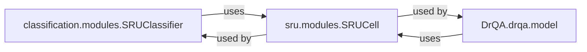

## Details

The core of this project revolves around the efficient processing of sequential data using the SRU (Simple Recurrent Unit) architecture. The `sru.modules.SRUCell` acts as the fundamental building block, providing a highly optimized recurrent unit. This foundational component is then leveraged by higher-level application models such as `classification.modules.SRUClassifier` for text classification tasks and `DrQA.drqa.model` for complex question-answering systems. These application models demonstrate the practical utility and performance benefits of integrating SRU units into diverse NLP applications, showcasing how the efficient `SRUCell` underpins more complex sequence processing functionalities.

### classification.modules.SRUClassifier
A specialized neural network model designed for text classification. It integrates SRU units into its architecture to efficiently process sequential text data and produce classification outputs. This component demonstrates the practical application of SRU in a common NLP task, highlighting its effectiveness in handling sequential information for classification.

**Related Classes/Methods**:

- <a href="https://github.com/asappresearch/sru/blob/master/classification/modules.py" target="_blank" rel="noopener noreferrer">`classification.modules.SRUClassifier`</a>

### DrQA.drqa.model
Represents the comprehensive model architecture of the DrQA Question Answering system. This component integrates SRU units into its recurrent layers (e.g., for encoding questions and documents), leveraging SRU's performance benefits for sequence processing within a larger, more complex NLP application. It exemplifies SRU's utility in advanced NLP systems by providing a robust framework for question answering.

**Related Classes/Methods**:

- <a href="https://github.com/asappresearch/sru/blob/master/DrQA/drqa/model.py" target="_blank" rel="noopener noreferrer">`DrQA.drqa.model`</a>

### sru.modules.SRUCell
While a core component of the overall project, within the context of `Application Models`, `SRUCell` acts as a foundational building block. It is the highly optimized, efficient recurrent unit that the application models (`classification.modules.SRUClassifier`, `DrQA.drqa.model`) depend on for their sequence processing capabilities. It provides the core recurrent logic that enables efficient sequence modeling.

**Related Classes/Methods**:

- <a href="https://github.com/asappresearch/sru/blob/master/sru/modules.py#L16-L419" target="_blank" rel="noopener noreferrer">`sru.modules.SRUCell`:16-419</a>

### [FAQ](https://github.com/CodeBoarding/GeneratedOnBoardings/tree/main?tab=readme-ov-file#faq)