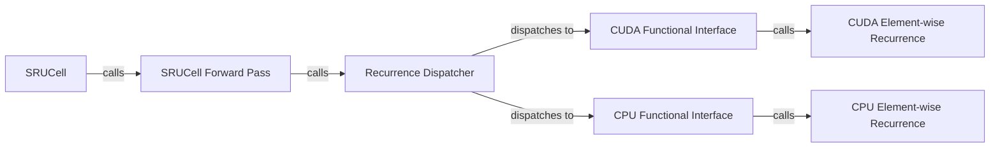

## Details

The `SRU Core Library` subsystem forms the computational core of the project, implementing the highly optimized SRU recurrent unit with both CUDA and CPU backends. Its boundaries are defined by the `sru.modules`, `sru.cuda_functional`, and `sru.ops` packages, which collectively manage the SRU's public API, backend dispatch, and low-level recurrence computations.

### SRUCell
Serves as the primary, user-facing PyTorch `nn.Module` for the SRU unit. It handles initialization, parameter management, and provides the high-level API for integrating SRU into neural networks.

**Related Classes/Methods**:

- <a href="https://github.com/asappresearch/sru/blob/master/sru/modules.py#L16-L419" target="_blank" rel="noopener noreferrer">`sru.modules.SRUCell`:16-419</a>

### SRUCell Forward Pass
Orchestrates the data flow during the forward pass. It applies input transformations (e.g., dropout, linear projections) and dispatches the core recurrence computation to the appropriate backend via `apply_recurrence`.

**Related Classes/Methods**:

- <a href="https://github.com/asappresearch/sru/blob/master/sru/modules.py" target="_blank" rel="noopener noreferrer">`sru.modules.SRUCell.forward`</a>

### Recurrence Dispatcher
Dynamically selects and invokes the most optimized recurrence implementation (CUDA or CPU) based on runtime conditions such as GPU availability and input tensor device. This is crucial for performance and hardware flexibility.

**Related Classes/Methods**:

- <a href="https://github.com/asappresearch/sru/blob/master/sru/modules.py#L283-L318" target="_blank" rel="noopener noreferrer">`sru.modules.apply_recurrence`:283-318</a>

### CUDA Functional Interface
Acts as the high-level Python interface to the low-level CUDA SRU kernel. It prepares and marshals data for the underlying C++/CUDA implementation, bridging Python tensors to GPU operations.

**Related Classes/Methods**:

- <a href="https://github.com/asappresearch/sru/blob/master/sru/cuda_functional.py#L158-L191" target="_blank" rel="noopener noreferrer">`sru.cuda_functional.forward`:158-191</a>

### CUDA Element-wise Recurrence
Performs the highly optimized, parallelized element-wise SRU recurrence computation directly on the GPU. This is the performance-critical component responsible for the significant speed improvements of SRU.

**Related Classes/Methods**:

- <a href="https://github.com/asappresearch/sru/blob/master/sru/cuda_functional.py#L37-L153" target="_blank" rel="noopener noreferrer">`sru.cuda_functional.elementwise_recurrence_forward`:37-153</a>

### CPU Functional Interface
Provides the high-level Python interface to the CPU-based SRU recurrence. It prepares data for the CPU implementation, serving as a robust fallback or for environments without GPU acceleration.

**Related Classes/Methods**:

- <a href="https://github.com/asappresearch/sru/blob/master/sru/ops.py#L145-L250" target="_blank" rel="noopener noreferrer">`sru.ops.elementwise_recurrence_naive`:145-250</a>

### CPU Element-wise Recurrence
Performs the element-wise SRU recurrence computation on the CPU. This component is used when GPU acceleration is not available or desired.

**Related Classes/Methods**:

- <a href="https://github.com/asappresearch/sru/blob/master/sru/ops.py#L22-L94" target="_blank" rel="noopener noreferrer">`sru.ops.elementwise_recurrence_inference`:22-94</a>

### [FAQ](https://github.com/CodeBoarding/GeneratedOnBoardings/tree/main?tab=readme-ov-file#faq)