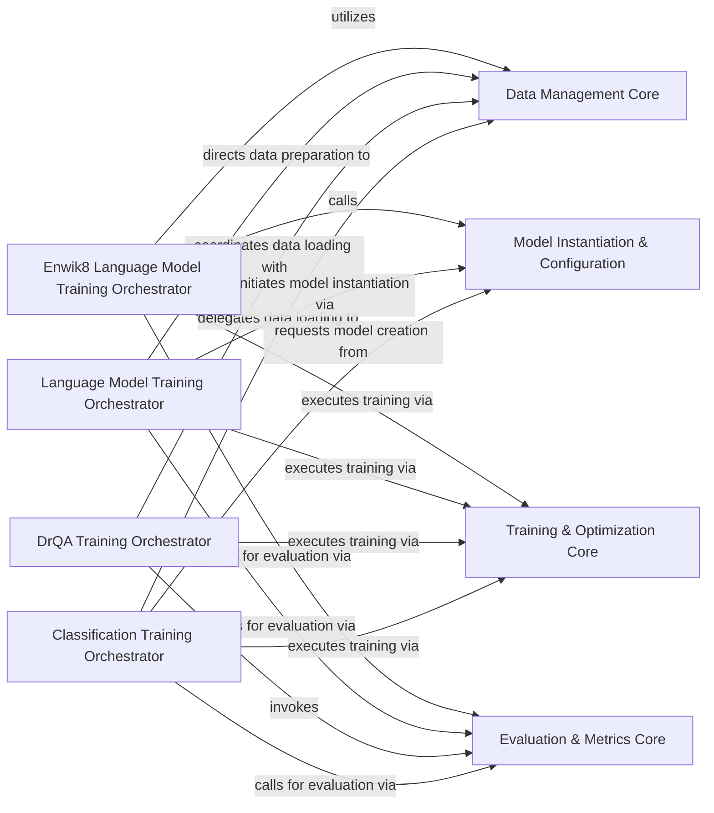

## Details

This subsystem focuses on the training and evaluation of various natural language processing (NLP) models, including text classification, DrQA, and generic language models. It is structured around several orchestrator components that manage the end-to-end training pipelines and a set of core components that provide specialized functionalities. The orchestrators delegate tasks such as data handling, model creation, training execution, and performance evaluation to these core components. The core components, primarily found within the `sru` package, encapsulate the fundamental operations of recurrent neural networks, including data processing, model architecture definition, and the core training recurrence.

### Classification Training Orchestrator
Manages the complete training and evaluation pipeline for text classification models, coordinating data loading, model instantiation, training, and evaluation.

**Related Classes/Methods**:

- <a href="https://github.com/asappresearch/sru/blob/master/classification/train_classifier.py#L118-L199" target="_blank" rel="noopener noreferrer">`classification.train_classifier.main`:118-199</a>

### DrQA Training Orchestrator
Oversees the training and evaluation process for DrQA (Document Reader Question Answering) models, including data handling, model training, and performance assessment.

**Related Classes/Methods**:

- <a href="https://github.com/asappresearch/sru/blob/master/DrQA/train.py#L120-L183" target="_blank" rel="noopener noreferrer">`DrQA.train.main`:120-183</a>

### Language Model Training Orchestrator
Orchestrates the training and evaluation of generic language models, managing the flow from data preparation to model training and evaluation.

**Related Classes/Methods**:

- <a href="https://github.com/asappresearch/sru/blob/master/language_model/train_lm.py#L184-L237" target="_blank" rel="noopener noreferrer">`language_model.train_lm.main`:184-237</a>

### Enwik8 Language Model Training Orchestrator
Manages the specialized training and evaluation of language models specifically on the enwik8 dataset, handling dataset-specific configurations and training routines.

**Related Classes/Methods**:

- <a href="https://github.com/asappresearch/sru/blob/master/language_model/train_enwik8.py#L142-L260" target="_blank" rel="noopener noreferrer">`language_model.train_enwik8.main`:142-260</a>

### Data Management Core
Provides functionalities for loading, preprocessing, and batching various datasets required for training and evaluation across different NLP tasks.

**Related Classes/Methods**:

- <a href="https://github.com/asappresearch/sru/blob/master/sru/ops.py" target="_blank" rel="noopener noreferrer">`sru.ops`</a>

### Model Instantiation & Configuration
Responsible for creating, initializing, and configuring model instances based on specified architectures and hyperparameters for different NLP tasks.

**Related Classes/Methods**:

- <a href="https://github.com/asappresearch/sru/blob/master/sru/modules.py#L16-L419" target="_blank" rel="noopener noreferrer">`sru.modules.SRUCell`:16-419</a>

### Training & Optimization Core
Encapsulates the core training loop logic, including forward/backward passes, loss calculation, gradient updates, and learning rate scheduling.

**Related Classes/Methods**:

- <a href="https://github.com/asappresearch/sru/blob/master/sru/ops.py" target="_blank" rel="noopener noreferrer">`sru.ops`</a>

### Evaluation & Metrics Core
Handles the evaluation of trained models, calculating performance metrics and generating reports to assess model quality.

**Related Classes/Methods**:

- <a href="https://github.com/asappresearch/sru/blob/master/sru/ops.py" target="_blank" rel="noopener noreferrer">`sru.ops`</a>

### [FAQ](https://github.com/CodeBoarding/GeneratedOnBoardings/tree/main?tab=readme-ov-file#faq)