```mermaid
graph LR
    SRU_Core_Library["SRU Core Library"]
    CUDA_Backend_Build_System["CUDA Backend & Build System"]
    Data_Processing_Pipeline["Data Processing Pipeline"]
    Application_Models["Application Models"]
    Training_Orchestration["Training & Orchestration"]
    Evaluation_Metrics["Evaluation & Metrics"]
    Training_Orchestration -- "initiates data loading from" --> Data_Processing_Pipeline
    Data_Processing_Pipeline -- "provides data to" --> Application_Models
    Training_Orchestration -- "controls" --> Application_Models
    Application_Models -- "utilizes" --> SRU_Core_Library
    SRU_Core_Library -- "relies on" --> CUDA_Backend_Build_System
    Training_Orchestration -- "triggers evaluation by" --> Evaluation_Metrics
    Evaluation_Metrics -- "queries" --> Application_Models
    click SRU_Core_Library href "https://github.com/CodeBoarding/GeneratedOnBoardings/blob/main/sru/SRU_Core_Library.md" "Details"
    click CUDA_Backend_Build_System href "https://github.com/CodeBoarding/GeneratedOnBoardings/blob/main/sru/CUDA_Backend_Build_System.md" "Details"
    click Application_Models href "https://github.com/CodeBoarding/GeneratedOnBoardings/blob/main/sru/Application_Models.md" "Details"
    click Training_Orchestration href "https://github.com/CodeBoarding/GeneratedOnBoardings/blob/main/sru/Training_Orchestration.md" "Details"
```

## Details

The `sru` project is structured around a performance-centric deep learning architecture, designed to provide highly efficient recurrent neural network capabilities within PyTorch. At its core, the SRU Core Library offers optimized recurrent units, leveraging a dedicated CUDA Backend & Build System for accelerated computations. Data flows into the system via the Data Processing Pipeline, which prepares raw text for consumption by various Application Models. These models, which integrate the SRU units, are then managed and executed by the Training & Orchestration component, responsible for the entire training lifecycle. Finally, the Evaluation & Metrics component assesses the performance of the trained models. This clear separation of concerns, from low-level kernel optimization to high-level application orchestration, facilitates modularity, reusability, and the project's emphasis on computational speed.

### SRU Core Library [[Expand]](./SRU_Core_Library.md)
Implements the fundamental, highly optimized SRU recurrent unit, including CUDA and CPU implementations. This is the project's computational heart.

**Related Classes/Methods**:

- <a href="https://github.com/asappresearch/sru/blob/master/sru/modules.py#L16-L419" target="_blank" rel="noopener noreferrer">`sru.modules.SRUCell`:16-419</a>
- <a href="https://github.com/asappresearch/sru/blob/master/sru/cuda_functional.py#L158-L191" target="_blank" rel="noopener noreferrer">`sru.cuda_functional.forward`:158-191</a>
- <a href="https://github.com/asappresearch/sru/blob/master/sru/ops.py#L145-L250" target="_blank" rel="noopener noreferrer">`sru.ops.elementwise_recurrence_naive`:145-250</a>

### CUDA Backend & Build System [[Expand]](./CUDA_Backend_Build_System.md)
Manages the compilation of custom CUDA kernels (written in C++) and their seamless integration into the Python environment, enabling high-performance SRU operations.

**Related Classes/Methods**:

- <a href="https://github.com/asappresearch/sru/blob/master/setup.py" target="_blank" rel="noopener noreferrer">`setup.py`</a>
- <a href="https://github.com/asappresearch/sru/blob/master/sru/csrc/" target="_blank" rel="noopener noreferrer">`sru.csrc`</a>

### Data Processing Pipeline
Handles the entire data preparation workflow, including raw text ingestion, tokenization, numericalization, and batching, to provide standardized input for models.

**Related Classes/Methods**:

- <a href="https://github.com/asappresearch/sru/blob/master/classification/dataloader.py#L30-L40" target="_blank" rel="noopener noreferrer">`classification.dataloader.read_corpus`:30-40</a>
- <a href="https://github.com/asappresearch/sru/blob/master/classification/dataloader.py#L153-L185" target="_blank" rel="noopener noreferrer">`classification.dataloader.create_batches`:153-185</a>
- <a href="https://github.com/asappresearch/sru/blob/master/DrQA/prepro.py#L254-L264" target="_blank" rel="noopener noreferrer">`DrQA.prepro.build_embedding`:254-264</a>

### Application Models [[Expand]](./Application_Models.md)
Defines the neural network architectures for various NLP tasks (e.g., Text Classification, Question Answering), integrating SRU units as core recurrent layers.

**Related Classes/Methods**:

- <a href="https://github.com/asappresearch/sru/blob/master/DrQA/drqa/model.py#L30-L61" target="_blank" rel="noopener noreferrer">`DrQA.drqa.model.__init__`:30-61</a>
- <a href="https://github.com/asappresearch/sru/blob/master/classification/modules.py" target="_blank" rel="noopener noreferrer">`classification.modules.SRUClassifier`</a>

### Training & Orchestration [[Expand]](./Training_Orchestration.md)
Serves as the main control flow for different NLP applications, orchestrating the entire training and evaluation process, including data loading, model instantiation, optimization, and logging.

**Related Classes/Methods**:

- <a href="https://github.com/asappresearch/sru/blob/master/classification/train_classifier.py#L118-L199" target="_blank" rel="noopener noreferrer">`classification.train_classifier.main`:118-199</a>
- <a href="https://github.com/asappresearch/sru/blob/master/DrQA/train.py#L120-L183" target="_blank" rel="noopener noreferrer">`DrQA.train.main`:120-183</a>
- <a href="https://github.com/asappresearch/sru/blob/master/language_model/train_lm.py#L184-L237" target="_blank" rel="noopener noreferrer">`language_model.train_lm.main`:184-237</a>
- <a href="https://github.com/asappresearch/sru/blob/master/language_model/train_enwik8.py#L142-L260" target="_blank" rel="noopener noreferrer">`language_model.train_enwik8.main`:142-260</a>

### Evaluation & Metrics
Provides functionalities for assessing model performance on validation and test datasets, calculating and reporting task-specific metrics.

**Related Classes/Methods**:

- <a href="https://github.com/asappresearch/sru/blob/master/classification/train_classifier.py#L64-L80" target="_blank" rel="noopener noreferrer">`classification.train_classifier.eval_model`:64-80</a>
- <a href="https://github.com/asappresearch/sru/blob/master/DrQA/train.py#L354-L363" target="_blank" rel="noopener noreferrer">`DrQA.train.score`:354-363</a>
- <a href="https://github.com/asappresearch/sru/blob/master/language_model/train_lm.py#L163-L182" target="_blank" rel="noopener noreferrer">`language_model.train_lm.eval_model`:163-182</a>

### [FAQ](https://github.com/CodeBoarding/GeneratedOnBoardings/tree/main?tab=readme-ov-file#faq)