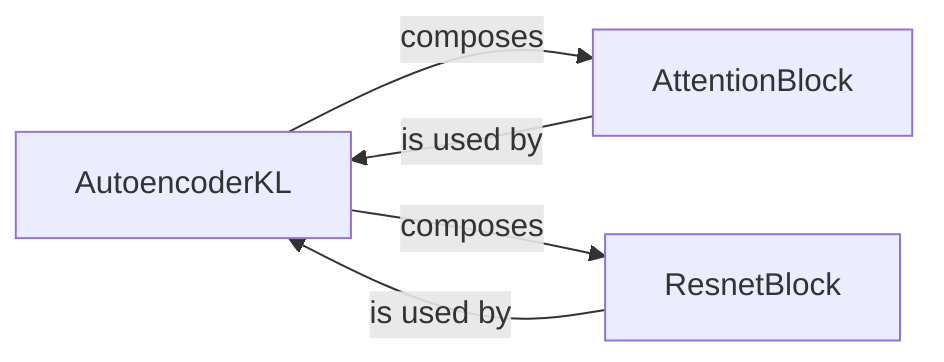

## Details

The Image Autoencoder (VAE) subsystem is primarily encapsulated within the `stable_diffusion_tf.autoencoder_kl` module, specifically the `stable_diffusion_tf/autoencoder_kl.py` file. This module defines the core components responsible for image compression and reconstruction.

### AutoencoderKL
This is the central orchestrator of the VAE subsystem. It manages the end-to-end process of compressing images into a lower-dimensional latent space (encoding) and reconstructing images from these latent representations (decoding). It integrates and utilizes the AttentionBlock and ResnetBlock components to achieve its functionality.

**Related Classes/Methods**:

- <a href="https://github.com/divamgupta/stable-diffusion-tensorflow/blob/master/stable_diffusion_tf/autoencoder_kl.py" target="_blank" rel="noopener noreferrer">`stable_diffusion_tf.autoencoder_kl.AutoencoderKL`</a>

### AttentionBlock
Implements attention mechanisms within the autoencoder's architecture. This allows the model to selectively focus on important features in the input image during encoding and in the latent representation during decoding, enhancing the quality and relevance of the compressed and reconstructed data.

**Related Classes/Methods**:

- <a href="https://github.com/divamgupta/stable-diffusion-tensorflow/blob/master/stable_diffusion_tf/autoencoder_kl.py#L8-L37" target="_blank" rel="noopener noreferrer">`stable_diffusion_tf.autoencoder_kl.AttentionBlock`:8-37</a>

### ResnetBlock
Provides residual connections within the autoencoder's network. These blocks are crucial for enabling the training of very deep neural networks by mitigating issues like vanishing gradients, ensuring efficient and effective feature learning and reconstruction.

**Related Classes/Methods**:

- <a href="https://github.com/divamgupta/stable-diffusion-tensorflow/blob/master/stable_diffusion_tf/autoencoder_kl.py#L40-L56" target="_blank" rel="noopener noreferrer">`stable_diffusion_tf.autoencoder_kl.ResnetBlock`:40-56</a>

### [FAQ](https://github.com/CodeBoarding/GeneratedOnBoardings/tree/main?tab=readme-ov-file#faq)