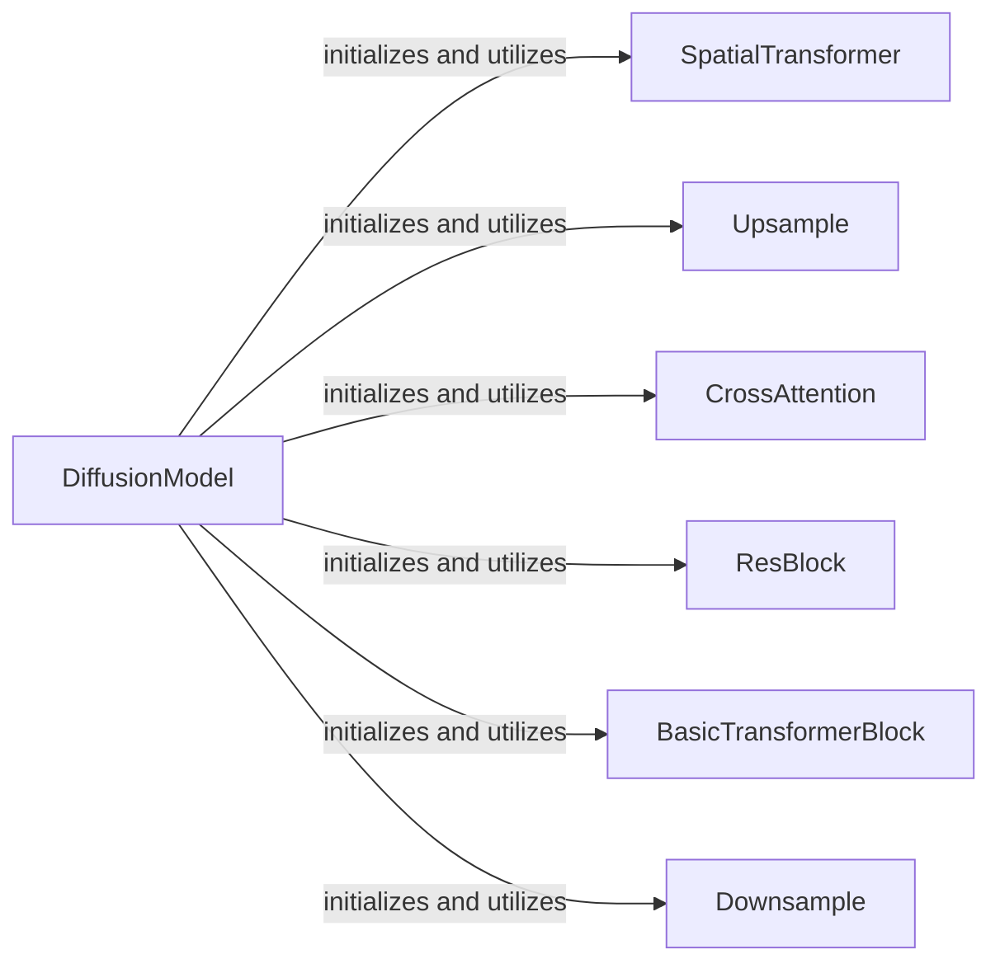

## Details

The Latent Diffusion Model (U-Net) subsystem is the core generative component responsible for iteratively denoising latent representations, guided by text embeddings, to produce the final latent image. Its primary implementation is found within stable_diffusion_tf/diffusion_model.py.

### DiffusionModel
The orchestrator of the U-Net, responsible for the overall latent diffusion process. It initializes and composes the various U-Net sub-components and manages the forward pass, iteratively denoising latent representations guided by text embeddings.

**Related Classes/Methods**:

- <a href="https://github.com/divamgupta/stable-diffusion-tensorflow/blob/master/stable_diffusion_tf/diffusion_model.py" target="_blank" rel="noopener noreferrer">`stable_diffusion_tf.diffusion_model.DiffusionModel`</a>

### SpatialTransformer
Applies spatial transformations to feature maps, crucial for aligning and processing features across different resolutions within the U-Net.

**Related Classes/Methods**:

- <a href="https://github.com/divamgupta/stable-diffusion-tensorflow/blob/master/stable_diffusion_tf/diffusion_model.py#L96-L115" target="_blank" rel="noopener noreferrer">`stable_diffusion_tf.diffusion_model.SpatialTransformer`:96-115</a>

### Upsample
Increases the resolution of feature maps in the decoder path of the U-Net, reconstructing higher-resolution latent images.

**Related Classes/Methods**:

- <a href="https://github.com/divamgupta/stable-diffusion-tensorflow/blob/master/stable_diffusion_tf/diffusion_model.py#L127-L135" target="_blank" rel="noopener noreferrer">`stable_diffusion_tf.diffusion_model.Upsample`:127-135</a>

### CrossAttention
Integrates external conditioning information (e.g., text embeddings) into the U-Net's feature processing, enabling text-guided image generation.

**Related Classes/Methods**:

- <a href="https://github.com/divamgupta/stable-diffusion-tensorflow/blob/master/stable_diffusion_tf/diffusion_model.py#L39-L73" target="_blank" rel="noopener noreferrer">`stable_diffusion_tf.diffusion_model.CrossAttention`:39-73</a>

### ResBlock
Provides residual connections, facilitating stable training and effective feature learning within the deep network. It's a fundamental building block for deep neural networks.

**Related Classes/Methods**:

- <a href="https://github.com/divamgupta/stable-diffusion-tensorflow/blob/master/stable_diffusion_tf/diffusion_model.py#L8-L36" target="_blank" rel="noopener noreferrer">`stable_diffusion_tf.diffusion_model.ResBlock`:8-36</a>

### BasicTransformerBlock
Processes features using transformer-like mechanisms, enabling complex interactions and transformations of feature representations, often used for self-attention or cross-attention.

**Related Classes/Methods**:

- <a href="https://github.com/divamgupta/stable-diffusion-tensorflow/blob/master/stable_diffusion_tf/diffusion_model.py#L76-L93" target="_blank" rel="noopener noreferrer">`stable_diffusion_tf.diffusion_model.BasicTransformerBlock`:76-93</a>

### Downsample
Reduces the resolution of feature maps in the encoder path of the U-Net, extracting multi-scale features.

**Related Classes/Methods**:

- <a href="https://github.com/divamgupta/stable-diffusion-tensorflow/blob/master/stable_diffusion_tf/diffusion_model.py#L118-L124" target="_blank" rel="noopener noreferrer">`stable_diffusion_tf.diffusion_model.Downsample`:118-124</a>

### [FAQ](https://github.com/CodeBoarding/GeneratedOnBoardings/tree/main?tab=readme-ov-file#faq)