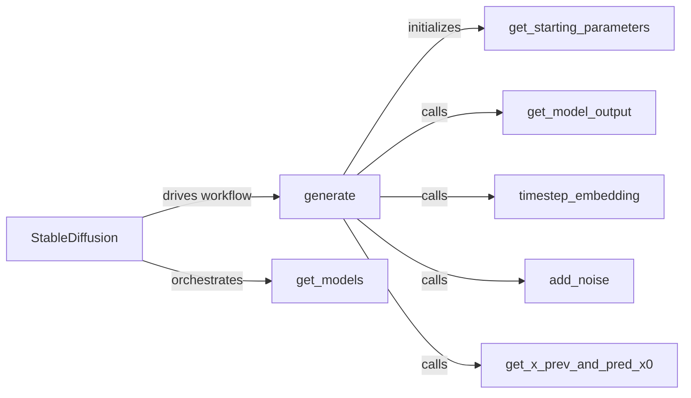

## Details

The Pipeline Orchestrator subsystem is primarily encapsulated within the `stable_diffusion_tf.stable_diffusion` module, with its core functionality residing in the `StableDiffusion` class. This class acts as the central control point for the entire Stable Diffusion image generation workflow. The subsystem is tightly cohesive, with the `StableDiffusion` class serving as the central hub. All other listed components are methods of the `StableDiffusion` class, indicating a strong internal dependency where these methods collectively implement the orchestration logic. The `generate` method acts as the primary workflow driver, calling other methods in a sequence to execute the diffusion process. The `get_models` method is a foundational step, providing the necessary external ML components that the other methods then interact with.

### StableDiffusion
The primary orchestrator of the Stable Diffusion pipeline. It initializes and manages the flow between the various ML models (Text Encoder, VAE, UNet) and handles the iterative diffusion process.

**Related Classes/Methods**:

- <a href="https://github.com/divamgupta/stable-diffusion-tensorflow/blob/master/stable_diffusion_tf/stable_diffusion.py#L18-L220" target="_blank" rel="noopener noreferrer">`stable_diffusion_tf.stable_diffusion.StableDiffusion`:18-220</a>

### generate
The main entry point for initiating the image generation process. It coordinates the overall sequence of operations, from text encoding to image decoding, including the iterative diffusion steps.

**Related Classes/Methods**:

- <a href="https://github.com/divamgupta/stable-diffusion-tensorflow/blob/master/stable_diffusion_tf/stable_diffusion.py" target="_blank" rel="noopener noreferrer">`stable_diffusion_tf.stable_diffusion.StableDiffusion:generate`</a>

### get_models
Responsible for loading and initializing the necessary pre-trained models (Text Encoder, VAE, UNet) required for the Stable Diffusion process.

**Related Classes/Methods**:

- <a href="https://github.com/divamgupta/stable-diffusion-tensorflow/blob/master/stable_diffusion_tf/stable_diffusion.py" target="_blank" rel="noopener noreferrer">`stable_diffusion_tf.stable_diffusion.StableDiffusion:get_models`</a>

### get_starting_parameters
Prepares the initial latent noise and other parameters required to begin the diffusion process, often based on input conditions like text prompts or initial images.

**Related Classes/Methods**:

- <a href="https://github.com/divamgupta/stable-diffusion-tensorflow/blob/master/stable_diffusion_tf/stable_diffusion.py" target="_blank" rel="noopener noreferrer">`stable_diffusion_tf.stable_diffusion.StableDiffusion:get_starting_parameters`</a>

### add_noise
Manages the addition of noise to latent representations during the diffusion process, a critical step in the iterative refinement of the image.

**Related Classes/Methods**:

- <a href="https://github.com/divamgupta/stable-diffusion-tensorflow/blob/master/stable_diffusion_tf/stable_diffusion.py" target="_blank" rel="noopener noreferrer">`stable_diffusion_tf.stable_diffusion.StableDiffusion:add_noise`</a>

### get_model_output
Interfaces with the Latent Diffusion Model (UNet) to obtain predictions at each timestep of the diffusion process, guiding the image generation.

**Related Classes/Methods**:

- <a href="https://github.com/divamgupta/stable-diffusion-tensorflow/blob/master/stable_diffusion_tf/stable_diffusion.py" target="_blank" rel="noopener noreferrer">`stable_diffusion_tf.stable_diffusion.StableDiffusion:get_model_output`</a>

### timestep_embedding
Generates the timestep embeddings required by the UNet model, which are crucial for conditioning the diffusion process on the current step.

**Related Classes/Methods**:

- <a href="https://github.com/divamgupta/stable-diffusion-tensorflow/blob/master/stable_diffusion_tf/stable_diffusion.py" target="_blank" rel="noopener noreferrer">`stable_diffusion_tf.stable_diffusion.StableDiffusion:timestep_embedding`</a>

### get_x_prev_and_pred_x0
Calculates the previous latent state (`x_prev`) and the predicted original latent state (`pred_x0`) based on the UNet's output, facilitating the iterative denoising.

**Related Classes/Methods**:

- <a href="https://github.com/divamgupta/stable-diffusion-tensorflow/blob/master/stable_diffusion_tf/stable_diffusion.py" target="_blank" rel="noopener noreferrer">`stable_diffusion_tf.stable_diffusion.StableDiffusion:get_x_prev_and_pred_x0`</a>

### [FAQ](https://github.com/CodeBoarding/GeneratedOnBoardings/tree/main?tab=readme-ov-file#faq)