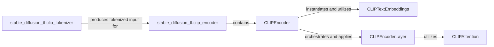

## Details

The text encoding subsystem within `stable-diffusion-tensorflow` is primarily responsible for transforming raw text prompts into meaningful numerical representations (CLIP embeddings) that can be used by the diffusion model. This process begins with the `stable_diffusion_tf.clip_tokenizer` which preprocesses and tokenizes the input text. The tokenized output is then fed into the `stable_diffusion_tf.clip_encoder`, which orchestrates a series of transformer-based operations. Within the encoder, `CLIPTextEmbeddings` converts tokens into initial vector representations, which are then iteratively refined by multiple `CLIPEncoderLayer` instances. Each layer leverages `CLIPAttention` to capture contextual relationships between tokens, ultimately producing a rich, contextualized CLIP embedding.

### stable_diffusion_tf.clip_tokenizer
This component is the entry point for raw text prompts. It performs essential preprocessing steps such as text cleaning, whitespace normalization, and applying Byte Pair Encoding (BPE) to convert the text into a sequence of numerical tokens.

**Related Classes/Methods**:

- <a href="https://github.com/divamgupta/stable-diffusion-tensorflow/blob/master/stable_diffusion_tf/clip_tokenizer" target="_blank" rel="noopener noreferrer">`stable_diffusion_tf.clip_tokenizer`</a>

### stable_diffusion_tf.clip_encoder
This is the high-level orchestrator for the text embedding process. It takes the tokenized input and, through its internal components, transforms it into comprehensive CLIP embeddings. It encapsulates the entire transformer-based encoding logic.

**Related Classes/Methods**:

- <a href="https://github.com/divamgupta/stable-diffusion-tensorflow/blob/master/stable_diffusion_tf/clip_encoder.py" target="_blank" rel="noopener noreferrer">`stable_diffusion_tf.clip_encoder`</a>

### CLIPEncoder
A key class within `stable_diffusion_tf.clip_encoder`, this component orchestrates the sequence of operations required to generate the final CLIP embedding. It initializes the token embeddings and then applies multiple layers of transformer processing.

**Related Classes/Methods**:

- <a href="https://github.com/divamgupta/stable-diffusion-tensorflow/blob/master/stable_diffusion_tf/clip_encoder.py#L84-L93" target="_blank" rel="noopener noreferrer">`stable_diffusion_tf.clip_encoder.CLIPEncoder`:84-93</a>

### CLIPTextEmbeddings
This component is responsible for converting the raw numerical token IDs into dense vector representations (embeddings). These initial embeddings capture the semantic meaning of each token before contextualization.

**Related Classes/Methods**:

- <a href="https://github.com/divamgupta/stable-diffusion-tensorflow/blob/master/stable_diffusion_tf/clip_encoder.py#L96-L110" target="_blank" rel="noopener noreferrer">`stable_diffusion_tf.clip_encoder.CLIPTextEmbeddings`:96-110</a>

### CLIPEncoderLayer
These are the fundamental building blocks of the transformer architecture within the CLIPEncoder. Each layer processes the token embeddings through self-attention mechanisms and feed-forward networks, iteratively refining their contextual understanding.

**Related Classes/Methods**:

- <a href="https://github.com/divamgupta/stable-diffusion-tensorflow/blob/master/stable_diffusion_tf/clip_encoder.py#L57-L81" target="_blank" rel="noopener noreferrer">`stable_diffusion_tf.clip_encoder.CLIPEncoderLayer`:57-81</a>

### CLIPAttention
A sub-component utilized by CLIPEncoderLayer, CLIPAttention computes attention scores. This mechanism allows the model to dynamically weigh the importance of different tokens in the input sequence when processing each token's embedding, producing contextually enriched outputs.

**Related Classes/Methods**:

- <a href="https://github.com/divamgupta/stable-diffusion-tensorflow/blob/master/stable_diffusion_tf/clip_encoder.py#L9-L54" target="_blank" rel="noopener noreferrer">`stable_diffusion_tf.clip_encoder.CLIPAttention`:9-54</a>

### [FAQ](https://github.com/CodeBoarding/GeneratedOnBoardings/tree/main?tab=readme-ov-file#faq)