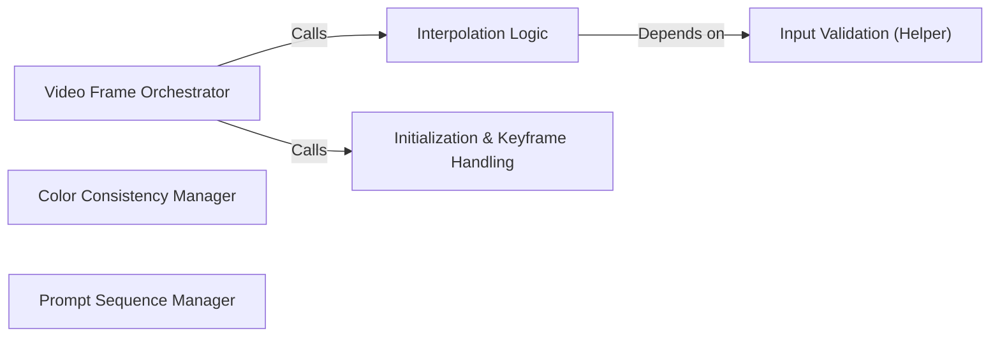

## Details

The `Video Generation Utilities` subsystem is primarily defined by the `stable_diffusion_tf.video_utils` module. This module encapsulates all the core logic and helper functions required for generating video sequences by interpolating between image frames or prompts, leveraging the main image generation pipeline.

### Video Frame Orchestrator
Acts as the primary controller for the video generation process. It orchestrates the sequence of operations required to produce video frames, managing the translation logic between defined keyframes and coordinating with other components for interpolation and prompt handling.

**Related Classes/Methods**:

- <a href="https://github.com/divamgupta/stable-diffusion-tensorflow/blob/master/stable_diffusion_tf/video_utils.py#L95-L99" target="_blank" rel="noopener noreferrer">`stable_diffusion_tf.video_utils.generate_frames_translation`:95-99</a>

### Interpolation Logic
Computes the intermediate values or steps necessary for creating smooth transitions between frames or prompts. This component is fundamental for achieving fluid motion in the generated video sequences.

**Related Classes/Methods**:

- <a href="https://github.com/divamgupta/stable-diffusion-tensorflow/blob/master/stable_diffusion_tf/video_utils.py#L46-L73" target="_blank" rel="noopener noreferrer">`stable_diffusion_tf.video_utils.get_inbetweens`:46-73</a>

### Color Consistency Manager
Ensures visual consistency across generated frames, specifically addressing and preventing artifacts such as flickering or abrupt color shifts. It applies techniques like histogram matching to align color distributions.

**Related Classes/Methods**:

- <a href="https://github.com/divamgupta/stable-diffusion-tensorflow/blob/master/stable_diffusion_tf/video_utils.py#L147-L153" target="_blank" rel="noopener noreferrer">`stable_diffusion_tf.video_utils.maintain_colors`:147-153</a>
- <a href="https://github.com/divamgupta/stable-diffusion-tensorflow/blob/master/stable_diffusion_tf/video_utils.py#L125-L134" target="_blank" rel="noopener noreferrer">`stable_diffusion_tf.video_utils.hist_matching`:125-134</a>
- <a href="https://github.com/divamgupta/stable-diffusion-tensorflow/blob/master/stable_diffusion_tf/video_utils.py#L137-L144" target="_blank" rel="noopener noreferrer">`stable_diffusion_tf.video_utils.cdf`:137-144</a>

### Prompt Sequence Manager
Constructs, organizes, and manages sequences of prompts or prompt indices. This is crucial for guiding the generative model through different textual or image prompts over the video's duration, enabling dynamic content generation.

**Related Classes/Methods**:

- <a href="https://github.com/divamgupta/stable-diffusion-tensorflow/blob/master/stable_diffusion_tf/video_utils.py#L191-L210" target="_blank" rel="noopener noreferrer">`stable_diffusion_tf.video_utils.create_prompt_iprompt_seq`:191-210</a>
- <a href="https://github.com/divamgupta/stable-diffusion-tensorflow/blob/master/stable_diffusion_tf/video_utils.py#L177-L181" target="_blank" rel="noopener noreferrer">`stable_diffusion_tf.video_utils.create_prompt_idx_dict`:177-181</a>

### Initialization & Keyframe Handling
Manages the initial setup of the video generation process. This includes parsing and interpreting input keyframe data, generating the very first frame of a sequence, and managing seed generation for reproducibility or variability.

**Related Classes/Methods**:

- <a href="https://github.com/divamgupta/stable-diffusion-tensorflow/blob/master/stable_diffusion_tf/video_utils.py#L213-L223" target="_blank" rel="noopener noreferrer">`stable_diffusion_tf.video_utils.generate_init_frame`:213-223</a>
- <a href="https://github.com/divamgupta/stable-diffusion-tensorflow/blob/master/stable_diffusion_tf/video_utils.py#L76-L92" target="_blank" rel="noopener noreferrer">`stable_diffusion_tf.video_utils.parse_key_frames`:76-92</a>
- <a href="https://github.com/divamgupta/stable-diffusion-tensorflow/blob/master/stable_diffusion_tf/video_utils.py#L184-L188" target="_blank" rel="noopener noreferrer">`stable_diffusion_tf.video_utils.next_seed`:184-188</a>

### Input Validation (Helper)
Provides basic utility for validating numerical inputs, ensuring data integrity for calculations performed by other components within the subsystem.

**Related Classes/Methods**:

- <a href="https://github.com/divamgupta/stable-diffusion-tensorflow/blob/master/stable_diffusion_tf/video_utils.py#L41-L43" target="_blank" rel="noopener noreferrer">`stable_diffusion_tf.video_utils.check_is_number`:41-43</a>

### [FAQ](https://github.com/CodeBoarding/GeneratedOnBoardings/tree/main?tab=readme-ov-file#faq)