```mermaid
graph LR
    CLI_Interface["CLI Interface"]
    Pipeline_Orchestrator["Pipeline Orchestrator"]
    Text_Encoding_Module["Text Encoding Module"]
    Image_Autoencoder_VAE_["Image Autoencoder (VAE)"]
    Latent_Diffusion_Model_U_Net_["Latent Diffusion Model (U-Net)"]
    Video_Generation_Utilities["Video Generation Utilities"]
    CLI_Interface -- "initiates generation with" --> Pipeline_Orchestrator
    Pipeline_Orchestrator -- "sends text prompts to" --> Text_Encoding_Module
    Text_Encoding_Module -- "provides text embeddings to" --> Latent_Diffusion_Model_U_Net_
    Pipeline_Orchestrator -- "orchestrates encoding/decoding of latent images with" --> Image_Autoencoder_VAE_
    Image_Autoencoder_VAE_ -- "provides latent input to" --> Latent_Diffusion_Model_U_Net_
    Latent_Diffusion_Model_U_Net_ -- "returns denoised latent to" --> Pipeline_Orchestrator
    Pipeline_Orchestrator -- "decodes final latent with" --> Image_Autoencoder_VAE_
    Video_Generation_Utilities -- "orchestrates frame generation through" --> Pipeline_Orchestrator
    click Pipeline_Orchestrator href "https://github.com/CodeBoarding/GeneratedOnBoardings/blob/main/stable-diffusion-tensorflow/Pipeline_Orchestrator.md" "Details"
    click Text_Encoding_Module href "https://github.com/CodeBoarding/GeneratedOnBoardings/blob/main/stable-diffusion-tensorflow/Text_Encoding_Module.md" "Details"
    click Image_Autoencoder_VAE_ href "https://github.com/CodeBoarding/GeneratedOnBoardings/blob/main/stable-diffusion-tensorflow/Image_Autoencoder_VAE_.md" "Details"
    click Latent_Diffusion_Model_U_Net_ href "https://github.com/CodeBoarding/GeneratedOnBoardings/blob/main/stable-diffusion-tensorflow/Latent_Diffusion_Model_U_Net_.md" "Details"
    click Video_Generation_Utilities href "https://github.com/CodeBoarding/GeneratedOnBoardings/blob/main/stable-diffusion-tensorflow/Video_Generation_Utilities.md" "Details"
```

## Details

The `stable-diffusion-tensorflow` project is structured around a robust generative AI pipeline, orchestrated by the `Pipeline Orchestrator`. User interactions, primarily through the `CLI Interface`, initiate the image generation process. The `Pipeline Orchestrator` then directs the flow, first engaging the `Text Encoding Module` to transform textual prompts into actionable embeddings. These embeddings, alongside latent image data managed by the `Image Autoencoder (VAE)`, are fed into the `Latent Diffusion Model (U-Net)`, the core of the generative process, which iteratively refines the latent representation. Finally, the `Image Autoencoder (VAE)` decodes the refined latent output into a tangible image. The architecture also includes `Video Generation Utilities` that extend this core image generation capability to create dynamic video sequences, demonstrating a clear separation of concerns and a well-defined data flow for both static image and dynamic video generation.

### CLI Interface
External entry points for users to interact with the Stable Diffusion model, initiating image generation tasks (e.g., text-to-image, image-to-image).

**Related Classes/Methods**:

- <a href="https://github.com/divamgupta/stable-diffusion-tensorflow/blob/master/text2image.py" target="_blank" rel="noopener noreferrer">`text2image`</a>
- <a href="https://github.com/divamgupta/stable-diffusion-tensorflow/blob/master/img2img.py" target="_blank" rel="noopener noreferrer">`img2img`</a>

### Pipeline Orchestrator [[Expand]](./Pipeline_Orchestrator.md)
The central control module that manages the entire Stable Diffusion workflow. It coordinates the data flow and operations between the Text Encoding Module, Image Autoencoder (VAE), and Latent Diffusion Model.

**Related Classes/Methods**:

- <a href="https://github.com/divamgupta/stable-diffusion-tensorflow/blob/master/stable_diffusion_tf/stable_diffusion.py" target="_blank" rel="noopener noreferrer">`stable_diffusion_tf.stable_diffusion`</a>

### Text Encoding Module [[Expand]](./Text_Encoding_Module.md)
Responsible for converting raw text prompts into numerical embeddings (CLIP embeddings) that condition the diffusion process.

**Related Classes/Methods**:

- <a href="https://github.com/divamgupta/stable-diffusion-tensorflow/blob/master/stable_diffusion_tf/clip_tokenizer/__init__.py" target="_blank" rel="noopener noreferrer">`stable_diffusion_tf.clip_tokenizer`</a>
- <a href="https://github.com/divamgupta/stable-diffusion-tensorflow/blob/master/stable_diffusion_tf/clip_encoder.py" target="_blank" rel="noopener noreferrer">`stable_diffusion_tf.clip_encoder`</a>

### Image Autoencoder (VAE) [[Expand]](./Image_Autoencoder_VAE_.md)
Handles the compression of images into a lower-dimensional latent space (encoding) and the reconstruction of images from latent representations (decoding).

**Related Classes/Methods**:

- <a href="https://github.com/divamgupta/stable-diffusion-tensorflow/blob/master/stable_diffusion_tf/autoencoder_kl.py" target="_blank" rel="noopener noreferrer">`stable_diffusion_tf.autoencoder_kl`</a>

### Latent Diffusion Model (U-Net) [[Expand]](./Latent_Diffusion_Model_U_Net_.md)
The core generative component that iteratively denoises latent representations, guided by text embeddings, to produce the final latent image.

**Related Classes/Methods**:

- <a href="https://github.com/divamgupta/stable-diffusion-tensorflow/blob/master/stable_diffusion_tf/diffusion_model.py" target="_blank" rel="noopener noreferrer">`stable_diffusion_tf.diffusion_model`</a>

### Video Generation Utilities [[Expand]](./Video_Generation_Utilities.md)
A specialized set of utilities for generating video sequences by interpolating between image frames or prompts, leveraging the core image generation pipeline.

**Related Classes/Methods**:

- <a href="https://github.com/divamgupta/stable-diffusion-tensorflow/blob/master/stable_diffusion_tf/video_utils.py" target="_blank" rel="noopener noreferrer">`stable_diffusion_tf.video_utils`</a>

### [FAQ](https://github.com/CodeBoarding/GeneratedOnBoardings/tree/main?tab=readme-ov-file#faq)