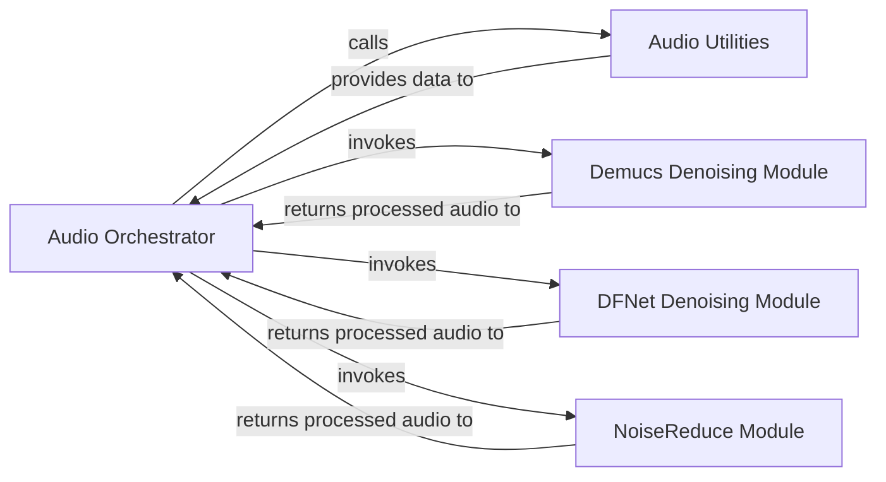

## Details

The `Audio Processing` subsystem is encapsulated within the `stable_whisper.audio` package. Its primary responsibility is to prepare audio data for transcription by handling loading, buffering, chunking, and applying various denoising and enhancement techniques.

### Audio Orchestrator
Acts as the central facade and orchestrator for the entire audio processing pipeline. It manages the high-level workflow, including audio loading, buffering, chunking, and integrating various denoising and enhancement functionalities. It provides a unified interface for complex audio operations, embodying the "Facade" and "Pipeline/Workflow" patterns.

**Related Classes/Methods**:

- <a href="https://github.com/jianfch/stable-ts/blob/main/stable_whisper/audio/__init__.py" target="_blank" rel="noopener noreferrer">`stable_whisper.audio.__init__`</a>

### Audio Utilities
Provides foundational and reusable utility functions essential for handling audio data. This includes capabilities for loading audio from diverse sources, resampling to a consistent rate, and standardizing audio properties. It serves as a core building block for the audio processing pipeline.

**Related Classes/Methods**:

- <a href="https://github.com/jianfch/stable-ts/blob/main/stable_whisper/audio/utils.py" target="_blank" rel="noopener noreferrer">`stable_whisper.audio.utils`</a>

### Demucs Denoising Module
A specialized module for audio denoising and enhancement using the Demucs model. It processes audio to reduce noise, contributing to cleaner input for transcription. This component represents an "Extension/Enhancement" point in the pipeline.

**Related Classes/Methods**:

- <a href="https://github.com/jianfch/stable-ts/blob/main/stable_whisper/audio/demucs.py" target="_blank" rel="noopener noreferrer">`stable_whisper.audio.demucs`</a>

### DFNet Denoising Module
A specialized module for audio denoising and enhancement using the DFNet model. Similar to Demucs, it focuses on improving audio quality by reducing unwanted noise. This is another "Extension/Enhancement" point.

**Related Classes/Methods**:

- <a href="https://github.com/jianfch/stable-ts/blob/main/stable_whisper/audio/dfnet.py" target="_blank" rel="noopener noreferrer">`stable_whisper.audio.dfnet`</a>

### NoiseReduce Module
A specialized module for audio denoising using the `noisereduce` library. It provides an alternative or complementary method for noise reduction within the audio processing pipeline. This also serves as an "Extension/Enhancement" point.

**Related Classes/Methods**:

- <a href="https://github.com/jianfch/stable-ts/blob/main/stable_whisper/audio/noisereduce.py" target="_blank" rel="noopener noreferrer">`stable_whisper.audio.noisereduce`</a>

### [FAQ](https://github.com/CodeBoarding/GeneratedOnBoardings/tree/main?tab=readme-ov-file#faq)