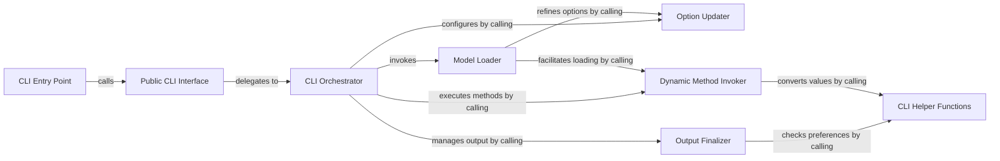

## Details

The `CLI Interface` subsystem serves as the primary user interaction point for the `stable-ts` library, parsing commands and orchestrating the audio processing pipeline.

### CLI Entry Point
The initial executable entry point when the `stable-ts` package is run as a script. Its sole responsibility is to invoke the main public CLI interface function.

**Related Classes/Methods**:

- <a href="https://github.com/jianfch/stable-ts/blob/main/stable_whisper/__main__.py" target="_blank" rel="noopener noreferrer">`stable_whisper.__main__`</a>

### Public CLI Interface
Provides the top-level command-line interface for users. It acts as the initial handler for all CLI commands, parsing raw arguments and delegating processing.

**Related Classes/Methods**:

- <a href="https://github.com/jianfch/stable-ts/blob/main/stable_whisper/whisper_word_level/cli.py" target="_blank" rel="noopener noreferrer">`stable_whisper.whisper_word_level.cli:cli`</a>

### CLI Orchestrator
The central control component for the CLI. It parses detailed user arguments, orchestrates the entire transcription workflow, manages model loading, applies configurations, and oversees output generation. It acts as a facade, coordinating interactions between various sub-components.

**Related Classes/Methods**:

- <a href="https://github.com/jianfch/stable-ts/blob/main/stable_whisper/whisper_word_level/cli.py" target="_blank" rel="noopener noreferrer">`stable_whisper.whisper_word_level.cli:_cli`</a>

### Model Loader
Handles the initialization and loading of the appropriate OpenAI Whisper model based on provided command-line options or default settings. It ensures model-specific configurations are correctly applied.

**Related Classes/Methods**:

- <a href="https://github.com/jianfch/stable-ts/blob/main/stable_whisper/whisper_word_level/cli.py" target="_blank" rel="noopener noreferrer">`stable_whisper.whisper_word_level.cli:_load_model`</a>

### Option Updater
Processes and integrates command-line arguments into the existing configuration options for the transcription or model loading process. It ensures user-defined settings correctly override or merge with default configurations.

**Related Classes/Methods**:

- <a href="https://github.com/jianfch/stable-ts/blob/main/stable_whisper/whisper_word_level/cli.py" target="_blank" rel="noopener noreferrer">`stable_whisper.whisper_word_level.cli:update_options_with_args`</a>

### Output Finalizer
Manages the post-transcription output process. This includes resolving output file paths, determining the desired output format (e.g., JSON, SRT, VTT), and saving the results to the specified location.

**Related Classes/Methods**:

- <a href="https://github.com/jianfch/stable-ts/blob/main/stable_whisper/whisper_word_level/cli.py" target="_blank" rel="noopener noreferrer">`stable_whisper.whisper_word_level.cli:finalize_outputs`</a>

### Dynamic Method Invoker
Provides a flexible mechanism to dynamically invoke core methods within the `stable-ts` library, passing a dictionary of processed options. This decouples the CLI orchestration from direct method calls.

**Related Classes/Methods**:

- <a href="https://github.com/jianfch/stable-ts/blob/main/stable_whisper/whisper_word_level/cli.py" target="_blank" rel="noopener noreferrer">`stable_whisper.whisper_word_level.cli:call_method_with_options`</a>

### CLI Helper Functions
Provides various utility functions specific to the CLI operations, such as checking for JSON output preference, converting values to string representations, and ensuring parent directories exist for output files.

**Related Classes/Methods**:

- <a href="https://github.com/jianfch/stable-ts/blob/main/stable_whisper/whisper_word_level/cli.py" target="_blank" rel="noopener noreferrer">`stable_whisper.whisper_word_level.cli:is_json`</a>
- <a href="https://github.com/jianfch/stable-ts/blob/main/stable_whisper/whisper_word_level/cli.py" target="_blank" rel="noopener noreferrer">`stable_whisper.whisper_word_level.cli:val_to_str`</a>
- <a href="https://github.com/jianfch/stable-ts/blob/main/stable_whisper/whisper_word_level/cli.py" target="_blank" rel="noopener noreferrer">`stable_whisper.whisper_word_level.cli:make_parent`</a>

### [FAQ](https://github.com/CodeBoarding/GeneratedOnBoardings/tree/main?tab=readme-ov-file#faq)