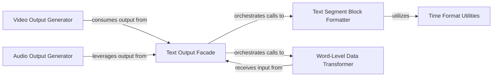

## Details

The `Output Generation` subsystem is responsible for transforming comprehensive transcription data into various user-specified output formats, including text-based subtitles, and potentially video and audio outputs. Its core functionality is primarily encapsulated within `stable_whisper/text_output.py`, `stable_whisper/video_output.py`, and `stable_whisper/audio/output.py`.

### Text Output Facade
Serves as the primary entry point for generating diverse text-based output formats (SRT, VTT, TSV, ASS, TXT, JSON) from a complete transcription result. It orchestrates the overall text output generation workflow by delegating to specialized formatters and transformers.

**Related Classes/Methods**:

- <a href="https://github.com/jianfch/stable-ts/blob/main/stable_whisper/text_output.py" target="_blank" rel="noopener noreferrer">`Text Output Facade`</a>

### Video Output Generator
Manages the generation of video-related outputs, such as embedding subtitles into video files or creating video segments based on transcription data.

**Related Classes/Methods**:

- <a href="https://github.com/jianfch/stable-ts/blob/main/stable_whisper/video_output.py" target="_blank" rel="noopener noreferrer">`Video Output Generator`</a>

### Audio Output Generator
Handles the generation of audio-related outputs, such as segmented audio files or audio with embedded metadata derived from the transcription.

**Related Classes/Methods**:

- <a href="https://github.com/jianfch/stable-ts/blob/main/stable_whisper/audio/output.py" target="_blank" rel="noopener noreferrer">`Audio Output Generator`</a>

### Text Segment Block Formatter
Acts as a dispatcher and formatter, converting a list of transcription segments into various block-level text formats (e.g., VTT, TSV, ASS, SRT). It delegates the actual formatting of individual segments to specific internal formatters.

**Related Classes/Methods**:

- <a href="https://github.com/jianfch/stable-ts/blob/main/stable_whisper/text_output.py" target="_blank" rel="noopener noreferrer">`Text Segment Block Formatter`</a>

### Word-Level Data Transformer
Transforms the comprehensive transcription result into a granular representation where each word has its own timestamp and text. This enables the generation of output formats that require word-level precision.

**Related Classes/Methods**:

- <a href="https://github.com/jianfch/stable-ts/blob/main/stable_whisper/text_output.py" target="_blank" rel="noopener noreferrer">`Word-Level Data Transformer`</a>

### Time Format Utilities
Provides a set of utility functions specifically designed for converting time in seconds into the various string formats required by different subtitle standards (e.g., VTT, SRT, ASS).

**Related Classes/Methods**:

- <a href="https://github.com/jianfch/stable-ts/blob/main/stable_whisper/text_output.py" target="_blank" rel="noopener noreferrer">`Time Format Utilities`</a>

### [FAQ](https://github.com/CodeBoarding/GeneratedOnBoardings/tree/main?tab=readme-ov-file#faq)