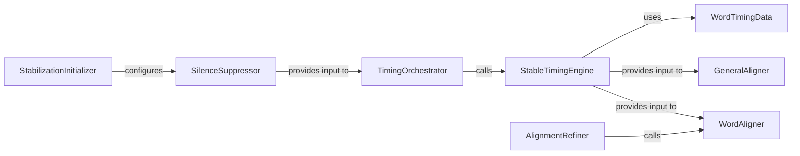

## Details

The `Timestamp & Alignment Refinement` subsystem focuses on enhancing the accuracy and stability of transcription timestamps. Its core functionality revolves around precise word-level timing, text-to-audio alignment, and the suppression of non-speech segments.

### TimingOrchestrator
Coordinates the overall process of generating precise word-level timestamps for transcribed audio segments, acting as the primary entry point for timing operations.

**Related Classes/Methods**:

- <a href="https://github.com/jianfch/stable-ts/blob/main/stable_whisper/timing.py" target="_blank" rel="noopener noreferrer">`TimingOrchestrator`</a>

### StableTimingEngine
Implements the core algorithm for determining stable and accurate word timings, often involving dynamic programming or similar alignment techniques.

**Related Classes/Methods**:

- <a href="https://github.com/jianfch/stable-ts/blob/main/stable_whisper/timing.py" target="_blank" rel="noopener noreferrer">`StableTimingEngine`</a>

### GeneralAligner
Handles the high-level setup and execution of text-to-audio alignment for entire segments, ensuring the transcribed text aligns correctly with the audio.

**Related Classes/Methods**:

- <a href="https://github.com/jianfch/stable-ts/blob/main/stable_whisper/alignment.py" target="_blank" rel="noopener noreferrer">`GeneralAligner`</a>

### WordAligner
Performs granular alignment at the individual word level, refining the start and end timestamps of each word within a segment.

**Related Classes/Methods**:

- <a href="https://github.com/jianfch/stable-ts/blob/main/stable_whisper/alignment.py" target="_blank" rel="noopener noreferrer">`WordAligner`</a>

### AlignmentRefiner
Improves the accuracy and quality of existing alignments, potentially by re-evaluating or adjusting segment and word boundaries based on various criteria.

**Related Classes/Methods**:

- <a href="https://github.com/jianfch/stable-ts/blob/main/stable_whisper/alignment.py" target="_blank" rel="noopener noreferrer">`AlignmentRefiner`</a>

### StabilizationInitializer
Configures and initializes various methods and parameters related to speech/non-speech prediction and overall timestamp stabilization. It sets up the environment for pre-processing.

**Related Classes/Methods**:

- <a href="https://github.com/jianfch/stable-ts/blob/main/stable_whisper/stabilization/__init__.py" target="_blank" rel="noopener noreferrer">`StabilizationInitializer`</a>

### SilenceSuppressor
Adjusts the transcription timestamps to effectively remove or account for identified silence segments, leading to more compact and accurate timings.

**Related Classes/Methods**:

- <a href="https://github.com/jianfch/stable-ts/blob/main/stable_whisper/stabilization/__init__.py" target="_blank" rel="noopener noreferrer">`SilenceSuppressor`</a>

### WordTimingData
Serves as a crucial data container for the precise timing information of individual words (e.g., start time, end time, word text).

**Related Classes/Methods**:

- <a href="https://github.com/jianfch/stable-ts/blob/main/stable_whisper/timing.py" target="_blank" rel="noopener noreferrer">`WordTimingData`</a>

### [FAQ](https://github.com/CodeBoarding/GeneratedOnBoardings/tree/main?tab=readme-ov-file#faq)