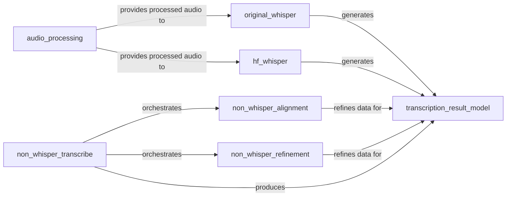

## Details

The stable-whisper transcription subsystem is designed around a modular pipeline, starting with audio_processing which prepares raw audio for transcription. This processed audio is then fed into either the original_whisper component for OpenAI's model or the hf_whisper component for Hugging Face's implementations. For scenarios requiring non-Whisper methods, the non_whisper_transcribe component orchestrates the workflow, delegating to non_whisper_alignment for precise timestamping and non_whisper_refinement for accuracy improvements. All transcription paths converge on the transcription_result_model, which standardizes and manages the final output, ensuring a consistent WhisperResult format across diverse transcription engines. This architecture promotes flexibility and extensibility, allowing for easy integration of new transcription models and post-processing techniques while maintaining a unified output structure.

### audio_processing
Responsible for handling and preparing audio data, ensuring it is in the correct format and state for subsequent transcription or alignment processes. This includes loading audio from various sources, resampling, and applying filters or denoisers.

**Related Classes/Methods**:

- <a href="https://github.com/jianfch/stable-ts/blob/main/stable_whisper/audio/utils.py" target="_blank" rel="noopener noreferrer">`stable_whisper.audio.AudioLoader`</a>
- <a href="https://github.com/jianfch/stable-ts/blob/main/stable_whisper/audio/utils.py#L63-L125" target="_blank" rel="noopener noreferrer">`stable_whisper.audio.utils.load_audio`:63-125</a>
- <a href="https://github.com/jianfch/stable-ts/blob/main/stable_whisper/audio/utils.py#L189-L214" target="_blank" rel="noopener noreferrer">`stable_whisper.audio.utils.audio_to_tensor_resample`:189-214</a>

### original_whisper
Executes the primary transcription logic using the OpenAI Whisper model, including language detection and segment processing to produce initial text and timestamps. It integrates audio processing and outputs structured transcription data.

**Related Classes/Methods**:

- <a href="https://github.com/jianfch/stable-ts/blob/main/stable_whisper/whisper_word_level/original_whisper.py#L27-L711" target="_blank" rel="noopener noreferrer">`stable_whisper.whisper_word_level.original_whisper.transcribe_stable`:27-711</a>

### hf_whisper
Provides an interface for transcription using Hugging Face's Whisper models (and other compatible Whisper backends), managing model loading and inference for these alternative Whisper implementations. It processes audio and generates transcription results.

**Related Classes/Methods**:

- <a href="https://github.com/jianfch/stable-ts/blob/main/stable_whisper/whisper_word_level/hf_whisper.py" target="_blank" rel="noopener noreferrer">`stable_whisper.whisper_word_level.hf_whisper.WhisperHF.transcribe`</a>

### non_whisper_transcribe
Orchestrates the entire transcription process when non-Whisper methods are employed. It acts as a high-level coordinator for the non-Whisper pipeline, delegating specific tasks like alignment and refinement.

**Related Classes/Methods**:

- <a href="https://github.com/jianfch/stable-ts/blob/main/stable_whisper/non_whisper/transcribe.py" target="_blank" rel="noopener noreferrer">`stable_whisper.non_whisper.transcribe_any`</a>

### non_whisper_alignment
Performs the crucial task of aligning transcribed text with the audio for non-Whisper methods, generating precise word-level timestamps.

**Related Classes/Methods**:

- <a href="https://github.com/jianfch/stable-ts/blob/main/stable_whisper/non_whisper/alignment.py#L245-L387" target="_blank" rel="noopener noreferrer">`stable_whisper.non_whisper.alignment.align`:245-387</a>

### non_whisper_refinement
Refines existing word-level timestamps obtained from non-Whisper transcriptions to enhance their accuracy and quality, ensuring high-fidelity output.

**Related Classes/Methods**:

- <a href="https://github.com/jianfch/stable-ts/blob/main/stable_whisper/non_whisper/refinement.py#L132-L197" target="_blank" rel="noopener noreferrer">`stable_whisper.non_whisper.refinement.refine`:132-197</a>

### transcription_result_model
Encapsulates and manages the structured transcription results, typically as WhisperResult objects, providing a consistent output format across different transcription methods. It serves as the central data model for all transcription outputs.

**Related Classes/Methods**:

- <a href="https://github.com/jianfch/stable-ts/blob/main/stable_whisper/result.py#L928-L3096" target="_blank" rel="noopener noreferrer">`stable_whisper.result.WhisperResult`:928-3096</a>
- <a href="https://github.com/jianfch/stable-ts/blob/main/stable_whisper/result.py" target="_blank" rel="noopener noreferrer">`stable_whisper.result.Segment`</a>
- <a href="https://github.com/jianfch/stable-ts/blob/main/stable_whisper/result.py#L74-L257" target="_blank" rel="noopener noreferrer">`stable_whisper.result.WordTiming`:74-257</a>

### [FAQ](https://github.com/CodeBoarding/GeneratedOnBoardings/tree/main?tab=readme-ov-file#faq)