```mermaid
graph LR
    stable_whisper_result_Result["stable_whisper.result.Result"]
    stable_whisper_result_regroup["stable_whisper.result.regroup"]
    stable_whisper_result_parse_regroup_algo["stable_whisper.result.parse_regroup_algo"]
    stable_whisper_result_split_methods["stable_whisper.result.split_methods"]
    stable_whisper_result_merge_methods["stable_whisper.result.merge_methods"]
    stable_whisper_result_Segment["stable_whisper.result.Segment"]
    stable_whisper_result_WordTiming["stable_whisper.result.WordTiming"]
    stable_whisper_result_to_dict["stable_whisper.result.to_dict"]
    stable_whisper_result_Result -- "composes" --> stable_whisper_result_Segment
    stable_whisper_result_Result -- "composes" --> stable_whisper_result_WordTiming
    stable_whisper_result_Result -- "provides data to" --> stable_whisper_result_to_dict
    stable_whisper_result_regroup -- "delegates to" --> stable_whisper_result_parse_regroup_algo
    stable_whisper_result_regroup -- "configures" --> stable_whisper_result_parse_regroup_algo
    stable_whisper_result_parse_regroup_algo -- "invokes methods from" --> stable_whisper_result_split_methods
    stable_whisper_result_parse_regroup_algo -- "orchestrates operations using" --> stable_whisper_result_merge_methods
    stable_whisper_result_split_methods -- "operates on" --> stable_whisper_result_Segment
    stable_whisper_result_split_methods -- "operates on" --> stable_whisper_result_WordTiming
    stable_whisper_result_merge_methods -- "operates on" --> stable_whisper_result_Segment
    stable_whisper_result_merge_methods -- "operates on" --> stable_whisper_result_WordTiming
    stable_whisper_result_Segment -- "composes" --> stable_whisper_result_WordTiming
```

## Details

The `Transcription Result Management` subsystem is primarily encapsulated within the `stable_whisper.result` package. It focuses on the post-processing, manipulation, and serialization of transcription results, embodying the "Text Post-processing Module" and "Output/Serialization Module" patterns.

### stable_whisper.result.Result
Serves as the primary data model for the entire transcription result, holding collections of Segment and WordTiming objects. It acts as a facade, providing a unified interface for all result manipulation and querying.

**Related Classes/Methods**:

- <a href="https://github.com/jianfch/stable-ts/blob/main/stable_whisper/result.py" target="_blank" rel="noopener noreferrer">`stable_whisper.result.Result`</a>

### stable_whisper.result.regroup
The high-level entry point for applying various post-processing algorithms (splitting, merging) to the transcription result. It orchestrates complex transformations based on user-defined parameters.

**Related Classes/Methods**:

- <a href="https://github.com/jianfch/stable-ts/blob/main/stable_whisper/result.py#L2887-L2972" target="_blank" rel="noopener noreferrer">`stable_whisper.result.regroup`:2887-2972</a>

### stable_whisper.result.parse_regroup_algo
Interprets and dispatches specific regrouping and manipulation algorithms (from split_methods and merge_methods) based on input parameters. This component acts as the execution engine for regroup, embodying the "Extension/Enhancement" pattern by allowing different algorithms to be plugged in.

**Related Classes/Methods**:

- <a href="https://github.com/jianfch/stable-ts/blob/main/stable_whisper/result.py#L2974-L3018" target="_blank" rel="noopener noreferrer">`stable_whisper.result.parse_regroup_algo`:2974-3018</a>

### stable_whisper.result.split_methods
A collection of methods (e.g., split_by_gap, split_by_punctuation, split_by_length) responsible for dividing existing segments based on various criteria. These are key extension points for customizing text refinement.

**Related Classes/Methods**:

- <a href="https://github.com/jianfch/stable-ts/blob/main/stable_whisper/result.py" target="_blank" rel="noopener noreferrer">`stable_whisper.result.split_methods`</a>

### stable_whisper.result.merge_methods
A collection of methods (e.g., merge_by_gap, merge_by_punctuation, merge_all_segments) responsible for combining segments based on different criteria. These also serve as crucial extension points for customizing text refinement.

**Related Classes/Methods**:

- <a href="https://github.com/jianfch/stable-ts/blob/main/stable_whisper/result.py" target="_blank" rel="noopener noreferrer">`stable_whisper.result.merge_methods`</a>

### stable_whisper.result.Segment
Represents a single segment of the transcription result, typically containing text and timing information, and a collection of WordTiming objects. It is a fundamental data structure within the Result object.

**Related Classes/Methods**:

- <a href="https://github.com/jianfch/stable-ts/blob/main/stable_whisper/result.py" target="_blank" rel="noopener noreferrer">`stable_whisper.result.Segment`</a>

### stable_whisper.result.WordTiming
Represents word-level timing information within a transcription segment, including start and end times for individual words. It is a granular data structure composed within Segment objects.

**Related Classes/Methods**:

- <a href="https://github.com/jianfch/stable-ts/blob/main/stable_whisper/result.py#L74-L257" target="_blank" rel="noopener noreferrer">`stable_whisper.result.WordTiming`:74-257</a>

### stable_whisper.result.to_dict
Converts the internal transcription result data (Result object) into a dictionary representation, facilitating serialization, external consumption, or integration with other systems. This is a standard "Output/Serialization Module" component for a library.

**Related Classes/Methods**:

- <a href="https://github.com/jianfch/stable-ts/blob/main/stable_whisper/result.py#L1393-L1400" target="_blank" rel="noopener noreferrer">`stable_whisper.result.to_dict`:1393-1400</a>

### [FAQ](https://github.com/CodeBoarding/GeneratedOnBoardings/tree/main?tab=readme-ov-file#faq)