```mermaid
graph LR
    CLI_Interface["CLI Interface"]
    Audio_Processing["Audio Processing"]
    Transcription_Engine["Transcription Engine"]
    Timestamp_Alignment_Refinement["Timestamp & Alignment Refinement"]
    Transcription_Result_Management["Transcription Result Management"]
    Output_Generation["Output Generation"]
    Configuration_Utilities["Configuration & Utilities"]
    CLI_Interface -- "initiates" --> Audio_Processing
    Audio_Processing -- "provides processed audio to" --> Transcription_Engine
    Transcription_Engine -- "outputs raw results to" --> Timestamp_Alignment_Refinement
    Timestamp_Alignment_Refinement -- "sends refined data to" --> Transcription_Result_Management
    Transcription_Result_Management -- "provides structured data to" --> Output_Generation
    Configuration_Utilities -- "supports" --> CLI_Interface
    Configuration_Utilities -- "supports" --> Audio_Processing
    Configuration_Utilities -- "supports" --> Transcription_Engine
    Configuration_Utilities -- "supports" --> Timestamp_Alignment_Refinement
    Configuration_Utilities -- "supports" --> Transcription_Result_Management
    Configuration_Utilities -- "supports" --> Output_Generation
    click CLI_Interface href "https://github.com/CodeBoarding/GeneratedOnBoardings/blob/main/stable-ts/CLI_Interface.md" "Details"
    click Audio_Processing href "https://github.com/CodeBoarding/GeneratedOnBoardings/blob/main/stable-ts/Audio_Processing.md" "Details"
    click Transcription_Engine href "https://github.com/CodeBoarding/GeneratedOnBoardings/blob/main/stable-ts/Transcription_Engine.md" "Details"
    click Timestamp_Alignment_Refinement href "https://github.com/CodeBoarding/GeneratedOnBoardings/blob/main/stable-ts/Timestamp_Alignment_Refinement.md" "Details"
    click Transcription_Result_Management href "https://github.com/CodeBoarding/GeneratedOnBoardings/blob/main/stable-ts/Transcription_Result_Management.md" "Details"
    click Output_Generation href "https://github.com/CodeBoarding/GeneratedOnBoardings/blob/main/stable-ts/Output_Generation.md" "Details"
```

## Details

The `stable-ts` library implements a robust, modular pipeline for advanced audio transcription and timestamp refinement. At its core, the `CLI Interface` orchestrates the entire workflow, guiding input through the `Audio Processing` module for preparation. The prepared audio then enters the `Transcription Engine`, which leverages various ASR models, including OpenAI Whisper and non-Whisper alternatives, to generate initial transcription data. This raw output is then meticulously refined by the `Timestamp & Alignment Refinement` component, ensuring high-accuracy word-level timestamps and text alignment. The `Transcription Result Management` module takes charge of post-processing these refined results, enabling flexible manipulation like regrouping and merging. Finally, the `Output Generation` module converts the comprehensive transcription data into diverse formats, catering to various user needs. Throughout this sophisticated process, a `Configuration & Utilities` layer provides essential parameters and helper functions, ensuring the library's high configurability and extensibility. This architecture emphasizes clear data flow, distinct component responsibilities, and modularity, making it ideal for both documentation and visual diagram representation.

### CLI Interface [[Expand]](./CLI_Interface.md)
The CLI serves as the entry point, parsing user commands and initiating the audio processing pipeline.

**Related Classes/Methods**:

- <a href="https://github.com/jianfch/stable-ts/blob/main/stable_whisper/whisper_word_level/cli.py" target="_blank" rel="noopener noreferrer">`stable_whisper.whisper_word_level.cli`</a>
- <a href="https://github.com/jianfch/stable-ts/blob/main/stable_whisper/__main__.py" target="_blank" rel="noopener noreferrer">`stable_whisper.__main__`</a>

### Audio Processing [[Expand]](./Audio_Processing.md)
Prepares the audio for transcription.

**Related Classes/Methods**:

- <a href="https://github.com/jianfch/stable-ts/blob/main/stable_whisper/audio/__init__.py" target="_blank" rel="noopener noreferrer">`stable_whisper.audio`</a>
- <a href="https://github.com/jianfch/stable-ts/blob/main/stable_whisper/audio/utils.py" target="_blank" rel="noopener noreferrer">`stable_whisper.audio.utils`</a>

### Transcription Engine [[Expand]](./Transcription_Engine.md)
Capable of utilizing various Whisper models or alternative non-Whisper methods.

**Related Classes/Methods**:

- <a href="https://github.com/jianfch/stable-ts/blob/main/stable_whisper/whisper_word_level/original_whisper.py" target="_blank" rel="noopener noreferrer">`stable_whisper.whisper_word_level.original_whisper`</a>
- <a href="https://github.com/jianfch/stable-ts/blob/main/stable_whisper/non_whisper/__init__.py" target="_blank" rel="noopener noreferrer">`stable_whisper.non_whisper`</a>

### Timestamp & Alignment Refinement [[Expand]](./Timestamp_Alignment_Refinement.md)
Stabilization and accuracy improvements for raw transcription output, including initial timestamps.

**Related Classes/Methods**:

- <a href="https://github.com/jianfch/stable-ts/blob/main/stable_whisper/stabilization/__init__.py" target="_blank" rel="noopener noreferrer">`stable_whisper.stabilization`</a>
- <a href="https://github.com/jianfch/stable-ts/blob/main/stable_whisper/timing.py" target="_blank" rel="noopener noreferrer">`stable_whisper.timing`</a>
- <a href="https://github.com/jianfch/stable-ts/blob/main/stable_whisper/alignment.py" target="_blank" rel="noopener noreferrer">`stable_whisper.alignment`</a>

### Transcription Result Management [[Expand]](./Transcription_Result_Management.md)
Handles post-processing operations like regrouping and merging.

**Related Classes/Methods**:

- <a href="https://github.com/jianfch/stable-ts/blob/main/stable_whisper/result.py" target="_blank" rel="noopener noreferrer">`stable_whisper.result`</a>

### Output Generation [[Expand]](./Output_Generation.md)
Formats the comprehensive transcription data into various user-specified outputs.

**Related Classes/Methods**:

- <a href="https://github.com/jianfch/stable-ts/blob/main/stable_whisper/text_output.py" target="_blank" rel="noopener noreferrer">`stable_whisper.text_output`</a>
- <a href="https://github.com/jianfch/stable-ts/blob/main/stable_whisper/video_output.py" target="_blank" rel="noopener noreferrer">`stable_whisper.video_output`</a>
- <a href="https://github.com/jianfch/stable-ts/blob/main/stable_whisper/audio/output.py" target="_blank" rel="noopener noreferrer">`stable_whisper.audio.output`</a>

### Configuration & Utilities
This cross-cutting component provides global configuration settings, default parameters, and general utility functions to all other modules.

**Related Classes/Methods**:

- <a href="https://github.com/jianfch/stable-ts/blob/main/stable_whisper/default.py" target="_blank" rel="noopener noreferrer">`stable_whisper.default`</a>
- <a href="https://github.com/jianfch/stable-ts/blob/main/stable_whisper/options.py" target="_blank" rel="noopener noreferrer">`stable_whisper.options`</a>
- <a href="https://github.com/jianfch/stable-ts/blob/main/stable_whisper/utils.py" target="_blank" rel="noopener noreferrer">`stable_whisper.utils`</a>

### [FAQ](https://github.com/CodeBoarding/GeneratedOnBoardings/tree/main?tab=readme-ov-file#faq)