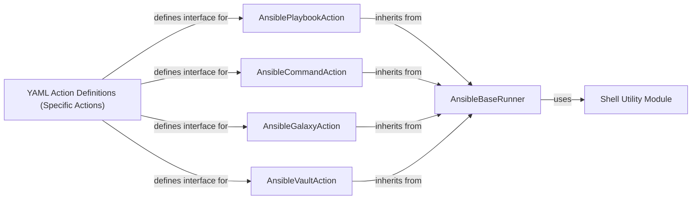

## Details

The "Specific Ansible Actions" component is a critical part of the StackStorm Ansible Integration Pack, serving as the direct interface between StackStorm's orchestration capabilities and Ansible's configuration management tools. This subsystem is designed with a clear separation of concerns, leveraging inheritance and the Adapter pattern to provide a robust and extensible set of actions. The core of this subsystem revolves around a base runner that handles common Ansible execution logic, which is then extended by individual action classes tailored for specific Ansible binaries.

### AnsibleBaseRunner
This is the foundational abstract component providing the common execution framework for all Ansible-related StackStorm Python actions. It encapsulates logic for setting up the execution environment (e.g., prepending virtual environment paths), parsing and transforming complex `extra_vars` arguments, dynamically constructing the Ansible command line, and executing the command via a subprocess. It acts as an Adapter for the underlying shell execution of Ansible commands.

**Related Classes/Methods**:

- `AnsibleBaseRunner` (1:1)

### AnsiblePlaybookAction
This component is a concrete StackStorm Python action specifically designed to execute Ansible playbooks. It extends `AnsibleBaseRunner`, inheriting its core execution logic, and primarily defines the `ansible-playbook` binary name and any specific argument replacement rules unique to playbook execution.

**Related Classes/Methods**:

- `AnsiblePlaybookAction` (1:1)

### AnsibleCommandAction
This component is a concrete StackStorm Python action responsible for executing arbitrary Ansible ad-hoc commands. Like `AnsiblePlaybookAction`, it extends `AnsibleBaseRunner` and specifies the `ansible` binary name along with any ad-hoc command-specific argument handling.

**Related Classes/Methods**:

- `AnsibleCommandAction` (1:1)

### AnsibleGalaxyAction
This component is a concrete StackStorm Python action dedicated to managing Ansible Galaxy operations (e.g., installing or removing roles and collections). It extends `AnsibleBaseRunner` and configures the `ansible-galaxy` binary and its unique argument replacement rules.

**Related Classes/Methods**:

- `AnsibleGalaxyAction` (1:1)

### AnsibleVaultAction
This component is a concrete StackStorm Python action for handling Ansible Vault operations, such as encrypting or decrypting sensitive files. It extends `AnsibleBaseRunner` and defines the `ansible-vault` binary and its specific argument handling.

**Related Classes/Methods**:

- `AnsibleVaultAction` (1:1)

### Shell Utility Module
This is a utility module that provides helper functions, particularly a decorator (`replace_args`), used by `AnsibleBaseRunner` to dynamically modify command-line arguments before execution. It abstracts common shell-related operations.

**Related Classes/Methods**:

- <a href="https://github.com/recursionpharma/stackstorm_pack_ansible/blob/trunk/actions/lib/shell.py#L1-L1" target="_blank" rel="noopener noreferrer">`shell` (1:1)</a>

### YAML Action Definitions (Specific Actions)
These YAML files serve as the public interface for the Python actions within StackStorm. Each file defines a specific action's metadata, including its name, description, and crucially, its input parameters (with types, defaults, and descriptions). They map the StackStorm action invocation to the underlying Python script.

**Related Classes/Methods**:

- `playbook.yaml` (1:1)
- `command.yaml` (1:1)
- `galaxy.install.yaml` (1:1)
- `galaxy.list.yaml` (1:1)
- `galaxy.remove.yaml` (1:1)
- `vault.decrypt.yaml` (1:1)
- `vault.encrypt.yaml` (1:1)

### [FAQ](https://github.com/CodeBoarding/GeneratedOnBoardings/tree/main?tab=readme-ov-file#faq)