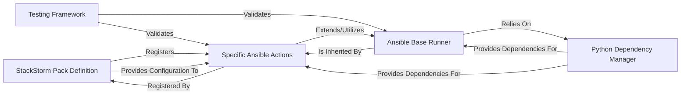

## Details

This StackStorm Integration Pack is designed to expose Ansible's capabilities as discrete, executable actions within the StackStorm automation platform. Its architecture emphasizes modularity, reusability, and clear separation of concerns, leveraging Python for core logic and YAML for StackStorm-specific definitions.

### StackStorm Pack Definition
This component serves as the primary configuration and registration point for the entire pack within StackStorm. It defines the pack's metadata and explicitly registers all available Ansible actions (e.g., playbook execution, Galaxy management, Vault operations, generic commands) through their respective YAML definitions. It orchestrates how StackStorm discovers and loads the pack's functionalities.

**Related Classes/Methods**:

- `pack.yaml` (1:1)
- `actions/playbook.yaml` (1:1)
- `actions/galaxy.install.yaml` (1:1)
- `actions/vault.decrypt.yaml` (1:1)
- `actions/command.yaml` (1:1)

### Ansible Base Runner [[Expand]](./Ansible_Base_Runner.md)
This is the foundational Python library that encapsulates the common logic for executing various Ansible commands. It handles critical tasks such as parsing input parameters, managing virtual environments to ensure correct Ansible execution, constructing command-line arguments, and invoking external shell commands via `subprocess.call`. It acts as the abstract base class from which all specific Ansible actions inherit their core execution capabilities.

**Related Classes/Methods**:

- <a href="https://github.com/recursionpharma/stackstorm_pack_ansible/blob/trunk/actions/lib/ansible_base.py#L1-L1" target="_blank" rel="noopener noreferrer">`actions/lib/ansible_base.py` (1:1)</a>
- <a href="https://github.com/recursionpharma/stackstorm_pack_ansible/blob/trunk/actions/lib/shell.py#L1-L1" target="_blank" rel="noopener noreferrer">`actions/lib/shell.py` (1:1)</a>

### Specific Ansible Actions [[Expand]](./Specific_Ansible_Actions.md)
This component represents the collection of individual StackStorm Python actions, each tailored to perform a distinct Ansible operation. These actions (e.g., `ansible_playbook.py`, `ansible_galaxy.py`, `ansible_vault.py`, `ansible.py`) extend the `Ansible Base Runner`, inheriting its core execution logic while defining specific argument handling and command-line construction rules for their respective Ansible tools. They are the direct interface between StackStorm and Ansible.

**Related Classes/Methods**:

- <a href="https://github.com/recursionpharma/stackstorm_pack_ansible/blob/trunk/actions/ansible_playbook.py#L1-L1" target="_blank" rel="noopener noreferrer">`actions/ansible_playbook.py` (1:1)</a>
- <a href="https://github.com/recursionpharma/stackstorm_pack_ansible/blob/trunk/actions/ansible_galaxy.py#L1-L1" target="_blank" rel="noopener noreferrer">`actions/ansible_galaxy.py` (1:1)</a>
- <a href="https://github.com/recursionpharma/stackstorm_pack_ansible/blob/trunk/actions/ansible_vault.py#L1-L1" target="_blank" rel="noopener noreferrer">`actions/ansible_vault.py` (1:1)</a>
- <a href="https://github.com/recursionpharma/stackstorm_pack_ansible/blob/trunk/actions/ansible.py#L1-L1" target="_blank" rel="noopener noreferrer">`actions/ansible.py` (1:1)</a>

### Python Dependency Manager
This component is responsible for specifying and managing all external Python libraries required for the pack's proper functioning. It ensures that the necessary dependencies (e.g., `pywinrm`, `netaddr`, `boto3`) are available and correctly installed within StackStorm's virtual environment, providing a consistent and reproducible execution context for all Python-based components.

**Related Classes/Methods**:

- `requirements.txt` (1:1)

### Testing Framework
This component comprises the unit and integration tests designed to validate the correctness and reliability of the pack's actions and shared libraries. It ensures that the `Ansible Base Runner` correctly constructs and executes Ansible commands, and that the `Specific Ansible Actions` behave as expected, providing confidence in the pack's overall functionality.

**Related Classes/Methods**:

- <a href="https://github.com/recursionpharma/stackstorm_pack_ansible/blob/trunk/tests/test_actions_lib_ansiblebaserunner.py#L1-L1" target="_blank" rel="noopener noreferrer">`tests/test_actions_lib_ansiblebaserunner.py` (1:1)</a>
- `tests/fixtures/example.txt` (1:1)

### [FAQ](https://github.com/CodeBoarding/GeneratedOnBoardings/tree/main?tab=readme-ov-file#faq)