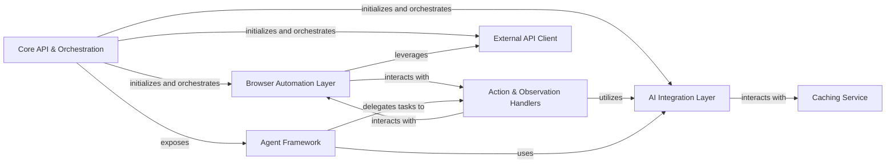

## Details

One paragraph explaining the functionality which is represented by this graph. What the main flow is and what is its purpose.

### Core API & Orchestration
Serves as the SDK's central entry point and public interface, responsible for initialization, configuration, and overall lifecycle management of browser and AI integrations.

**Related Classes/Methods**: _None_

### Browser Automation Layer
Provides the foundational capabilities for programmatic interaction with web pages, managing browser contexts, pages, and low-level DOM interactions using Playwright.

**Related Classes/Methods**: _None_

### AI Integration Layer
Manages communication with various Large Language Models, handling prompt generation, and performing AI-driven inference for actions, observations, and data extraction.

**Related Classes/Methods**: _None_

### Action & Observation Handlers
Encapsulates the core logic for processing and executing AI-driven `act`, `extract`, and `observe` commands, coordinating between the Browser Automation and AI Integration layers.

**Related Classes/Methods**: _None_

### Agent Framework
Offers a structured framework for building and executing sophisticated AI agents capable of performing complex, multi-step tasks by orchestrating browser interactions and LLM calls.

**Related Classes/Methods**: _None_

### Caching Service
Improves performance and reduces redundant API calls by caching responses from LLMs and intermediate action steps, ensuring efficient re-use of previously computed results.

**Related Classes/Methods**: _None_

### External API Client
Manages secure and efficient communication with external backend services (e.g., Browserbase) for remote browser execution and enhanced AI capabilities.

**Related Classes/Methods**: _None_

### [FAQ](https://github.com/CodeBoarding/GeneratedOnBoardings/tree/main?tab=readme-ov-file#faq)