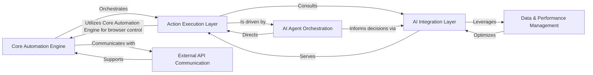

## Details

Updated architectural analysis of the Stagehand project based on feedback.

### Core Automation Engine
The central orchestrator, managing browser lifecycle, page interactions, and providing the primary SDK facade. It leverages low-level browser interaction capabilities.

**Related Classes/Methods**:

- <a href="https://github.com/browserbase/stagehand/blob/main/lib/index.ts" target="_blank" rel="noopener noreferrer">`lib.Stagehand.init`</a>
- <a href="https://github.com/browserbase/stagehand/blob/main/lib/index.ts" target="_blank" rel="noopener noreferrer">`lib.Stagehand.agent`</a>
- <a href="https://github.com/browserbase/stagehand/blob/main/lib/StagehandPage.ts" target="_blank" rel="noopener noreferrer">`lib.StagehandPage.init`</a>
- <a href="https://github.com/browserbase/stagehand/blob/main/lib/StagehandPage.ts" target="_blank" rel="noopener noreferrer">`lib.StagehandPage.act`</a>
- <a href="https://github.com/browserbase/stagehand/blob/main/lib/StagehandPage.ts" target="_blank" rel="noopener noreferrer">`lib.StagehandPage.extract`</a>
- <a href="https://github.com/browserbase/stagehand/blob/main/lib/StagehandPage.ts" target="_blank" rel="noopener noreferrer">`lib.StagehandPage.observe`</a>
- <a href="https://github.com/browserbase/stagehand/blob/main/lib/StagehandContext.ts" target="_blank" rel="noopener noreferrer">`lib.StagehandContext.init`</a>
- <a href="https://github.com/browserbase/stagehand/blob/main/lib/index.ts" target="_blank" rel="noopener noreferrer">`lib.index.getBrowser`</a>

### AI Integration Layer
Abstracts interactions with Large Language Models (LLMs), handling client selection, prompt engineering, inference, and response processing.

**Related Classes/Methods**:

- <a href="https://github.com/browserbase/stagehand/blob/main/lib/llm/LLMProvider.ts" target="_blank" rel="noopener noreferrer">`lib.llm.LLMProvider.getClient`</a>
- <a href="https://github.com/browserbase/stagehand/blob/main/lib/inference.ts" target="_blank" rel="noopener noreferrer">`lib.inference.extract`</a>
- <a href="https://github.com/browserbase/stagehand/blob/main/lib/inference.ts" target="_blank" rel="noopener noreferrer">`lib.inference.observe`</a>
- <a href="https://github.com/browserbase/stagehand/blob/main/lib/prompt.ts" target="_blank" rel="noopener noreferrer">`lib.prompt.buildActObservePrompt`</a>

### Action Execution Layer
Implements the specific logic for high-level user actions (`act`, `extract`, `observe`, `agent`), coordinating between the Core Automation Engine and the AI Integration Layer.

**Related Classes/Methods**:

- <a href="https://github.com/browserbase/stagehand/blob/main/lib/handlers/actHandler.ts" target="_blank" rel="noopener noreferrer">`lib.handlers.actHandler.actFromObserveResult`</a>
- <a href="https://github.com/browserbase/stagehand/blob/main/lib/handlers/extractHandler.ts" target="_blank" rel="noopener noreferrer">`lib.handlers.extractHandler.extract`</a>
- <a href="https://github.com/browserbase/stagehand/blob/main/lib/handlers/observeHandler.ts" target="_blank" rel="noopener noreferrer">`lib.handlers.observeHandler.observe`</a>
- <a href="https://github.com/browserbase/stagehand/blob/main/lib/handlers/agentHandler.ts" target="_blank" rel="noopener noreferrer">`lib.handlers.agentHandler.execute`</a>

### AI Agent Orchestration
Provides the foundational logic for AI-driven computer use agents, abstracting patterns for agent execution and state management.

**Related Classes/Methods**:

- <a href="https://github.com/browserbase/stagehand/blob/main/lib/agent/StagehandAgent.ts" target="_blank" rel="noopener noreferrer">`lib.agent.StagehandAgent.execute`</a>

### External API Communication
Manages communication with external backend services for remote browser execution or other API-driven features.

**Related Classes/Methods**:

- <a href="https://github.com/browserbase/stagehand/blob/main/lib/api.ts" target="_blank" rel="noopener noreferrer">`lib.api.StagehandAPI.init`</a>
- <a href="https://github.com/browserbase/stagehand/blob/main/lib/api.ts" target="_blank" rel="noopener noreferrer">`lib.api.StagehandAPI.agentExecute`</a>
- <a href="https://github.com/browserbase/stagehand/blob/main/lib/api.ts" target="_blank" rel="noopener noreferrer">`lib.api.StagehandAPI.end`</a>

### Data & Performance Management
Implements caching mechanisms for LLM responses and action steps, improving performance and reducing redundant calls.

**Related Classes/Methods**:

- <a href="https://github.com/browserbase/stagehand/blob/main/lib/cache/BaseCache.ts" target="_blank" rel="noopener noreferrer">`lib.cache.BaseCache.get`</a>
- <a href="https://github.com/browserbase/stagehand/blob/main/lib/cache/BaseCache.ts" target="_blank" rel="noopener noreferrer">`lib.cache.BaseCache.set`</a>

### [FAQ](https://github.com/CodeBoarding/GeneratedOnBoardings/tree/main?tab=readme-ov-file#faq)