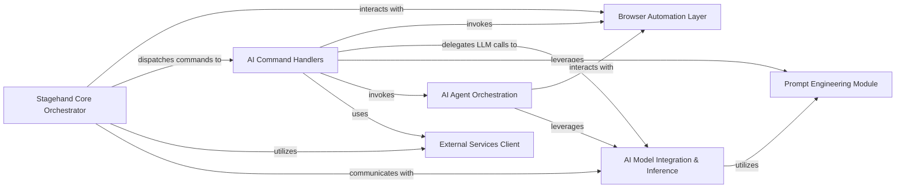

## Details

The feedback is valid and highlights an important distinction between qualified names of modules/classes/functions and direct file references. The previous analysis incorrectly used `QName:` for file paths. The `getFileStructure` tool confirmed the existence of these files, so the issue is purely in the representation. This feedback does not require architectural changes, as the identified components and their relationships remain accurate. The update will focus on correcting the "Related Classes/Methods" section to accurately reflect file references instead of implying them as qualified names of code entities.

### Stagehand Core Orchestrator
The central control unit and facade of the SDK. It initializes the browser environment, manages the lifecycle of web pages, and dispatches high-level commands (act, extract, observe, agent) to the appropriate handlers.

**Related Classes/Methods**:

- <a href="https://github.com/browserbase/stagehand/blob/main/lib/index.ts" target="_blank" rel="noopener noreferrer">`lib/index.ts`</a>
- <a href="https://github.com/browserbase/stagehand/blob/main/lib/StagehandContext.ts" target="_blank" rel="noopener noreferrer">`lib/StagehandContext.ts`</a>
- <a href="https://github.com/browserbase/stagehand/blob/main/lib/StagehandPage.ts" target="_blank" rel="noopener noreferrer">`lib/StagehandPage.ts`</a>

### Browser Automation Layer
Provides a robust abstraction over Playwright, enabling programmatic interaction with web pages (e.g., navigation, clicking, typing, scrolling) and capturing their state. This component also includes utilities for low-level DOM interaction and accessibility tree generation, crucial for providing structured input to AI models.

**Related Classes/Methods**:

- <a href="https://github.com/browserbase/stagehand/blob/main/lib/StagehandPage.ts" target="_blank" rel="noopener noreferrer">`lib/StagehandPage.ts`</a>
- <a href="https://github.com/browserbase/stagehand/blob/main/lib/dom/" target="_blank" rel="noopener noreferrer">`lib/dom/`</a>
- <a href="https://github.com/browserbase/stagehand/blob/main/lib/a11y/utils.ts" target="_blank" rel="noopener noreferrer">`lib/a11y/utils.ts`</a>

### AI Model Integration & Inference
A pluggable system for integrating with various Large Language Models (LLMs) (e.g., OpenAI, Anthropic, Google, Groq, Cerebras). It provides a unified interface for making chat completion requests and manages the specific LLM calls for `extract` and `observe` operations, including logging inference details.

**Related Classes/Methods**:

- <a href="https://github.com/browserbase/stagehand/blob/main/lib/llm/" target="_blank" rel="noopener noreferrer">`lib/llm/`</a>
- <a href="https://github.com/browserbase/stagehand/blob/main/lib/inference.ts" target="_blank" rel="noopener noreferrer">`lib/inference.ts`</a>
- <a href="https://github.com/browserbase/stagehand/blob/main/lib/inferenceLogUtils.ts" target="_blank" rel="noopener noreferrer">`lib/inferenceLogUtils.ts`</a>

### AI Command Handlers
Encapsulates the core business logic for processing specific AI-driven operations: `act` (performing actions), `extract` (extracting structured data), `observe` (observing page state), and `agent` (orchestrating multi-step tasks). These handlers coordinate LLM calls with browser interactions to fulfill high-level commands.

**Related Classes/Methods**:

- <a href="https://github.com/browserbase/stagehand/blob/main/lib/handlers/actHandler.ts" target="_blank" rel="noopener noreferrer">`lib/handlers/actHandler.ts`</a>
- <a href="https://github.com/browserbase/stagehand/blob/main/lib/handlers/extractHandler.ts" target="_blank" rel="noopener noreferrer">`lib/handlers/extractHandler.ts`</a>
- <a href="https://github.com/browserbase/stagehand/blob/main/lib/handlers/observeHandler.ts" target="_blank" rel="noopener noreferrer">`lib/handlers/observeHandler.ts`</a>
- <a href="https://github.com/browserbase/stagehand/blob/main/lib/handlers/agentHandler.ts" target="_blank" rel="noopener noreferrer">`lib/handlers/agentHandler.ts`</a>
- <a href="https://github.com/browserbase/stagehand/blob/main/lib/handlers/operatorHandler.ts" target="_blank" rel="noopener noreferrer">`lib/handlers/operatorHandler.ts`</a>
- <a href="https://github.com/browserbase/stagehand/blob/main/lib/handlers/handlerUtils/actHandlerUtils.ts" target="_blank" rel="noopener noreferrer">`lib/handlers/handlerUtils/actHandlerUtils.ts`</a>

### Prompt Engineering Module
Dedicated to constructing and formatting the prompts sent to LLMs. This includes generating system prompts, user messages, and tool definitions, ensuring LLMs receive well-structured and effective input for optimal performance across various tasks.

**Related Classes/Methods**:

- <a href="https://github.com/browserbase/stagehand/blob/main/lib/prompt.ts" target="_blank" rel="noopener noreferrer">`lib/prompt.ts`</a>

### AI Agent Orchestration
Manages the lifecycle and execution of high-level AI agents that can perform multi-step tasks. These agents iteratively observe the page, decide on the next action, and execute a sequence of operations to achieve complex goals. It supports different agent types (e.g., Anthropic CUA, OpenAI CUA).

**Related Classes/Methods**:

- <a href="https://github.com/browserbase/stagehand/blob/main/lib/agent/" target="_blank" rel="noopener noreferrer">`lib/agent/`</a>

### External Services Client
Handles secure and abstracted communication with external Stagehand API services, such as Browserbase. It manages HTTP request details, API keys, and session IDs, providing a clean interface for interacting with remote services.

**Related Classes/Methods**:

- <a href="https://github.com/browserbase/stagehand/blob/main/lib/api.ts" target="_blank" rel="noopener noreferrer">`lib/api.ts`</a>

### [FAQ](https://github.com/CodeBoarding/GeneratedOnBoardings/tree/main?tab=readme-ov-file#faq)