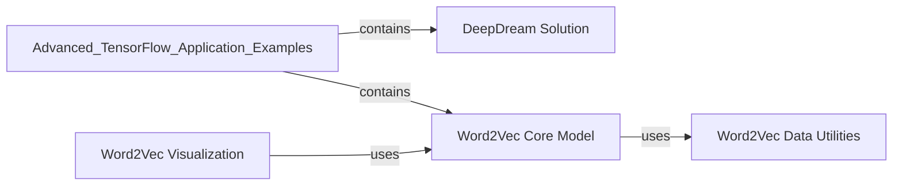

## Component Details

The `Advanced TensorFlow Application Examples` component serves as a showcase for sophisticated TensorFlow applications, specifically focusing on the DeepDream algorithm and various aspects of the Word2Vec model. This component is fundamental because it demonstrates advanced techniques beyond basic TensorFlow operations, providing practical examples of neural network visualization and natural language processing.

### DeepDream Solution
This component implements the DeepDream algorithm, which visualizes patterns learned by a convolutional neural network by iteratively enhancing activations in specific layers. It uses a pre-trained Inception model to generate psychedelic-like images, demonstrating neural network introspection and image synthesis.

**Related Classes/Methods**:

- <a href="https://github.com/chiphuyen/stanford-tensorflow-tutorials/blob/master/2017/examples/deepdream/deepdream_solution.py#L1-L1" target="_blank" rel="noopener noreferrer">`deepdream_solution` (1:1)</a>

### Word2Vec Core Model
This component contains the core TensorFlow implementation of the Word2Vec model, specifically the skip-gram architecture with Negative Sampling (NCE loss). It defines the neural network structure for learning dense vector representations (embeddings) of words from a large text corpus.

**Related Classes/Methods**:

- <a href="https://github.com/chiphuyen/stanford-tensorflow-tutorials/blob/master/examples/04_word2vec.py#L1-L1" target="_blank" rel="noopener noreferrer">`04_word2vec` (1:1)</a>

### Word2Vec Data Utilities
This component provides essential utility functions for preprocessing text data into a format suitable for the Word2Vec model. It handles tasks such as building a vocabulary, converting words to numerical IDs, and generating batches of training data (center words and context words) for the skip-gram model.

**Related Classes/Methods**:

- <a href="https://github.com/chiphuyen/stanford-tensorflow-tutorials/blob/master/examples/word2vec_utils.py#L1-L1" target="_blank" rel="noopener noreferrer">`word2vec_utils` (1:1)</a>

### Word2Vec Visualization
This component is responsible for visualizing the learned word embeddings from the Word2Vec model. It typically uses dimensionality reduction techniques like t-SNE to project high-dimensional word vectors into a 2D or 3D space, allowing for a visual inspection of semantic relationships between words.

**Related Classes/Methods**:

- <a href="https://github.com/chiphuyen/stanford-tensorflow-tutorials/blob/master/2017/examples/04_word2vec_visualize.py#L1-L1" target="_blank" rel="noopener noreferrer">`04_word2vec_visualize` (1:1)</a>

### [FAQ](https://github.com/CodeBoarding/GeneratedOnBoardings/tree/main?tab=readme-ov-file#faq)