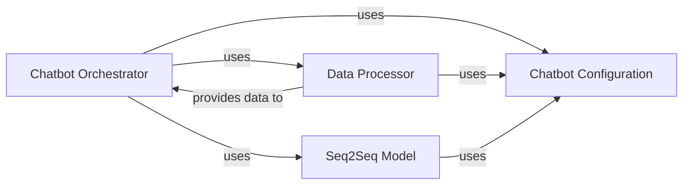

## Component Details

This comprehensive component encapsulates the entire neural chatbot system, handling data preparation, defining the sequence-to-sequence model architecture with attention, managing training and evaluation, and facilitating interactive chat. It represents a complete, self-contained deep learning application.

### Chatbot Orchestrator
This component serves as the main entry point and control hub for the entire chatbot application. It orchestrates the training, evaluation, and interactive chat processes by integrating functionalities from the data processing, model, and configuration components. It manages the overall flow, including session management, checkpointing, and user interaction.

**Related Classes/Methods**:

- <a href="https://github.com/chiphuyen/stanford-tensorflow-tutorials/blob/master/2017/assignments/chatbot/chatbot.py#L1-L1" target="_blank" rel="noopener noreferrer">`assignments.chatbot.chatbot` (1:1)</a>

### Chatbot Configuration
This component is responsible for defining and managing all static and dynamic parameters required by the chatbot application. This includes hyperparameters for the model, paths to datasets, vocabulary settings, training parameters (e.g., learning rate, batch size), and other operational settings. It centralizes configuration, making the application flexible and easy to tune.

**Related Classes/Methods**:

- <a href="https://github.com/chiphuyen/stanford-tensorflow-tutorials/blob/master/2017/assignments/chatbot/config.py#L1-L1" target="_blank" rel="noopener noreferrer">`assignments.chatbot.config` (1:1)</a>

### Data Processor
This component handles all aspects of data preparation for the chatbot. Its responsibilities include loading raw text data, performing tokenization, building and managing the vocabulary (mapping words to IDs), converting text sequences into numerical representations, and generating training and evaluation batches. It ensures data is in the correct format for the neural network.

**Related Classes/Methods**:

- <a href="https://github.com/chiphuyen/stanford-tensorflow-tutorials/blob/master/2017/assignments/chatbot/data.py#L1-L1" target="_blank" rel="noopener noreferrer">`assignments.chatbot.data` (1:1)</a>

### Seq2Seq Model
This component defines the core neural network architecture of the chatbot, which is a sequence-to-sequence model with an attention mechanism. It encapsulates the encoder and decoder components, manages the forward pass computation, calculates the loss during training, and handles model saving and loading. It is the intelligence core of the chatbot.

**Related Classes/Methods**:

- <a href="https://github.com/chiphuyen/stanford-tensorflow-tutorials/blob/master/2017/assignments/chatbot/model.py#L1-L1" target="_blank" rel="noopener noreferrer">`assignments.chatbot.model` (1:1)</a>

### [FAQ](https://github.com/CodeBoarding/GeneratedOnBoardings/tree/main?tab=readme-ov-file#faq)