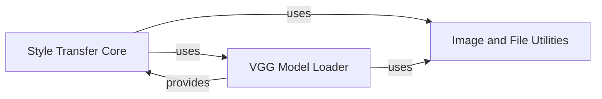

## Component Details

The Neural Style Transfer System is designed to generate new images by combining the content of one image with the artistic style of another. This system is modularized into three core components, each with distinct responsibilities, working together to achieve the style transfer effect.

### Style Transfer Core
This is the central orchestrator of the neural style transfer process. It defines the overall training loop, hyper-parameters, and the core loss functions (content and style loss). It manages the TensorFlow session, initializes variables, runs the optimization steps, and handles the output of generated images.

**Related Classes/Methods**:

- <a href="https://github.com/chiphuyen/stanford-tensorflow-tutorials/blob/master/assignments/02_style_transfer/style_transfer.py#L1-L10000" target="_blank" rel="noopener noreferrer">`assignments.02_style_transfer.style_transfer` (1:10000)</a>

### VGG Model Loader
This component is dedicated to handling the pre-trained VGG-19 convolutional neural network, which is fundamental for extracting content and style features. It manages the download of the VGG weights, loads them, and constructs the VGG network within the TensorFlow graph, making its intermediate layer outputs accessible.

**Related Classes/Methods**:

- <a href="https://github.com/chiphuyen/stanford-tensorflow-tutorials/blob/master/assignments/02_style_transfer/load_vgg.py#L1-L10000" target="_blank" rel="noopener noreferrer">`assignments.02_style_transfer.load_vgg` (1:10000)</a>

### Image and File Utilities
This component provides a collection of general utility functions essential for supporting the neural style transfer process. Its functionalities primarily revolve around file handling (downloading, directory creation) and image manipulation (resizing, noise generation, saving).

**Related Classes/Methods**:

- <a href="https://github.com/chiphuyen/stanford-tensorflow-tutorials/blob/master/assignments/02_style_transfer/utils.py#L1-L10000" target="_blank" rel="noopener noreferrer">`assignments.02_style_transfer.utils` (1:10000)</a>

### [FAQ](https://github.com/CodeBoarding/GeneratedOnBoardings/tree/main?tab=readme-ov-file#faq)