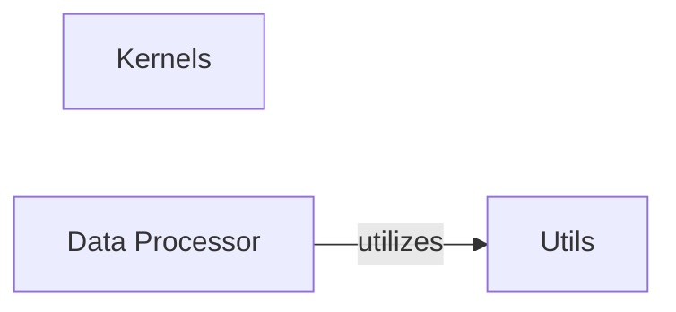

## Component Details

This section provides a detailed overview of the `Shared Project Utilities` component, which serves as a central hub for common helper functions and resources across various deep learning examples within the project. It encompasses general data loading mechanisms, basic data preprocessing routines, and definitions for convolutional kernels used in image processing.

### Utils
This component provides general-purpose utility functions that are broadly applicable across the project. Key functionalities include `huber_loss` (a robust loss function commonly used in regression tasks to handle outliers) and `make_dir` (a helper function for safely creating directories if they do not already exist). These functions are designed to be reusable and to prevent code duplication.

**Related Classes/Methods**:

- `huber_loss` (0:0)
- `make_dir` (0:0)

### Kernels
This component is dedicated to defining various convolutional kernels as TensorFlow constants. These kernels, such as blur, sharpen, edge detection, Sobel, and emboss filters, are fundamental for performing image processing operations. They are essential building blocks for convolutional neural networks (CNNs) and other image-based deep learning models.

**Related Classes/Methods**:

- `blur` (0:0)
- `sharpen` (0:0)
- `edge_detection` (0:0)
- `Sobel` (0:0)
- `emboss` (0:0)

### Data Processor
This module is responsible for handling the entire data pipeline for text-based datasets. Its functionalities include downloading raw data (e.g., `text8.zip`), reading and processing the data, building a vocabulary, and generating batches for training or evaluation. It encapsulates critical data preprocessing steps required by many deep learning models, ensuring data consistency and readiness.

**Related Classes/Methods**:

- `download_raw_data` (0:0)
- `read_and_process_data` (0:0)
- `build_vocabulary` (0:0)
- `generate_batches` (0:0)

### [FAQ](https://github.com/CodeBoarding/GeneratedOnBoardings/tree/main?tab=readme-ov-file#faq)