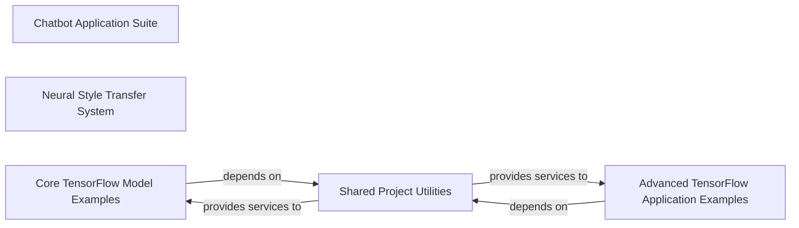

## Component Details

This analysis synthesizes information from the Control Flow Graph (CFG) and Source Analysis to provide a high-level data flow overview of the `stanford-tensorflow-tutorials` project. The project is structured as a collection of distinct deep learning tutorials and examples.

### Chatbot Application Suite
This comprehensive component encapsulates the entire neural chatbot system. It handles data preparation (loading, tokenization, vocabulary building, batching), defines the sequence-to-sequence model architecture with attention, manages training (optimization, checkpointing, evaluation), and facilitates interactive chat. It represents a complete, self-contained deep learning application.

**Related Classes/Methods**:

- <a href="https://github.com/chiphuyen/stanford-tensorflow-tutorials/blob/master/2017/assignments/chatbot/chatbot.py#L1-L1" target="_blank" rel="noopener noreferrer">`assignments.chatbot.chatbot` (1:1)</a>
- <a href="https://github.com/chiphuyen/stanford-tensorflow-tutorials/blob/master/2017/assignments/chatbot/config.py#L1-L1" target="_blank" rel="noopener noreferrer">`assignments.chatbot.config` (1:1)</a>
- <a href="https://github.com/chiphuyen/stanford-tensorflow-tutorials/blob/master/2017/assignments/chatbot/data.py#L1-L1" target="_blank" rel="noopener noreferrer">`assignments.chatbot.data` (1:1)</a>
- <a href="https://github.com/chiphuyen/stanford-tensorflow-tutorials/blob/master/2017/assignments/chatbot/model.py#L1-L1" target="_blank" rel="noopener noreferrer">`assignments.chatbot.model` (1:1)</a>

### Neural Style Transfer System
Implements the neural style transfer algorithm, which generates a new image by combining the content of one image with the artistic style of another. It involves loading pre-trained VGG networks, extracting feature representations, and optimizing an image to match desired content and style features. This is another complete, distinct deep learning application.

**Related Classes/Methods**:

- <a href="https://github.com/chiphuyen/stanford-tensorflow-tutorials/blob/master/assignments/02_style_transfer/style_transfer.py#L1-L1" target="_blank" rel="noopener noreferrer">`assignments.02_style_transfer.style_transfer` (1:1)</a>
- <a href="https://github.com/chiphuyen/stanford-tensorflow-tutorials/blob/master/assignments/02_style_transfer/load_vgg.py#L1-L1" target="_blank" rel="noopener noreferrer">`assignments.02_style_transfer.load_vgg` (1:1)</a>
- <a href="https://github.com/chiphuyen/stanford-tensorflow-tutorials/blob/master/assignments/02_style_transfer/utils.py#L1-L1" target="_blank" rel="noopener noreferrer">`assignments.02_style_transfer.utils` (1:1)</a>

### Core TensorFlow Model Examples
This component groups several fundamental TensorFlow tutorial examples that introduce core machine learning models and concepts. It includes implementations of linear regression, autoencoders for unsupervised learning, convolutional neural networks (CNNs) for image classification (MNIST), and character-level recurrent neural networks (RNNs) for sequence modeling.

**Related Classes/Methods**:

- <a href="https://github.com/chiphuyen/stanford-tensorflow-tutorials/blob/master/2017/examples/autoencoder/autoencoder.py#L28-L38" target="_blank" rel="noopener noreferrer">`examples.autoencoder.autoencoder` (28:38)</a>
- <a href="https://github.com/chiphuyen/stanford-tensorflow-tutorials/blob/master/2017/examples/autoencoder/train.py#L1-L1" target="_blank" rel="noopener noreferrer">`examples.autoencoder.train` (1:1)</a>
- <a href="https://github.com/chiphuyen/stanford-tensorflow-tutorials/blob/master/2017/examples/autoencoder/utils.py#L1-L1" target="_blank" rel="noopener noreferrer">`examples.autoencoder.utils` (1:1)</a>
- <a href="https://github.com/chiphuyen/stanford-tensorflow-tutorials/blob/master/examples/03_linreg_starter.py#L1-L1" target="_blank" rel="noopener noreferrer">`examples.03_linreg_starter` (1:1)</a>
- <a href="https://github.com/chiphuyen/stanford-tensorflow-tutorials/blob/master/2017/examples/07_convnet_mnist.py#L1-L1" target="_blank" rel="noopener noreferrer">`examples.07_convnet_mnist` (1:1)</a>
- <a href="https://github.com/chiphuyen/stanford-tensorflow-tutorials/blob/master/examples/11_char_rnn.py#L1-L1" target="_blank" rel="noopener noreferrer">`examples.11_char_rnn` (1:1)</a>

### Advanced TensorFlow Application Examples
This component covers more specialized and advanced TensorFlow applications. It includes the DeepDream algorithm for visualizing neural network patterns and utilities for the Word2Vec model, which focuses on learning dense vector representations of words for natural language processing.

**Related Classes/Methods**:

- <a href="https://github.com/chiphuyen/stanford-tensorflow-tutorials/blob/master/2017/examples/deepdream/deepdream_solution.py#L1-L1" target="_blank" rel="noopener noreferrer">`examples.deepdream.deepdream_solution` (1:1)</a>
- <a href="https://github.com/chiphuyen/stanford-tensorflow-tutorials/blob/master/examples/word2vec_utils.py#L1-L1" target="_blank" rel="noopener noreferrer">`examples.word2vec_utils` (1:1)</a>

### Shared Project Utilities
This central utility component provides common helper functions and resources utilized across various deep learning examples within the project. This includes general data loading mechanisms, basic data preprocessing routines, and definitions for various convolutional kernels used in image processing.

**Related Classes/Methods**:

- <a href="https://github.com/chiphuyen/stanford-tensorflow-tutorials/blob/master/2017/examples/utils.py#L1-L1" target="_blank" rel="noopener noreferrer">`examples.utils` (1:1)</a>
- <a href="https://github.com/chiphuyen/stanford-tensorflow-tutorials/blob/master/2017/examples/kernels.py#L1-L1" target="_blank" rel="noopener noreferrer">`examples.kernels` (1:1)</a>

### [FAQ](https://github.com/CodeBoarding/GeneratedOnBoardings/tree/main?tab=readme-ov-file#faq)