```mermaid
graph LR
    SVD_Source_Management["SVD Source Management"]
    SVD_Patching_Engine["SVD Patching Engine"]
    SVD_Transformation_Processing_Tools["SVD Transformation/Processing Tools"]
    Code_Generation_Core_svd2rust_["Code Generation Core (svd2rust)"]
    Generated_Peripheral_Access_Crates_PACs_["Generated Peripheral Access Crates (PACs)"]
    PAC_Crate_Orchestrator["PAC Crate Orchestrator"]
    Configuration_Metadata_Management["Configuration & Metadata Management"]
    SVD_Source_Management -- "provides raw SVDs to" --> SVD_Patching_Engine
    SVD_Patching_Engine -- "applies patches to" --> SVD_Source_Management
    SVD_Patching_Engine -- "outputs patched SVDs to" --> SVD_Transformation_Processing_Tools
    SVD_Transformation_Processing_Tools -- "consumes patched SVDs from" --> SVD_Patching_Engine
    SVD_Transformation_Processing_Tools -- "provides processed SVDs to" --> Code_Generation_Core_svd2rust_
    Code_Generation_Core_svd2rust_ -- "consumes processed SVDs from" --> SVD_Transformation_Processing_Tools
    Code_Generation_Core_svd2rust_ -- "produces" --> Generated_Peripheral_Access_Crates_PACs_
    PAC_Crate_Orchestrator -- "orchestrates" --> SVD_Patching_Engine
    PAC_Crate_Orchestrator -- "orchestrates" --> SVD_Transformation_Processing_Tools
    PAC_Crate_Orchestrator -- "orchestrates" --> Code_Generation_Core_svd2rust_
    PAC_Crate_Orchestrator -- "reads configuration from" --> Configuration_Metadata_Management
    Configuration_Metadata_Management -- "defines patches for" --> SVD_Patching_Engine
    PAC_Crate_Orchestrator -- "manages" --> Generated_Peripheral_Access_Crates_PACs_
    click Code_Generation_Core_svd2rust_ href "https://github.com/CodeBoarding/GeneratedOnBoardings/blob/main/stm32-rs/Code_Generation_Core_svd2rust_.md" "Details"
```

## Details

The `stm32-rs` project implements an automated pipeline for generating Rust Peripheral Access Crates (PACs) from System View Description (SVD) files. This architecture is centered around the `PAC Crate Orchestrator`, which coordinates the entire process. The workflow begins with `SVD Source Management` providing raw SVD files, which are then processed by the `SVD Patching Engine` to apply device-specific corrections and enhancements. Subsequently, `SVD Transformation/Processing Tools` prepare the SVD data for the `Code Generation Core (svd2rust)`, an external tool responsible for generating the Rust PAC code. All operational parameters, device lists, and patch definitions are managed by the `Configuration & Metadata Management` component. The final output consists of `Generated Peripheral Access Crates (PACs)`, which offer a high-level, type-safe interface for microcontroller peripheral interaction.

### SVD Source Management
Manages the collection, storage, and initial access of raw System View Description (SVD) XML files, serving as the primary input for the entire PAC generation pipeline.

**Related Classes/Methods**:

- <a href="https://github.com/stm32-rs/stm32-rs/blob/master/devices/" target="_blank" rel="noopener noreferrer">`devices/`</a>

### SVD Patching Engine
Applies device-specific patches (defined in YAML files) to the raw SVD files, correcting or enhancing the peripheral descriptions before code generation. This ensures accuracy and completeness of the SVD data.

**Related Classes/Methods**:

### SVD Transformation/Processing Tools
Performs pre-processing and validation on SVD files after patching, preparing them for consumption by the code generation core. This might involve tasks like flattening, validation, or specific data transformations using tools like `svdtools`.

**Related Classes/Methods**: _None_

### Code Generation Core (svd2rust) [[Expand]](./Code_Generation_Core_svd2rust_.md)
The external, primary tool responsible for consuming processed SVD files and generating the actual Rust Peripheral Access Crate (PAC) code. It translates the SVD descriptions into Rust modules, structs, and register definitions.

**Related Classes/Methods**: _None_

### Generated Peripheral Access Crates (PACs)
The final output artifacts of the code generation pipeline. These are Rust crates containing the auto-generated code that provides a safe and idiomatic interface for interacting with a specific microcontroller's peripherals.

**Related Classes/Methods**:

### PAC Crate Orchestrator
Orchestrates the entire PAC generation workflow. It manages the sequence of operations, including invoking SVD processing tools, the `svd2rust` code generator, and organizing the generated PACs. It acts as the central control flow for the pipeline.

**Related Classes/Methods**:

- <a href="https://github.com/stm32-rs/stm32-rs/blob/master/scripts/makecrates.py" target="_blank" rel="noopener noreferrer">`scripts.makecrates`</a>

### Configuration & Metadata Management
Manages all configuration files, metadata (e.g., device lists, patch definitions, build settings), and templates required by the various stages of the SVD processing and PAC generation pipeline.

**Related Classes/Methods**:

- <a href="https://github.com/stm32-rs/stm32-rs/blob/master/stm32_part_table.yaml" target="_blank" rel="noopener noreferrer">`stm32_part_table.yaml`</a>

### [FAQ](https://github.com/CodeBoarding/GeneratedOnBoardings/tree/main?tab=readme-ov-file#faq)