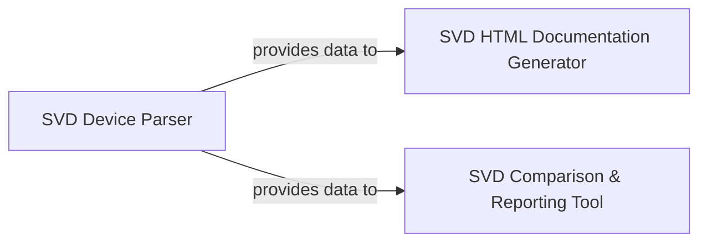

## Details

The system is composed of three main architectural components: the SVD HTML Documentation Generator, the SVD Comparison & Reporting Tool, and the SVD Device Parser. The SVD Device Parser acts as a foundational utility, responsible for extracting core device and interrupt information from SVD files. Both the SVD HTML Documentation Generator and the SVD Comparison & Reporting Tool consume data provided by the SVD Device Parser. The SVD HTML Documentation Generator transforms this parsed SVD data into human-readable HTML documentation, while the SVD Comparison & Reporting Tool leverages the parsed data from two SVD files to identify and report discrepancies in an HTML format. This architecture promotes reusability of the SVD parsing logic and clearly delineates responsibilities for documentation and comparison functionalities.

### SVD HTML Documentation Generator
This component is responsible for parsing a single SVD (System View Description) file and transforming its contents into human-readable HTML documentation. It focuses on presenting the device's peripherals, registers, and fields in a structured, browsable format. This component acts as a data transformation stage, converting SVD XML data into a structured HTML output.

**Related Classes/Methods**:

- <a href="https://github.com/stm32-rs/stm32-rs/blob/master/scripts/makehtml.py#L303-L306" target="_blank" rel="noopener noreferrer">`process_svd`:303-306</a>
- <a href="https://github.com/stm32-rs/stm32-rs/blob/master/scripts/makehtml.py#L156-L251" target="_blank" rel="noopener noreferrer">`parse_register`:156-251</a>

### SVD Comparison & Reporting Tool
This component provides analytical capabilities by comparing two SVD files, typically representing different versions or configurations of a device. It identifies and highlights discrepancies between the two SVDs and generates an HTML report that visually presents these differences, aiding in change tracking and verification.

**Related Classes/Methods**:

- <a href="https://github.com/stm32-rs/stm32-rs/blob/master/scripts/interrupts.py#L22-L42" target="_blank" rel="noopener noreferrer">`main`:22-42</a>
- <a href="https://github.com/stm32-rs/stm32-rs/blob/master/scripts/htmlcomparesvd.py#L21-L48" target="_blank" rel="noopener noreferrer">`parse`:21-48</a>
- <a href="https://github.com/stm32-rs/stm32-rs/blob/master/scripts/htmlcomparesvd.py#L187-L207" target="_blank" rel="noopener noreferrer">`html_tables`:187-207</a>

### SVD Device Parser
This component is a shared utility responsible for parsing SVD files to extract device-level information, specifically interrupt data. It provides a standardized way to access core device details from SVD files for other components.

**Related Classes/Methods**:

- <a href="https://github.com/stm32-rs/stm32-rs/blob/master/scripts/interrupts.py#L6-L19" target="_blank" rel="noopener noreferrer">`parse_device`:6-19</a>

### [FAQ](https://github.com/CodeBoarding/GeneratedOnBoardings/tree/main?tab=readme-ov-file#faq)