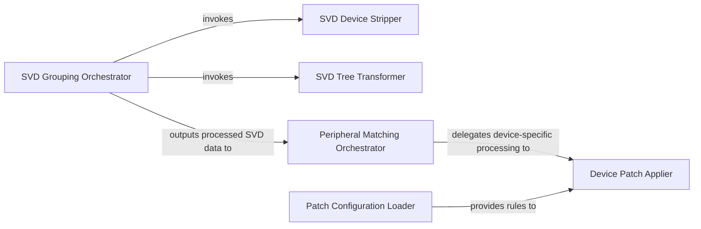

## Details

The `SVD Source & Patch Management` subsystem is responsible for the initial ingestion, pre-processing, and patching of raw SVD (System View Description) files. It encompasses the functionalities defined within `scripts/group.py` and `scripts/matchperipherals.py`, acting as the foundational stage in the SVD data transformation pipeline.

### SVD Grouping Orchestrator
Serves as the primary entry point for the initial SVD data preparation workflow, orchestrating fundamental cleaning and organization operations.

**Related Classes/Methods**:

- <a href="https://github.com/stm32-rs/stm32-rs/blob/master/scripts/group.py#L20-L137" target="_blank" rel="noopener noreferrer">`scripts.group.main`:20-137</a>

### SVD Device Stripper
Filters and refines raw SVD data by removing irrelevant or redundant device information, ensuring data standardization.

**Related Classes/Methods**:

- <a href="https://github.com/stm32-rs/stm32-rs/blob/master/scripts/group.py#L123-L131" target="_blank" rel="noopener noreferrer">`scripts.group.strip_devices`:123-131</a>

### SVD Tree Transformer
Transforms the SVD data into a hierarchical, tree-like structure, optimizing it for subsequent processing stages.

**Related Classes/Methods**:

- <a href="https://github.com/stm32-rs/stm32-rs/blob/master/scripts/group.py#L91-L111" target="_blank" rel="noopener noreferrer">`scripts.group.treeify`:91-111</a>

### Peripheral Matching Orchestrator
Initiates and manages the peripheral matching and patching process, applying configuration-driven rules to SVD data.

**Related Classes/Methods**:

- <a href="https://github.com/stm32-rs/stm32-rs/blob/master/scripts/matchperipherals.py#L74-L100" target="_blank" rel="noopener noreferrer">`scripts.matchperipherals.main`:74-100</a>

### Patch Configuration Loader
Reads and parses YAML configuration files that contain the rules, definitions, and patches necessary for peripheral matching and SVD data correction.

**Related Classes/Methods**:

- <a href="https://github.com/stm32-rs/stm32-rs/blob/master/scripts/matchperipherals.py#L21-L38" target="_blank" rel="noopener noreferrer">`scripts.matchperipherals.process_yamlfile`:21-38</a>

### Device Patch Applier
Processes individual device SVD data, applying specific matching and patching logic based on the rules retrieved from YAML configurations.

**Related Classes/Methods**:

- <a href="https://github.com/stm32-rs/stm32-rs/blob/master/scripts/matchperipherals.py#L41-L71" target="_blank" rel="noopener noreferrer">`scripts.matchperipherals.process_device`:41-71</a>

### [FAQ](https://github.com/CodeBoarding/GeneratedOnBoardings/tree/main?tab=readme-ov-file#faq)