```mermaid
graph LR
    SVD_Source_Patch_Management["SVD Source & Patch Management"]
    SVD_Transformation_Feature_Extraction["SVD Transformation & Feature Extraction"]
    PAC_Crate_Orchestration["PAC Crate Orchestration"]
    Code_Generation_Core_svd2rust_["Code Generation Core (svd2rust)"]
    Generated_PACs["Generated PACs"]
    SVD_Documentation_Comparison["SVD Documentation & Comparison"]
    SVD_Source_Patch_Management -- "outputs cleaned SVDs to" --> SVD_Transformation_Feature_Extraction
    SVD_Source_Patch_Management -- "provides SVDs for" --> SVD_Documentation_Comparison
    SVD_Transformation_Feature_Extraction -- "provides enriched SVD data to" --> PAC_Crate_Orchestration
    SVD_Transformation_Feature_Extraction -- "provides detailed SVD data to" --> SVD_Documentation_Comparison
    PAC_Crate_Orchestration -- "invokes with configured inputs" --> Code_Generation_Core_svd2rust_
    Code_Generation_Core_svd2rust_ -- "generates" --> Generated_PACs
    click SVD_Source_Patch_Management href "https://github.com/CodeBoarding/GeneratedOnBoardings/blob/main/stm32-rs/SVD_Source_Patch_Management.md" "Details"
    click Code_Generation_Core_svd2rust_ href "https://github.com/CodeBoarding/GeneratedOnBoardings/blob/main/stm32-rs/Code_Generation_Core_svd2rust_.md" "Details"
    click SVD_Documentation_Comparison href "https://github.com/CodeBoarding/GeneratedOnBoardings/blob/main/stm32-rs/SVD_Documentation_Comparison.md" "Details"
```

## Details

The `stm32-rs` project implements a robust pipeline for generating Rust Peripheral Access Crates (PACs) and comprehensive documentation from System View Description (SVD) files. The core of this process involves several distinct, interacting components. The initial phase is handled by the `SVD Source & Patch Management` component, which is responsible for ingesting raw SVD files, applying necessary patches, and performing pre-processing to ensure data consistency and standardization. This component, primarily driven by scripts like `group.py` and `matchperipherals.py`, acts as the entry point for SVD data into the system. Following the initial processing, the cleaned SVD data is passed to the `SVD Transformation & Feature Extraction` component. This stage, implemented through scripts such as `interrupts.py` and `periphtemplate.py`, parses the SVD data to extract specific features crucial for code generation and documentation, transforming the data into an intermediate representation. This enriched data is then utilized in two primary directions. Firstly, the transformed SVD data feeds into the `PAC Crate Orchestration` component. This critical component, embodied by `makecrates.py`, manages the entire `svd2rust` code generation process. It prepares the necessary inputs, handles feature flag configurations, and structures the output into distinct PAC crates. The `PAC Crate Orchestration` component directly invokes the `Code Generation Core (svd2rust)`, an external, black-box tool that performs the actual Rust code generation from the processed SVD files. The result of this invocation is the `Generated PACs`, which are the final, ready-to-use Rust libraries providing safe and idiomatic bindings for microcontroller peripherals. Secondly, both the raw SVD data from `SVD Source & Patch Management` and the detailed SVD data from `SVD Transformation & Feature Extraction` are consumed by the `SVD Documentation & Comparison` component. This component, leveraging scripts like `htmlcomparesvd.py` and `makehtml.py`, is responsible for generating human-readable documentation (e.g., HTML) and providing tools for comparing different SVD versions or device configurations, ensuring comprehensive and up-to-date documentation alongside the generated code. This structured flow ensures a clear separation of concerns, allowing for independent development and maintenance of each stage, and provides a robust, automated system for embedded Rust development.

### SVD Source & Patch Management [[Expand]](./SVD_Source_Patch_Management.md)
Manages the ingestion of raw SVD files from various sources and applies necessary patches and pre-processing steps. This component ensures SVD data is standardized and corrected before further processing.

**Related Classes/Methods**:

- <a href="https://github.com/stm32-rs/stm32-rs/blob/master/scripts/group.py" target="_blank" rel="noopener noreferrer">`scripts/group.py`</a>
- <a href="https://github.com/stm32-rs/stm32-rs/blob/master/scripts/group.py" target="_blank" rel="noopener noreferrer">`scripts/group.py:main`</a>
- <a href="https://github.com/stm32-rs/stm32-rs/blob/master/scripts/group.py" target="_blank" rel="noopener noreferrer">`scripts/group.py:strip_devices`</a>
- <a href="https://github.com/stm32-rs/stm32-rs/blob/master/scripts/group.py" target="_blank" rel="noopener noreferrer">`scripts/group.py:treeify`</a>
- <a href="https://github.com/stm32-rs/stm32-rs/blob/master/scripts/matchperipherals.py" target="_blank" rel="noopener noreferrer">`scripts/matchperipherals.py`</a>
- <a href="https://github.com/stm32-rs/stm32-rs/blob/master/scripts/matchperipherals.py" target="_blank" rel="noopener noreferrer">`scripts/matchperipherals.py:main`</a>
- <a href="https://github.com/stm32-rs/stm32-rs/blob/master/scripts/matchperipherals.py" target="_blank" rel="noopener noreferrer">`scripts/matchperipherals.py:process_yamlfile`</a>

### SVD Transformation & Feature Extraction
Parses the pre-processed SVD data to extract specific features (e.g., interrupts, peripheral templates) and transforms the data into an intermediate representation optimized for code generation or documentation.

**Related Classes/Methods**:

- <a href="https://github.com/stm32-rs/stm32-rs/blob/master/scripts/interrupts.py" target="_blank" rel="noopener noreferrer">`scripts/interrupts.py`</a>
- <a href="https://github.com/stm32-rs/stm32-rs/blob/master/scripts/interrupts.py" target="_blank" rel="noopener noreferrer">`scripts/interrupts.py:main`</a>
- <a href="https://github.com/stm32-rs/stm32-rs/blob/master/scripts/interrupts.py" target="_blank" rel="noopener noreferrer">`scripts/interrupts.py:parse_device`</a>
- <a href="https://github.com/stm32-rs/stm32-rs/blob/master/scripts/periphtemplate.py" target="_blank" rel="noopener noreferrer">`scripts/periphtemplate.py`</a>
- <a href="https://github.com/stm32-rs/stm32-rs/blob/master/scripts/periphtemplate.py" target="_blank" rel="noopener noreferrer">`scripts/periphtemplate.py:main`</a>
- <a href="https://github.com/stm32-rs/stm32-rs/blob/master/scripts/periphtemplate.py" target="_blank" rel="noopener noreferrer">`scripts/periphtemplate.py:parse_periph`</a>

### PAC Crate Orchestration
Orchestrates the `svd2rust` code generation process. This component prepares the necessary inputs for `svd2rust`, manages feature flags, and structures the output into distinct PAC crates.

**Related Classes/Methods**:

- <a href="https://github.com/stm32-rs/stm32-rs/blob/master/scripts/makecrates.py" target="_blank" rel="noopener noreferrer">`scripts/makecrates.py`</a>
- <a href="https://github.com/stm32-rs/stm32-rs/blob/master/scripts/makecrates.py" target="_blank" rel="noopener noreferrer">`scripts/makecrates.py:main`</a>
- <a href="https://github.com/stm32-rs/stm32-rs/blob/master/scripts/makecrates.py" target="_blank" rel="noopener noreferrer">`scripts/makecrates.py:make_device_rows`</a>
- <a href="https://github.com/stm32-rs/stm32-rs/blob/master/scripts/makecrates.py" target="_blank" rel="noopener noreferrer">`scripts/makecrates.py:make_features`</a>
- <a href="https://github.com/stm32-rs/stm32-rs/blob/master/scripts/makecrates.py" target="_blank" rel="noopener noreferrer">`scripts/makecrates.py:make_mods`</a>
- <a href="https://github.com/stm32-rs/stm32-rs/blob/master/scripts/makecrates.py" target="_blank" rel="noopener noreferrer">`scripts/makecrates.py:read_device_table`</a>

### Code Generation Core (svd2rust) [[Expand]](./Code_Generation_Core_svd2rust_.md)
The external, primary tool responsible for consuming processed SVD files and generating the actual Rust Peripheral Access Crate (PAC) code. Its invocation and configuration within this project are managed by the `PAC Crate Orchestration` component.

**Related Classes/Methods**:

- <a href="https://github.com/stm32-rs/stm32-rs/blob/master/scripts/makecrates.py" target="_blank" rel="noopener noreferrer">`scripts/makecrates.py`</a>

### Generated PACs
The final output of the pipeline: Rust Peripheral Access Crates. These are ready-to-use libraries providing safe and idiomatic Rust bindings for microcontroller peripherals. Their generation is orchestrated by the `PAC Crate Orchestration` component.

**Related Classes/Methods**:

- <a href="https://github.com/stm32-rs/stm32-rs/blob/master/scripts/makecrates.py" target="_blank" rel="noopener noreferrer">`scripts/makecrates.py`</a>

### SVD Documentation & Comparison [[Expand]](./SVD_Documentation_Comparison.md)
Generates human-readable documentation (e.g., HTML) from SVD files and provides tools for comparing different SVD versions or device configurations.

**Related Classes/Methods**:

- <a href="https://github.com/stm32-rs/stm32-rs/blob/master/scripts/htmlcomparesvd.py" target="_blank" rel="noopener noreferrer">`scripts/htmlcomparesvd.py`</a>
- <a href="https://github.com/stm32-rs/stm32-rs/blob/master/scripts/htmlcomparesvd.py" target="_blank" rel="noopener noreferrer">`scripts/htmlcomparesvd.py:main`</a>
- <a href="https://github.com/stm32-rs/stm32-rs/blob/master/scripts/htmlcomparesvd.py" target="_blank" rel="noopener noreferrer">`scripts/htmlcomparesvd.py:parse`</a>
- <a href="https://github.com/stm32-rs/stm32-rs/blob/master/scripts/htmlcomparesvd.py" target="_blank" rel="noopener noreferrer">`scripts/htmlcomparesvd.py:html_tables`</a>
- <a href="https://github.com/stm32-rs/stm32-rs/blob/master/scripts/makehtml.py" target="_blank" rel="noopener noreferrer">`scripts/makehtml.py`</a>
- <a href="https://github.com/stm32-rs/stm32-rs/blob/master/scripts/makehtml.py" target="_blank" rel="noopener noreferrer">`scripts/makehtml.py:process_svd`</a>
- <a href="https://github.com/stm32-rs/stm32-rs/blob/master/scripts/makehtml.py" target="_blank" rel="noopener noreferrer">`scripts/makehtml.py:parse_device`</a>
- <a href="https://github.com/stm32-rs/stm32-rs/blob/master/scripts/makehtml.py" target="_blank" rel="noopener noreferrer">`scripts/makehtml.py:parse_register`</a>

### [FAQ](https://github.com/CodeBoarding/GeneratedOnBoardings/tree/main?tab=readme-ov-file#faq)