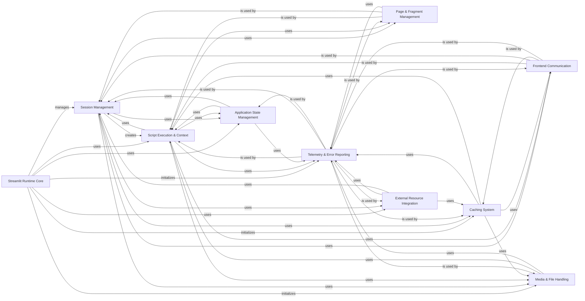

## Component Details

The Application Core subsystem of Streamlit is responsible for orchestrating the entire lifecycle of a Streamlit application, from managing user sessions and executing Python scripts to handling application state, caching data, and facilitating communication with the frontend. It ensures that user interactions trigger appropriate script reruns, maintains data consistency, and provides mechanisms for integrating with external resources and tracking application performance.

### Streamlit Runtime Core
The central orchestrator of the Streamlit application, managing various internal managers (media, script cache, stats) and handling the overall application lifecycle, including starting and stopping the runtime.

**Related Classes/Methods**:

- <a href="https://github.com/streamlit/streamlit/blob/master/lib/streamlit/runtime/runtime.py#L1-L319" target="_blank" rel="noopener noreferrer">`streamlit.runtime.runtime` (1:319)</a>
- <a href="https://github.com/streamlit/streamlit/blob/master/lib/streamlit/runtime/runtime.py#L147-L736" target="_blank" rel="noopener noreferrer">`streamlit.runtime.runtime.Runtime` (147:736)</a>
- <a href="https://github.com/streamlit/streamlit/blob/master/lib/streamlit/runtime/runtime.py#L151-L157" target="_blank" rel="noopener noreferrer">`streamlit.runtime.runtime.Runtime.instance` (151:157)</a>
- <a href="https://github.com/streamlit/streamlit/blob/master/lib/streamlit/runtime/runtime.py#L160-L168" target="_blank" rel="noopener noreferrer">`streamlit.runtime.runtime.Runtime.exists` (160:168)</a>

### Session Management
Handles the lifecycle of user sessions, including connection, disconnection, and managing session-specific data and messages. It orchestrates the creation and shutdown of application sessions.

**Related Classes/Methods**:

- <a href="https://github.com/streamlit/streamlit/blob/master/lib/streamlit/runtime/app_session.py#L1-L490" target="_blank" rel="noopener noreferrer">`streamlit.runtime.app_session` (1:490)</a>
- <a href="https://github.com/streamlit/streamlit/blob/master/lib/streamlit/runtime/app_session.py#L74-L901" target="_blank" rel="noopener noreferrer">`streamlit.runtime.app_session.AppSession` (74:901)</a>
- <a href="https://github.com/streamlit/streamlit/blob/master/lib/streamlit/runtime/session_manager.py#L1-L204" target="_blank" rel="noopener noreferrer">`streamlit.runtime.session_manager` (1:204)</a>
- <a href="https://github.com/streamlit/streamlit/blob/master/lib/streamlit/runtime/session_manager.py#L171-L394" target="_blank" rel="noopener noreferrer">`streamlit.runtime.session_manager.SessionManager` (171:394)</a>
- <a href="https://github.com/streamlit/streamlit/blob/master/lib/streamlit/runtime/session_manager.py#L33-L43" target="_blank" rel="noopener noreferrer">`streamlit.runtime.session_manager.SessionClient` (33:43)</a>
- <a href="https://github.com/streamlit/streamlit/blob/master/lib/streamlit/runtime/session_manager.py#L92-L168" target="_blank" rel="noopener noreferrer">`streamlit.runtime.session_manager.SessionStorage` (92:168)</a>
- <a href="https://github.com/streamlit/streamlit/blob/master/lib/streamlit/runtime/websocket_session_manager.py#L1-L128" target="_blank" rel="noopener noreferrer">`streamlit.runtime.websocket_session_manager` (1:128)</a>
- <a href="https://github.com/streamlit/streamlit/blob/master/lib/streamlit/runtime/websocket_session_manager.py#L37-L171" target="_blank" rel="noopener noreferrer">`streamlit.runtime.websocket_session_manager.WebsocketSessionManager` (37:171)</a>
- <a href="https://github.com/streamlit/streamlit/blob/master/lib/streamlit/runtime/memory_session_storage.py#L1-L56" target="_blank" rel="noopener noreferrer">`streamlit.runtime.memory_session_storage` (1:56)</a>
- <a href="https://github.com/streamlit/streamlit/blob/master/lib/streamlit/runtime/memory_session_storage.py#L27-L77" target="_blank" rel="noopener noreferrer">`streamlit.runtime.memory_session_storage.MemorySessionStorage` (27:77)</a>

### Script Execution & Context
Manages the execution of Streamlit scripts and provides a context for each script run. This context holds session-specific data and allows interaction with the Streamlit runtime, including handling script requests like rerun or stop.

**Related Classes/Methods**:

- `streamlit.runtime.scriptrunner` (full file reference)
- <a href="https://github.com/streamlit/streamlit/blob/master/lib/streamlit/runtime/scriptrunner/script_runner.py#L1-L450" target="_blank" rel="noopener noreferrer">`streamlit.runtime.scriptrunner.script_runner` (1:450)</a>
- <a href="https://github.com/streamlit/streamlit/blob/master/lib/streamlit/runtime/scriptrunner/script_runner.py#L168-L754" target="_blank" rel="noopener noreferrer">`streamlit.runtime.scriptrunner.script_runner.ScriptRunner` (168:754)</a>
- <a href="https://github.com/streamlit/streamlit/blob/master/lib/streamlit/runtime/scriptrunner/exec_code.py#L1-L105" target="_blank" rel="noopener noreferrer">`streamlit.runtime.scriptrunner.exec_code` (1:105)</a>
- <a href="https://github.com/streamlit/streamlit/blob/master/lib/streamlit/runtime/scriptrunner/exec_code.py#L75-L166" target="_blank" rel="noopener noreferrer">`streamlit.runtime.scriptrunner.exec_code.exec_func_with_error_handling` (75:166)</a>
- <a href="https://github.com/streamlit/streamlit/blob/master/lib/streamlit/runtime/scriptrunner/magic.py#L1-L158" target="_blank" rel="noopener noreferrer">`streamlit.runtime.scriptrunner.magic` (1:158)</a>
- <a href="https://github.com/streamlit/streamlit/blob/master/lib/streamlit/runtime/scriptrunner/magic.py#L28-L53" target="_blank" rel="noopener noreferrer">`streamlit.runtime.scriptrunner.magic.add_magic` (28:53)</a>
- <a href="https://github.com/streamlit/streamlit/blob/master/lib/streamlit/runtime/scriptrunner/script_cache.py#L1-L68" target="_blank" rel="noopener noreferrer">`streamlit.runtime.scriptrunner.script_cache` (1:68)</a>
- <a href="https://github.com/streamlit/streamlit/blob/master/lib/streamlit/runtime/scriptrunner/script_cache.py#L26-L89" target="_blank" rel="noopener noreferrer">`streamlit.runtime.scriptrunner.script_cache.ScriptCache` (26:89)</a>
- <a href="https://github.com/streamlit/streamlit/blob/master/lib/streamlit/runtime/scriptrunner_utils/script_run_context.py#L1-L190" target="_blank" rel="noopener noreferrer">`streamlit.runtime.scriptrunner_utils.script_run_context` (1:190)</a>
- <a href="https://github.com/streamlit/streamlit/blob/master/lib/streamlit/runtime/scriptrunner_utils/script_run_context.py#L69-L221" target="_blank" rel="noopener noreferrer">`streamlit.runtime.scriptrunner_utils.script_run_context.ScriptRunContext` (69:221)</a>
- <a href="https://github.com/streamlit/streamlit/blob/master/lib/streamlit/runtime/scriptrunner_utils/script_run_context.py#L258-L284" target="_blank" rel="noopener noreferrer">`streamlit.runtime.scriptrunner_utils.script_run_context.get_script_run_ctx` (258:284)</a>
- <a href="https://github.com/streamlit/streamlit/blob/master/lib/streamlit/runtime/scriptrunner_utils/script_requests.py#L1-L223" target="_blank" rel="noopener noreferrer">`streamlit.runtime.scriptrunner_utils.script_requests` (1:223)</a>
- <a href="https://github.com/streamlit/streamlit/blob/master/lib/streamlit/runtime/scriptrunner_utils/script_requests.py#L157-L311" target="_blank" rel="noopener noreferrer">`streamlit.runtime.scriptrunner_utils.script_requests.ScriptRequests` (157:311)</a>
- <a href="https://github.com/streamlit/streamlit/blob/master/lib/streamlit/runtime/scriptrunner_utils/exceptions.py#L1-L34" target="_blank" rel="noopener noreferrer">`streamlit.runtime.scriptrunner_utils.exceptions` (1:34)</a>
- <a href="https://github.com/streamlit/streamlit/blob/master/lib/streamlit/runtime/scriptrunner_utils/exceptions.py#L34-L48" target="_blank" rel="noopener noreferrer">`streamlit.runtime.scriptrunner_utils.exceptions.RerunException` (34:48)</a>
- <a href="https://github.com/streamlit/streamlit/blob/master/lib/streamlit/runtime/script_data.py#L1-L32" target="_blank" rel="noopener noreferrer">`streamlit.runtime.script_data` (1:32)</a>
- <a href="https://github.com/streamlit/streamlit/blob/master/lib/streamlit/runtime/script_data.py#L22-L46" target="_blank" rel="noopener noreferrer">`streamlit.runtime.script_data.ScriptData` (22:46)</a>
- <a href="https://github.com/streamlit/streamlit/blob/master/lib/streamlit/runtime/context.py#L1-L248" target="_blank" rel="noopener noreferrer">`streamlit.runtime.context` (1:248)</a>
- <a href="https://github.com/streamlit/streamlit/blob/master/lib/streamlit/runtime/context.py#L127-L396" target="_blank" rel="noopener noreferrer">`streamlit.runtime.context.ContextProxy` (127:396)</a>
- <a href="https://github.com/streamlit/streamlit/blob/master/lib/streamlit/runtime/context_util.py#L1-L35" target="_blank" rel="noopener noreferrer">`streamlit.runtime.context_util` (1:35)</a>

### Application State Management
Manages the state of the Streamlit application, including the values of widgets, the overall session state, and query parameters in the URL. It ensures state consistency across script reruns.

**Related Classes/Methods**:

- <a href="https://github.com/streamlit/streamlit/blob/master/lib/streamlit/runtime/state/session_state.py#L1-L409" target="_blank" rel="noopener noreferrer">`streamlit.lib.streamlit.runtime.state.session_state` (1:409)</a>
- <a href="https://github.com/streamlit/streamlit/blob/master/lib/streamlit/runtime/state/session_state.py#L342-L758" target="_blank" rel="noopener noreferrer">`streamlit.lib.streamlit.runtime.state.session_state.SessionState` (342:758)</a>
- <a href="https://github.com/streamlit/streamlit/blob/master/lib/streamlit/runtime/state/query_params.py#L1-L160" target="_blank" rel="noopener noreferrer">`streamlit.lib.streamlit.runtime.state.query_params` (1:160)</a>
- <a href="https://github.com/streamlit/streamlit/blob/master/lib/streamlit/runtime/state/query_params.py#L39-L199" target="_blank" rel="noopener noreferrer">`streamlit.lib.streamlit.runtime.state.query_params.QueryParams` (39:199)</a>
- <a href="https://github.com/streamlit/streamlit/blob/master/lib/streamlit/runtime/state/widgets.py#L1-L79" target="_blank" rel="noopener noreferrer">`streamlit.lib.streamlit.runtime.state.widgets` (1:79)</a>
- <a href="https://github.com/streamlit/streamlit/blob/master/lib/streamlit/runtime/state/widgets.py#L36-L112" target="_blank" rel="noopener noreferrer">`streamlit.lib.streamlit.runtime.state.widgets.register_widget` (36:112)</a>
- <a href="https://github.com/streamlit/streamlit/blob/master/lib/streamlit/runtime/state/session_state_proxy.py#L1-L109" target="_blank" rel="noopener noreferrer">`streamlit.lib.streamlit.runtime.state.session_state_proxy` (1:109)</a>
- <a href="https://github.com/streamlit/streamlit/blob/master/lib/streamlit/runtime/state/session_state_proxy.py#L69-L146" target="_blank" rel="noopener noreferrer">`streamlit.lib.streamlit.runtime.state.session_state_proxy.SessionStateProxy` (69:146)</a>
- <a href="https://github.com/streamlit/streamlit/blob/master/lib/streamlit/runtime/state/query_params_proxy.py#L1-L179" target="_blank" rel="noopener noreferrer">`streamlit.lib.streamlit.runtime.state.query_params_proxy` (1:179)</a>
- <a href="https://github.com/streamlit/streamlit/blob/master/lib/streamlit/runtime/state/query_params_proxy.py#L27-L220" target="_blank" rel="noopener noreferrer">`streamlit.lib.streamlit.runtime.state.query_params_proxy.QueryParamsProxy` (27:220)</a>
- <a href="https://github.com/streamlit/streamlit/blob/master/lib/streamlit/runtime/state/safe_session_state.py#L1-L90" target="_blank" rel="noopener noreferrer">`streamlit.lib.streamlit.runtime.state.safe_session_state` (1:90)</a>
- <a href="https://github.com/streamlit/streamlit/blob/master/lib/streamlit/runtime/state/safe_session_state.py#L31-L138" target="_blank" rel="noopener noreferrer">`streamlit.lib.streamlit.runtime.state.safe_session_state.SafeSessionState` (31:138)</a>
- <a href="https://github.com/streamlit/streamlit/blob/master/lib/streamlit/runtime/state/common.py#L1-L128" target="_blank" rel="noopener noreferrer">`streamlit.lib.streamlit.runtime.state.common` (1:128)</a>
- <a href="https://github.com/streamlit/streamlit/blob/master/lib/streamlit/runtime/state/common.py#L107-L125" target="_blank" rel="noopener noreferrer">`streamlit.lib.streamlit.runtime.state.common.WidgetMetadata` (107:125)</a>

### Caching System
Provides mechanisms for caching data and resources to improve application performance. This includes managing data caches, resource caches, message replay for cached elements, and hashing utilities for cache key generation.

**Related Classes/Methods**:

- <a href="https://github.com/streamlit/streamlit/blob/master/lib/streamlit/runtime/caching/cache_data_api.py#L1-L344" target="_blank" rel="noopener noreferrer">`streamlit.lib.streamlit.runtime.caching.cache_data_api` (1:344)</a>
- <a href="https://github.com/streamlit/streamlit/blob/master/lib/streamlit/runtime/caching/cache_data_api.py#L324-L602" target="_blank" rel="noopener noreferrer">`streamlit.lib.streamlit.runtime.caching.cache_data_api.CacheDataAPI` (324:602)</a>
- <a href="https://github.com/streamlit/streamlit/blob/master/lib/streamlit/runtime/caching/cache_resource_api.py#L1-L305" target="_blank" rel="noopener noreferrer">`streamlit.lib.streamlit.runtime.caching.cache_resource_api` (1:305)</a>
- <a href="https://github.com/streamlit/streamlit/blob/master/lib/streamlit/runtime/caching/cache_resource_api.py#L187-L445" target="_blank" rel="noopener noreferrer">`streamlit.lib.streamlit.runtime.caching.cache_resource_api.CacheResourceAPI` (187:445)</a>
- <a href="https://github.com/streamlit/streamlit/blob/master/lib/streamlit/runtime/caching/cache_errors.py#L1-L108" target="_blank" rel="noopener noreferrer">`streamlit.lib.streamlit.runtime.caching.cache_errors` (1:108)</a>
- <a href="https://github.com/streamlit/streamlit/blob/master/lib/streamlit/runtime/caching/cache_errors.py#L93-L94" target="_blank" rel="noopener noreferrer">`streamlit.lib.streamlit.runtime.caching.cache_errors.CacheError` (93:94)</a>
- <a href="https://github.com/streamlit/streamlit/blob/master/lib/streamlit/runtime/caching/cache_utils.py#L1-L344" target="_blank" rel="noopener noreferrer">`streamlit.lib.streamlit.runtime.caching.cache_utils` (1:344)</a>
- <a href="https://github.com/streamlit/streamlit/blob/master/lib/streamlit/runtime/caching/cache_utils.py#L65-L118" target="_blank" rel="noopener noreferrer">`streamlit.lib.streamlit.runtime.caching.cache_utils.Cache` (65:118)</a>
- <a href="https://github.com/streamlit/streamlit/blob/master/lib/streamlit/runtime/caching/cached_message_replay.py#L1-L182" target="_blank" rel="noopener noreferrer">`streamlit.lib.streamlit.runtime.caching.cached_message_replay` (1:182)</a>
- <a href="https://github.com/streamlit/streamlit/blob/master/lib/streamlit/runtime/caching/cached_message_replay.py#L74-L82" target="_blank" rel="noopener noreferrer">`streamlit.lib.streamlit.runtime.caching.cached_message_replay.CachedResult` (74:82)</a>
- <a href="https://github.com/streamlit/streamlit/blob/master/lib/streamlit/runtime/caching/hashing.py#L1-L458" target="_blank" rel="noopener noreferrer">`streamlit.lib.streamlit.runtime.caching.hashing` (1:458)</a>
- <a href="https://github.com/streamlit/streamlit/blob/master/lib/streamlit/runtime/caching/hashing.py#L154-L169" target="_blank" rel="noopener noreferrer">`streamlit.lib.streamlit.runtime.caching.hashing.update_hash` (154:169)</a>
- <a href="https://github.com/streamlit/streamlit/blob/master/lib/streamlit/runtime/caching/legacy_cache_api.py#L1-L130" target="_blank" rel="noopener noreferrer">`streamlit.lib.streamlit.runtime.caching.legacy_cache_api` (1:130)</a>
- <a href="https://github.com/streamlit/streamlit/blob/master/lib/streamlit/runtime/caching/storage/cache_storage_protocol.py#L1-L147" target="_blank" rel="noopener noreferrer">`streamlit.lib.streamlit.runtime.caching.storage.cache_storage_protocol` (1:147)</a>
- <a href="https://github.com/streamlit/streamlit/blob/master/lib/streamlit/runtime/caching/storage/cache_storage_protocol.py#L162-L239" target="_blank" rel="noopener noreferrer">`streamlit.lib.streamlit.runtime.caching.storage.cache_storage_protocol.CacheStorageManager` (162:239)</a>
- <a href="https://github.com/streamlit/streamlit/blob/master/lib/streamlit/runtime/caching/storage/dummy_cache_storage.py#L1-L44" target="_blank" rel="noopener noreferrer">`streamlit.lib.streamlit.runtime.caching.storage.dummy_cache_storage` (1:44)</a>
- <a href="https://github.com/streamlit/streamlit/blob/master/lib/streamlit/runtime/caching/storage/local_disk_cache_storage.py#L1-L140" target="_blank" rel="noopener noreferrer">`streamlit.lib.streamlit.runtime.caching.storage.local_disk_cache_storage` (1:140)</a>
- <a href="https://github.com/streamlit/streamlit/blob/master/lib/streamlit/runtime/caching/storage/in_memory_cache_storage_wrapper.py#L1-L109" target="_blank" rel="noopener noreferrer">`streamlit.lib.streamlit.runtime.caching.storage.in_memory_cache_storage_wrapper` (1:109)</a>

### Media & File Handling
Manages the storage and retrieval of media files (audio, video, images) and user-uploaded files within the Streamlit application. It provides mechanisms for adding, getting, and managing these files.

**Related Classes/Methods**:

- <a href="https://github.com/streamlit/streamlit/blob/master/lib/streamlit/runtime/media_file_manager.py#L1-L169" target="_blank" rel="noopener noreferrer">`streamlit.runtime.media_file_manager` (1:169)</a>
- <a href="https://github.com/streamlit/streamlit/blob/master/lib/streamlit/runtime/media_file_manager.py#L63-L233" target="_blank" rel="noopener noreferrer">`streamlit.runtime.media_file_manager.MediaFileManager` (63:233)</a>
- <a href="https://github.com/streamlit/streamlit/blob/master/lib/streamlit/runtime/memory_media_file_storage.py#L1-L128" target="_blank" rel="noopener noreferrer">`streamlit.runtime.memory_media_file_storage` (1:128)</a>
- <a href="https://github.com/streamlit/streamlit/blob/master/lib/streamlit/runtime/memory_media_file_storage.py#L91-L182" target="_blank" rel="noopener noreferrer">`streamlit.runtime.memory_media_file_storage.MemoryMediaFileStorage` (91:182)</a>
- <a href="https://github.com/streamlit/streamlit/blob/master/lib/streamlit/runtime/memory_uploaded_file_manager.py#L1-L90" target="_blank" rel="noopener noreferrer">`streamlit.runtime.memory_uploaded_file_manager` (1:90)</a>
- <a href="https://github.com/streamlit/streamlit/blob/master/lib/streamlit/runtime/memory_uploaded_file_manager.py#L33-L138" target="_blank" rel="noopener noreferrer">`streamlit.runtime.memory_uploaded_file_manager.MemoryUploadedFileManager` (33:138)</a>
- <a href="https://github.com/streamlit/streamlit/blob/master/lib/streamlit/runtime/uploaded_file_manager.py#L1-L99" target="_blank" rel="noopener noreferrer">`streamlit.runtime.uploaded_file_manager` (1:99)</a>
- <a href="https://github.com/streamlit/streamlit/blob/master/lib/streamlit/runtime/uploaded_file_manager.py#L89-L149" target="_blank" rel="noopener noreferrer">`streamlit.runtime.uploaded_file_manager.UploadedFileManager` (89:149)</a>

### Frontend Communication
Manages the queueing, processing, and serialization of messages (ForwardMsgs) sent from the Streamlit backend to the frontend. It ensures efficient and correct delivery of UI updates.

**Related Classes/Methods**:

- <a href="https://github.com/streamlit/streamlit/blob/master/lib/streamlit/runtime/forward_msg_queue.py#L1-L152" target="_blank" rel="noopener noreferrer">`streamlit.runtime.forward_msg_queue` (1:152)</a>
- <a href="https://github.com/streamlit/streamlit/blob/master/lib/streamlit/runtime/forward_msg_queue.py#L22-L169" target="_blank" rel="noopener noreferrer">`streamlit.runtime.forward_msg_queue.ForwardMsgQueue` (22:169)</a>
- <a href="https://github.com/streamlit/streamlit/blob/master/lib/streamlit/runtime/forward_msg_cache.py#L1-L65" target="_blank" rel="noopener noreferrer">`streamlit.runtime.forward_msg_cache` (1:65)</a>
- <a href="https://github.com/streamlit/streamlit/blob/master/lib/streamlit/runtime/forward_msg_cache.py#L26-L66" target="_blank" rel="noopener noreferrer">`streamlit.runtime.forward_msg_cache.populate_hash_if_needed` (26:66)</a>
- <a href="https://github.com/streamlit/streamlit/blob/master/lib/streamlit/runtime/runtime_util.py#L1-L78" target="_blank" rel="noopener noreferrer">`streamlit.runtime.runtime_util` (1:78)</a>
- <a href="https://github.com/streamlit/streamlit/blob/master/lib/streamlit/runtime/runtime_util.py#L66-L90" target="_blank" rel="noopener noreferrer">`streamlit.runtime.runtime_util.serialize_forward_msg` (66:90)</a>

### Page & Fragment Management
Manages the different pages in a multi-page Streamlit application and the execution and storage of code fragments. It handles navigation, current page state, script hash tracking, and independent execution of reusable code blocks.

**Related Classes/Methods**:

- <a href="https://github.com/streamlit/streamlit/blob/master/lib/streamlit/runtime/pages_manager.py#L1-L118" target="_blank" rel="noopener noreferrer">`streamlit.runtime.pages_manager` (1:118)</a>
- <a href="https://github.com/streamlit/streamlit/blob/master/lib/streamlit/runtime/pages_manager.py#L27-L160" target="_blank" rel="noopener noreferrer">`streamlit.runtime.pages_manager.PagesManager` (27:160)</a>
- <a href="https://github.com/streamlit/streamlit/blob/master/lib/streamlit/runtime/fragment.py#L289-L293" target="_blank" rel="noopener noreferrer">`streamlit.runtime.fragment` (289:293)</a>
- <a href="https://github.com/streamlit/streamlit/blob/master/lib/streamlit/runtime/fragment.py#L48-L86" target="_blank" rel="noopener noreferrer">`streamlit.runtime.fragment.FragmentStorage` (48:86)</a>
- <a href="https://github.com/streamlit/streamlit/blob/master/lib/streamlit/runtime/fragment.py#L94-L132" target="_blank" rel="noopener noreferrer">`streamlit.runtime.fragment.MemoryFragmentStorage` (94:132)</a>
- <a href="https://github.com/streamlit/streamlit/blob/master/lib/streamlit/runtime/fragment.py#L289-L293" target="_blank" rel="noopener noreferrer">`streamlit.runtime.fragment.fragment` (289:293)</a>

### Telemetry & Error Reporting
Collects and reports usage statistics and performance metrics for the Streamlit application, and provides utilities for handling and reporting exceptions to ensure graceful degradation and informative error messages.

**Related Classes/Methods**:

- <a href="https://github.com/streamlit/streamlit/blob/master/lib/streamlit/runtime/metrics_util.py#L1-L290" target="_blank" rel="noopener noreferrer">`streamlit.runtime.metrics_util` (1:290)</a>
- <a href="https://github.com/streamlit/streamlit/blob/master/lib/streamlit/runtime/metrics_util.py#L346-L349" target="_blank" rel="noopener noreferrer">`streamlit.runtime.metrics_util.gather_metrics` (346:349)</a>
- <a href="https://github.com/streamlit/streamlit/blob/master/lib/streamlit/runtime/metrics_util.py#L471-L519" target="_blank" rel="noopener noreferrer">`streamlit.runtime.metrics_util.create_page_profile_message` (471:519)</a>
- <a href="https://github.com/streamlit/streamlit/blob/master/lib/streamlit/runtime/stats.py#L1-L78" target="_blank" rel="noopener noreferrer">`streamlit.runtime.stats` (1:78)</a>
- <a href="https://github.com/streamlit/streamlit/blob/master/lib/streamlit/runtime/stats.py#L92-L109" target="_blank" rel="noopener noreferrer">`streamlit.runtime.stats.StatsManager` (92:109)</a>
- `streamlit.error_util` (full file reference)

### External Resource Integration
Provides abstractions and utilities for connecting to external data sources and securely accessing application secrets.

**Related Classes/Methods**:

- `streamlit.runtime.secrets` (full file reference)
- <a href="https://github.com/streamlit/streamlit/blob/master/lib/streamlit/runtime/connection_factory.py#L118-L125" target="_blank" rel="noopener noreferrer">`streamlit.runtime.connection_factory` (118:125)</a>

### [FAQ](https://github.com/CodeBoarding/GeneratedOnBoardings/tree/main?tab=readme-ov-file#faq)