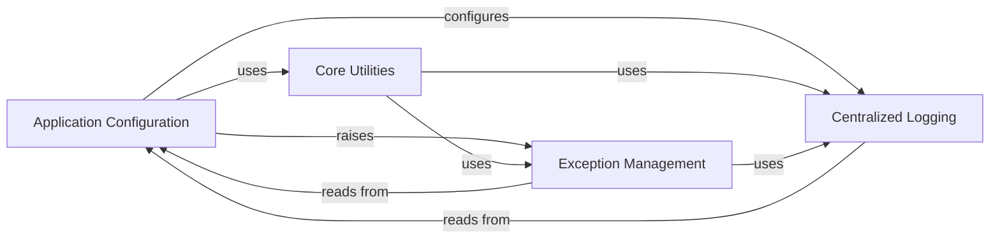

## Component Details

The `Configuration & Utilities` subsystem provides the foundational services for managing application settings, offering a suite of general-purpose helper functions, and establishing a centralized system for error handling and logging. It ensures that the application's behavior can be customized through various configuration sources, provides essential low-level functionalities, and maintains robust error reporting and diagnostic capabilities.

### Application Configuration
Manages application-wide settings and options, including loading, validation, and access to configuration values from various sources like default values, TOML files, environment variables, and command-line flags. It provides a structured way to define and retrieve operational parameters for Streamlit.

**Related Classes/Methods**:

- `streamlit.lib.streamlit.config` (full file reference)
- `streamlit.lib.streamlit.config_option` (full file reference)
- `streamlit.lib.streamlit.config_util` (full file reference)

### Core Utilities
A comprehensive collection of fundamental helper functions and modules that provide common functionalities used across the Streamlit codebase. This includes string manipulation, file system operations, type checking, time utilities, network utilities, command-line interface helpers, environment variable handling, Git interactions, and temporary directory management.

**Related Classes/Methods**:

- `streamlit.lib.streamlit.util` (full file reference)
- `streamlit.lib.streamlit.string_util` (full file reference)
- `streamlit.lib.streamlit.file_util` (full file reference)
- `streamlit.lib.streamlit.type_util` (full file reference)
- `streamlit.lib.streamlit.time_util` (full file reference)
- `streamlit.lib.streamlit.net_util` (full file reference)
- `streamlit.lib.streamlit.cli_util` (full file reference)
- `streamlit.lib.streamlit.env_util` (full file reference)
- `streamlit.lib.streamlit.git_util` (full file reference)
- `streamlit.lib.streamlit.temporary_directory` (full file reference)

### Exception Management
Provides a centralized system for defining, raising, and reporting various types of errors and exceptions within the Streamlit application. It ensures consistent error messaging, facilitates debugging, and handles how uncaught exceptions are displayed to the user and logged.

**Related Classes/Methods**:

- `streamlit.lib.streamlit.errors` (full file reference)
- `streamlit.lib.streamlit.error_util` (full file reference)

### Centralized Logging
Offers a standardized interface for logging diagnostic messages, warnings, and errors throughout the Streamlit application. It allows for configurable log levels and message formats, aiding in monitoring and debugging application behavior.

**Related Classes/Methods**:

- `streamlit.lib.streamlit.logger` (full file reference)

### [FAQ](https://github.com/CodeBoarding/GeneratedOnBoardings/tree/main?tab=readme-ov-file#faq)