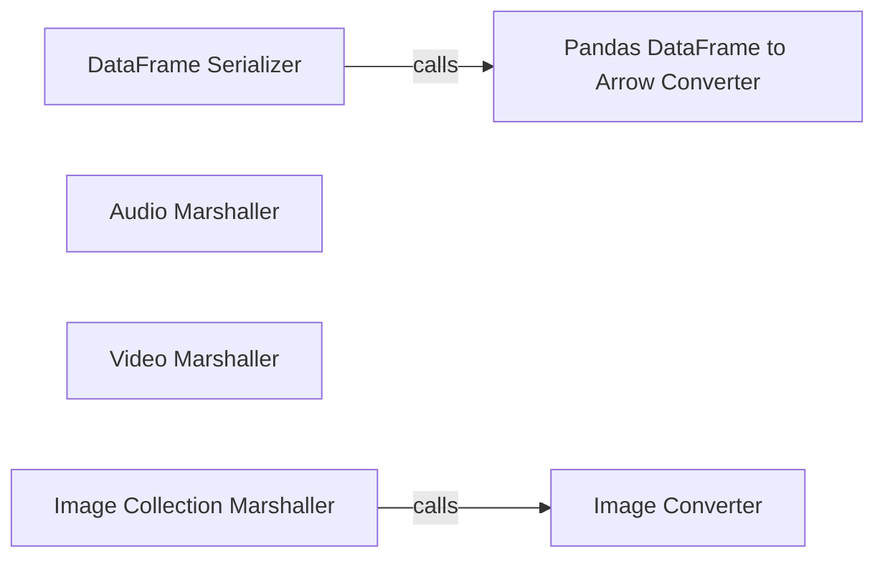

## Details

The `Data Serialization & Transformation (Backend)` subsystem is a critical part of Streamlit's architecture, responsible for converting various Python data structures into optimized, transportable formats for efficient network transmission to the frontend. This aligns with the "Data Serialization/Communication Layer" expected component in the project's architectural patterns.

### DataFrame Serializer
Orchestrates the conversion of diverse tabular data structures (e.g., Pandas, Dask, Polars Dataframes) into the Apache Arrow byte format, ensuring efficient and optimized data transfer to the frontend. This component acts as a high-level entry point for tabular data serialization.

**Related Classes/Methods**:

- <a href="https://github.com/streamlit/streamlit/blob/develop/lib/streamlit/dataframe_util.py" target="_blank" rel="noopener noreferrer">`streamlit.dataframe_util.convert_anything_to_arrow_bytes`</a>

### Pandas DataFrame to Arrow Converter
Specifically handles the conversion of Pandas DataFrames into Apache Arrow bytes. This includes pre-processing steps to ensure compatibility and optimize the data structure for Arrow's columnar format. It's a specialized utility called by the more general `DataFrame Serializer`.

**Related Classes/Methods**:

- <a href="https://github.com/streamlit/streamlit/blob/develop/lib/streamlit/dataframe_util.py" target="_blank" rel="noopener noreferrer">`streamlit.dataframe_util.convert_pandas_df_to_arrow_bytes`</a>

### Audio Marshaller
Transforms raw audio data (e.g., NumPy arrays, file paths) into a suitable, transportable format (e.g., base64 encoded string, URL) for web transmission and playback on the frontend. This component ensures audio content can be efficiently embedded or streamed.

**Related Classes/Methods**:

- <a href="https://github.com/streamlit/streamlit/blob/develop/lib/streamlit/elements/media.py" target="_blank" rel="noopener noreferrer">`streamlit.elements.media.marshall_audio`</a>

### Video Marshaller
Manages the serialization and preparation of video data, including handling of external video sources (e.g., YouTube URLs) and direct video file streams. It ensures video content is correctly formatted for display in a web browser.

**Related Classes/Methods**:

- <a href="https://github.com/streamlit/streamlit/blob/develop/lib/streamlit/elements/media.py" target="_blank" rel="noopener noreferrer">`streamlit.elements.media.marshall_video`</a>

### Image Converter
Converts various image representations (e.g., NumPy arrays, PIL images, file paths) into a URL or byte stream (e.g., base64 encoded string). This is a fundamental utility for making images web-ready.

**Related Classes/Methods**:

- <a href="https://github.com/streamlit/streamlit/blob/develop/lib/streamlit/elements/lib/image_utils.py" target="_blank" rel="noopener noreferrer">`streamlit.elements.lib.image_utils.image_to_url`</a>

### Image Collection Marshaller
Provides a higher-level mechanism to serialize collections or lists of images. It leverages the `Image Converter` to process individual images within a collection, streamlining the preparation of multiple images for frontend display.

**Related Classes/Methods**:

- <a href="https://github.com/streamlit/streamlit/blob/develop/lib/streamlit/elements/lib/image_utils.py" target="_blank" rel="noopener noreferrer">`streamlit.elements.lib.image_utils.marshall_images`</a>

### [FAQ](https://github.com/CodeBoarding/GeneratedOnBoardings/tree/main?tab=readme-ov-file#faq)