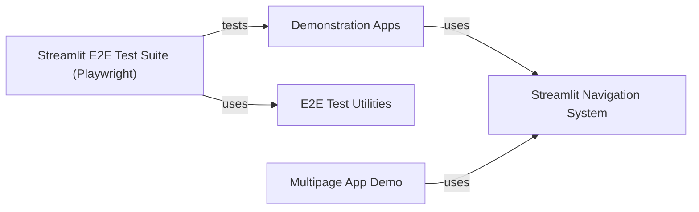

## Component Details

This graph illustrates the structure and interactions of Streamlit's demonstration applications and their supporting components. The core functionality revolves around the 'Demonstration Apps', which are example Streamlit applications showcasing various features like data visualization, mapping, and animations. The 'Streamlit Navigation System' is crucial for organizing and navigating these multi-page demonstrations. To ensure the reliability and correctness of these demo applications, the 'Streamlit E2E Test Suite (Playwright)' provides comprehensive end-to-end testing, leveraging 'E2E Test Utilities' for common testing functionalities. Additionally, a 'Multipage App Demo' serves as another example of a Streamlit application, further demonstrating the framework's capabilities.

### Demonstration Apps
Contains a collection of example Streamlit applications and associated utility functions, serving as practical demonstrations and templates for users to understand and learn how to build Streamlit applications. These demos showcase various Streamlit functionalities like mapping, dataframes, plotting, and animations.

**Related Classes/Methods**:

- <a href="https://github.com/streamlit/streamlit/blob/master/lib/streamlit/hello/animation_demo.py#L23-L69" target="_blank" rel="noopener noreferrer">`streamlit.lib.streamlit.hello.animation_demo` (23:69)</a>
- `streamlit.lib.streamlit.hello.dataframe_demo` (full file reference)
- `streamlit.lib.streamlit.hello.hello` (full file reference)
- <a href="https://github.com/streamlit/streamlit/blob/master/lib/streamlit/hello/mapping_demo.py#L24-L102" target="_blank" rel="noopener noreferrer">`streamlit.lib.streamlit.hello.mapping_demo` (24:102)</a>
- <a href="https://github.com/streamlit/streamlit/blob/master/lib/streamlit/hello/plotting_demo.py#L23-L42" target="_blank" rel="noopener noreferrer">`streamlit.lib.streamlit.hello.plotting_demo` (23:42)</a>
- `streamlit.lib.streamlit.hello.streamlit_app` (full file reference)
- `streamlit.lib.streamlit.hello.utils` (full file reference)

### Streamlit Navigation System
This component is responsible for managing the navigation within a Streamlit application, allowing users to switch between different pages. It utilizes `st.navigation` to define the application's page structure.

**Related Classes/Methods**:

- <a href="https://github.com/streamlit/streamlit/blob/master/lib/streamlit/commands/navigation.py#L83-L262" target="_blank" rel="noopener noreferrer">`streamlit.commands.navigation.navigation` (83:262)</a>
- <a href="https://github.com/streamlit/streamlit/blob/master/lib/streamlit/navigation/page.py#L30-L125" target="_blank" rel="noopener noreferrer">`streamlit.navigation.page.Page` (30:125)</a>
- <a href="https://github.com/streamlit/streamlit/blob/master/lib/streamlit/hello/streamlit_app.py#L23-L53" target="_blank" rel="noopener noreferrer">`streamlit.lib.streamlit.hello.streamlit_app:run` (23:53)</a>

### Streamlit E2E Test Suite (Playwright)
This component comprises end-to-end tests for the Streamlit 'hello' application, implemented using Playwright. It includes tests for navigating to different pages, checking page titles and icons, and verifying print mode functionalities.

**Related Classes/Methods**:

- <a href="https://github.com/streamlit/streamlit/blob/master/e2e_playwright/hello_app_test.py#L23-L28" target="_blank" rel="noopener noreferrer">`streamlit.e2e_playwright.hello_app_test:navigate_to_page` (23:28)</a>
- <a href="https://github.com/streamlit/streamlit/blob/master/e2e_playwright/hello_app_test.py#L45-L52" target="_blank" rel="noopener noreferrer">`streamlit.e2e_playwright.hello_app_test:test_home_page` (45:52)</a>
- <a href="https://github.com/streamlit/streamlit/blob/master/e2e_playwright/hello_app_test.py#L31-L34" target="_blank" rel="noopener noreferrer">`streamlit.e2e_playwright.hello_app_test.check_page_title` (31:34)</a>
- <a href="https://github.com/streamlit/streamlit/blob/master/e2e_playwright/hello_app_test.py#L37-L42" target="_blank" rel="noopener noreferrer">`streamlit.e2e_playwright.hello_app_test.check_page_icon` (37:42)</a>
- <a href="https://github.com/streamlit/streamlit/blob/master/e2e_playwright/hello_app_test.py#L55-L65" target="_blank" rel="noopener noreferrer">`streamlit.e2e_playwright.hello_app_test:test_animation_demo_page` (55:65)</a>
- <a href="https://github.com/streamlit/streamlit/blob/master/e2e_playwright/hello_app_test.py#L68-L82" target="_blank" rel="noopener noreferrer">`streamlit.e2e_playwright.hello_app_test:test_plotting_demo_page` (68:82)</a>
- <a href="https://github.com/streamlit/streamlit/blob/master/e2e_playwright/hello_app_test.py#L85-L95" target="_blank" rel="noopener noreferrer">`streamlit.e2e_playwright.hello_app_test:test_mapping_demo_page` (85:95)</a>
- <a href="https://github.com/streamlit/streamlit/blob/master/e2e_playwright/hello_app_test.py#L102-L111" target="_blank" rel="noopener noreferrer">`streamlit.e2e_playwright.hello_app_test:_load_dataframe_demo_page` (102:111)</a>
- <a href="https://github.com/streamlit/streamlit/blob/master/e2e_playwright/hello_app_test.py#L114-L117" target="_blank" rel="noopener noreferrer">`streamlit.e2e_playwright.hello_app_test:test_dataframe_demo_page` (114:117)</a>
- <a href="https://github.com/streamlit/streamlit/blob/master/e2e_playwright/hello_app_test.py#L146-L162" target="_blank" rel="noopener noreferrer">`streamlit.e2e_playwright.hello_app_test:test_app_print_mode_portrait_with_sidebar_open` (146:162)</a>
- <a href="https://github.com/streamlit/streamlit/blob/master/e2e_playwright/hello_app_test.py#L138-L139" target="_blank" rel="noopener noreferrer">`streamlit.e2e_playwright.hello_app_test._set_portrait_dimensions` (138:139)</a>
- <a href="https://github.com/streamlit/streamlit/blob/master/e2e_playwright/hello_app_test.py#L128-L129" target="_blank" rel="noopener noreferrer">`streamlit.e2e_playwright.hello_app_test._evaluate_match_media_print` (128:129)</a>
- <a href="https://github.com/streamlit/streamlit/blob/master/e2e_playwright/hello_app_test.py#L165-L185" target="_blank" rel="noopener noreferrer">`streamlit.e2e_playwright.hello_app_test:test_app_print_mode_portrait_with_sidebar_closed` (165:185)</a>
- <a href="https://github.com/streamlit/streamlit/blob/master/e2e_playwright/hello_app_test.py#L188-L203" target="_blank" rel="noopener noreferrer">`streamlit.e2e_playwright.hello_app_test:test_app_print_mode_landscape_with_sidebar_open` (188:203)</a>
- <a href="https://github.com/streamlit/streamlit/blob/master/e2e_playwright/hello_app_test.py#L142-L143" target="_blank" rel="noopener noreferrer">`streamlit.e2e_playwright.hello_app_test._set_landscape_dimensions` (142:143)</a>
- <a href="https://github.com/streamlit/streamlit/blob/master/e2e_playwright/hello_app_test.py#L206-L226" target="_blank" rel="noopener noreferrer">`streamlit.e2e_playwright.hello_app_test:test_app_print_mode_landscape_with_sidebar_closed` (206:226)</a>

### E2E Test Utilities
This component provides utility functions specifically for end-to-end testing, such as waiting for the application to run, which are used by the Playwright test suite.

**Related Classes/Methods**:

- <a href="https://github.com/streamlit/streamlit/blob/master/e2e_playwright/conftest.py#L900-L947" target="_blank" rel="noopener noreferrer">`e2e_playwright.conftest.wait_for_app_run` (900:947)</a>

### Multipage App Demo
This component represents another example of a Streamlit application, specifically a multipage app, demonstrating data handling.

**Related Classes/Methods**:

- <a href="https://github.com/streamlit/streamlit/blob/master/frontend/app/performance/apps/multipage/multipage_app.py#L23-L58" target="_blank" rel="noopener noreferrer">`frontend.app.performance.apps.multipage.multipage_app:data_frame_demo` (23:58)</a>
- <a href="https://github.com/streamlit/streamlit/blob/master/frontend/app/performance/apps/multipage/multipage_app.py#L25-L28" target="_blank" rel="noopener noreferrer">`streamlit.frontend.app.performance.apps.multipage.multipage_app.data_frame_demo.get_UN_data` (25:28)</a>

### [FAQ](https://github.com/CodeBoarding/GeneratedOnBoardings/tree/main?tab=readme-ov-file#faq)