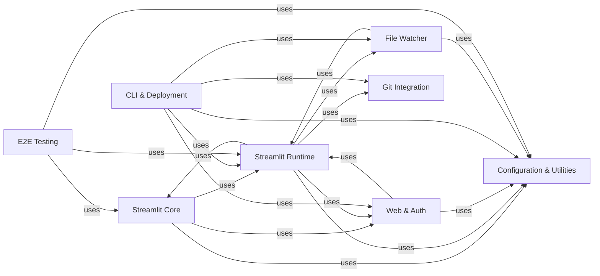

## Component Details

This graph provides an overview of the Streamlit application's architecture, focusing on the core functionalities, runtime management, UI rendering, web serving, configuration, and development/deployment tools. The main flow involves the CLI initiating the bootstrap process, which sets up the runtime environment and starts the web server. The runtime then executes Streamlit scripts, interacting with the core library for UI elements and data display. File watchers ensure live reloading of applications upon code changes, while configuration and utility components provide essential services across the system. The web server handles client communication, and authentication ensures secure access. Git integration and E2E testing utilities support development and quality assurance.

### Streamlit Core
Provides the main public API for building Streamlit applications, including functions for displaying data, creating layouts, managing user interactions, and handling UI elements and widgets.

**Related Classes/Methods**:

- `streamlit.lib.streamlit.platform` (full file reference)
- `streamlit.lib.streamlit.delta_generator` (full file reference)
- `streamlit.lib.streamlit.user_info` (full file reference)
- `streamlit.lib.streamlit.error_util` (full file reference)
- <a href="https://github.com/streamlit/streamlit/blob/master/lib/streamlit/cli_util.py#L67-L106" target="_blank" rel="noopener noreferrer">`streamlit.lib.streamlit.cli_util.open_browser` (67:106)</a>
- `streamlit.lib.streamlit.dataframe_util` (full file reference)
- <a href="https://github.com/streamlit/streamlit/blob/master/lib/streamlit/config.py#L102-L125" target="_blank" rel="noopener noreferrer">`streamlit.lib.streamlit.config.set_option` (102:125)</a>
- <a href="https://github.com/streamlit/streamlit/blob/master/lib/streamlit/config.py#L128-L174" target="_blank" rel="noopener noreferrer">`streamlit.lib.streamlit.config.set_user_option` (128:174)</a>
- <a href="https://github.com/streamlit/streamlit/blob/master/lib/streamlit/config.py#L177-L201" target="_blank" rel="noopener noreferrer">`streamlit.lib.streamlit.config.get_option` (177:201)</a>
- <a href="https://github.com/streamlit/streamlit/blob/master/lib/streamlit/config.py#L204-L227" target="_blank" rel="noopener noreferrer">`streamlit.lib.streamlit.config.get_options_for_section` (204:227)</a>
- <a href="https://github.com/streamlit/streamlit/blob/master/lib/streamlit/config.py#L1322-L1337" target="_blank" rel="noopener noreferrer">`streamlit.lib.streamlit.config.get_where_defined` (1322:1337)</a>
- <a href="https://github.com/streamlit/streamlit/blob/master/lib/streamlit/config.py#L1358-L1376" target="_blank" rel="noopener noreferrer">`streamlit.lib.streamlit.config.is_manually_set` (1358:1376)</a>
- `streamlit.lib.streamlit.cursor` (full file reference)
- `streamlit.lib.streamlit.delta_generator_singletons` (full file reference)
- `streamlit.lib.streamlit.auth_util` (full file reference)
- `streamlit.lib.streamlit.commands.experimental_query_params` (full file reference)
- `streamlit.lib.streamlit.commands.execution_control` (full file reference)
- `streamlit.lib.streamlit.navigation.page` (full file reference)
- `streamlit.lib.streamlit.elements.write` (full file reference)
- `streamlit.lib.streamlit.elements.layouts` (full file reference)
- `streamlit.lib.streamlit.elements.pyplot` (full file reference)
- `streamlit.lib.streamlit.elements.map` (full file reference)
- `streamlit.lib.streamlit.elements.vega_charts` (full file reference)
- `streamlit.lib.streamlit.elements.deck_gl_json_chart` (full file reference)
- `streamlit.lib.streamlit.elements.json` (full file reference)
- <a href="https://github.com/streamlit/streamlit/blob/master/lib/streamlit/elements/dialog_decorator.py#L118-L120" target="_blank" rel="noopener noreferrer">`streamlit.lib.streamlit.elements.dialog_decorator` (118:120)</a>
- `streamlit.lib.streamlit.elements.alert` (full file reference)
- `streamlit.lib.streamlit.elements.form` (full file reference)
- `streamlit.lib.streamlit.elements.media` (full file reference)
- `streamlit.lib.streamlit.elements.html` (full file reference)
- `streamlit.lib.streamlit.elements.iframe` (full file reference)
- `streamlit.lib.streamlit.elements.balloons` (full file reference)
- <a href="https://github.com/streamlit/streamlit/blob/master/lib/streamlit/elements/spinner.py#L33-L114" target="_blank" rel="noopener noreferrer">`streamlit.lib.streamlit.elements.spinner` (33:114)</a>
- `streamlit.lib.streamlit.elements.progress` (full file reference)
- `streamlit.lib.streamlit.elements.arrow` (full file reference)
- `streamlit.lib.streamlit.elements.doc_string` (full file reference)
- `streamlit.lib.streamlit.elements.toast` (full file reference)
- `streamlit.lib.streamlit.elements.snow` (full file reference)
- `streamlit.lib.streamlit.elements.empty` (full file reference)
- `streamlit.lib.streamlit.elements.graphviz_chart` (full file reference)
- `streamlit.lib.streamlit.elements.bokeh_chart` (full file reference)
- `streamlit.lib.streamlit.elements.metric` (full file reference)
- `streamlit.lib.streamlit.elements.markdown` (full file reference)
- `streamlit.lib.streamlit.elements.plotly_chart` (full file reference)
- `streamlit.lib.streamlit.elements.image` (full file reference)
- `streamlit.lib.streamlit.elements.heading` (full file reference)
- `streamlit.lib.streamlit.elements.exception` (full file reference)
- `streamlit.lib.streamlit.elements.widgets` (full file reference)
- `streamlit.lib.streamlit.elements.lib` (full file reference)

### Streamlit Runtime
Manages the execution lifecycle of Streamlit applications, including session management, script execution, message queuing, and handling of various runtime events.

**Related Classes/Methods**:

- `streamlit.lib.streamlit.runtime.credentials` (full file reference)
- `streamlit.lib.streamlit.runtime.websocket_session_manager` (full file reference)
- `streamlit.lib.streamlit.runtime.app_session` (full file reference)
- `streamlit.lib.streamlit.runtime.memory_media_file_storage` (full file reference)
- `streamlit.lib.streamlit.runtime.metrics_util` (full file reference)
- `streamlit.lib.streamlit.runtime.runtime_util` (full file reference)
- `streamlit.lib.streamlit.runtime.forward_msg_queue` (full file reference)
- `streamlit.lib.streamlit.runtime.runtime` (full file reference)
- `streamlit.lib.streamlit.runtime.media_file_manager` (full file reference)
- `streamlit.lib.streamlit.runtime` (full file reference)
- `streamlit.lib.streamlit.runtime.secrets` (full file reference)
- <a href="https://github.com/streamlit/streamlit/blob/master/lib/streamlit/runtime/fragment.py#L289-L293" target="_blank" rel="noopener noreferrer">`streamlit.lib.streamlit.runtime.fragment` (289:293)</a>
- `streamlit.lib.streamlit.runtime.pages_manager` (full file reference)
- `streamlit.lib.streamlit.runtime.caching` (full file reference)
- `streamlit.lib.streamlit.runtime.state` (full file reference)
- `streamlit.lib.streamlit.runtime.scriptrunner_utils` (full file reference)
- `streamlit.lib.streamlit.runtime.scriptrunner` (full file reference)
- `streamlit.runtime.uploaded_file_manager` (full file reference)

### Configuration & Utilities
Responsible for loading, setting, and retrieving configuration options, and provides a collection of general-purpose helper functions for file operations, URL manipulation, type checking, string formatting, command-line interface utilities, error handling, and logging.

**Related Classes/Methods**:

- `streamlit.config` (full file reference)
- <a href="https://github.com/streamlit/streamlit/blob/master/lib/streamlit/config.py#L1392-L1424" target="_blank" rel="noopener noreferrer">`streamlit.lib.streamlit.config._set_option` (1392:1424)</a>
- <a href="https://github.com/streamlit/streamlit/blob/master/lib/streamlit/config.py#L467-L475" target="_blank" rel="noopener noreferrer">`streamlit.lib.streamlit.config._logger_log_level` (467:475)</a>
- <a href="https://github.com/streamlit/streamlit/blob/master/lib/streamlit/config.py#L479-L492" target="_blank" rel="noopener noreferrer">`streamlit.lib.streamlit.config._logger_message_format` (479:492)</a>
- <a href="https://github.com/streamlit/streamlit/blob/master/lib/streamlit/config.py#L957-L972" target="_blank" rel="noopener noreferrer">`streamlit.lib.streamlit.config._browser_server_port` (957:972)</a>
- <a href="https://github.com/streamlit/streamlit/blob/master/lib/streamlit/config.py#L1340-L1355" target="_blank" rel="noopener noreferrer">`streamlit.lib.streamlit.config._is_unset` (1340:1355)</a>
- <a href="https://github.com/streamlit/streamlit/blob/master/lib/streamlit/config.py#L1443-L1513" target="_blank" rel="noopener noreferrer">`streamlit.lib.streamlit.config._update_config_with_toml` (1443:1513)</a>
- <a href="https://github.com/streamlit/streamlit/blob/master/lib/streamlit/config.py#L1516-L1547" target="_blank" rel="noopener noreferrer">`streamlit.lib.streamlit.config._maybe_read_env_variable` (1516:1547)</a>
- <a href="https://github.com/streamlit/streamlit/blob/master/lib/streamlit/config.py#L1570-L1592" target="_blank" rel="noopener noreferrer">`streamlit.lib.streamlit.config.get_config_files` (1570:1592)</a>
- <a href="https://github.com/streamlit/streamlit/blob/master/lib/streamlit/config.py#L1595-L1670" target="_blank" rel="noopener noreferrer">`streamlit.lib.streamlit.config.get_config_options` (1595:1670)</a>
- <a href="https://github.com/streamlit/streamlit/blob/master/lib/streamlit/config.py#L1673-L1714" target="_blank" rel="noopener noreferrer">`streamlit.lib.streamlit.config._check_conflicts` (1673:1714)</a>
- <a href="https://github.com/streamlit/streamlit/blob/master/lib/streamlit/config.py#L1717-L1718" target="_blank" rel="noopener noreferrer">`streamlit.lib.streamlit.config._set_development_mode` (1717:1718)</a>
- <a href="https://github.com/streamlit/streamlit/blob/master/lib/streamlit/config.py#L1721-L1772" target="_blank" rel="noopener noreferrer">`streamlit.lib.streamlit.config.on_config_parsed` (1721:1772)</a>
- <a href="https://github.com/streamlit/streamlit/blob/master/lib/streamlit/config_util.py#L23-L38" target="_blank" rel="noopener noreferrer">`streamlit.config_util.server_option_changed` (23:38)</a>
- <a href="https://github.com/streamlit/streamlit/blob/master/lib/streamlit/config.py#L1379-L1386" target="_blank" rel="noopener noreferrer">`streamlit.config.show_config` (1379:1386)</a>
- `streamlit.cli_util` (full file reference)
- `streamlit.env_util` (full file reference)
- `streamlit.file_util` (full file reference)
- `streamlit.url_util` (full file reference)
- `streamlit.type_util` (full file reference)
- `streamlit.string_util` (full file reference)
- `streamlit.net_util` (full file reference)
- `streamlit.deprecation_util` (full file reference)
- `streamlit.util` (full file reference)
- <a href="https://github.com/streamlit/streamlit/blob/master/lib/streamlit/vendor/pympler/asizeof.py#L2590-L2671" target="_blank" rel="noopener noreferrer">`streamlit.vendor.pympler.asizeof` (2590:2671)</a>
- `streamlit.errors` (full file reference)
- `streamlit.logger` (full file reference)

### Web & Auth
Implements the HTTP and WebSocket server for Streamlit, handling client connections, routing requests, managing communication with the frontend, and handling user authentication and secrets.

**Related Classes/Methods**:

- `streamlit.lib.streamlit.web.server` (full file reference)
- `streamlit.web.server.component_request_handler` (full file reference)
- `streamlit.web.server.routes` (full file reference)
- `streamlit.web.server.server` (full file reference)
- `streamlit.web.server.stats_request_handler` (full file reference)
- `streamlit.web.server.app_static_file_handler` (full file reference)
- `streamlit.web.server.authlib_tornado_integration` (full file reference)
- `streamlit.web.server.browser_websocket_handler` (full file reference)
- `streamlit.web.server.media_file_handler` (full file reference)
- `streamlit.web.server.oauth_authlib_routes` (full file reference)
- `streamlit.web.server.oidc_mixin` (full file reference)
- `streamlit.web.server.server_util` (full file reference)
- `streamlit.web.server.upload_file_request_handler` (full file reference)
- `streamlit.web.server.websocket_headers` (full file reference)
- `streamlit.lib.streamlit.web.cache_storage_manager_config` (full file reference)
- `streamlit.auth_util` (full file reference)

### CLI & Deployment
Encompasses tools and modules that support the development and deployment lifecycle of Streamlit applications, including the command-line interface for running apps and the initial bootstrap process for starting the web application.

**Related Classes/Methods**:

- <a href="https://github.com/streamlit/streamlit/blob/master/lib/streamlit/web/cli.py#L1-L344" target="_blank" rel="noopener noreferrer">`streamlit.lib.streamlit.web.cli` (1:344)</a>
- <a href="https://github.com/streamlit/streamlit/blob/master/lib/streamlit/web/bootstrap.py#L1-L260" target="_blank" rel="noopener noreferrer">`streamlit.lib.streamlit.web.bootstrap` (1:260)</a>

### File Watcher
Monitors changes in local source files and directories to trigger automatic reruns of the Streamlit application.

**Related Classes/Methods**:

- <a href="https://github.com/streamlit/streamlit/blob/master/lib/streamlit/watcher/event_based_path_watcher.py#L1-L305" target="_blank" rel="noopener noreferrer">`streamlit.lib.streamlit.watcher.event_based_path_watcher` (1:305)</a>
- <a href="https://github.com/streamlit/streamlit/blob/master/lib/streamlit/watcher/folder_black_list.py#L1-L60" target="_blank" rel="noopener noreferrer">`streamlit.lib.streamlit.watcher.folder_black_list` (1:60)</a>
- <a href="https://github.com/streamlit/streamlit/blob/master/lib/streamlit/watcher/local_sources_watcher.py#L1-L200" target="_blank" rel="noopener noreferrer">`streamlit.lib.streamlit.watcher.local_sources_watcher` (1:200)</a>
- <a href="https://github.com/streamlit/streamlit/blob/master/lib/streamlit/watcher/path_watcher.py#L1-L140" target="_blank" rel="noopener noreferrer">`streamlit.lib.streamlit.watcher.path_watcher` (1:140)</a>
- <a href="https://github.com/streamlit/streamlit/blob/master/lib/streamlit/watcher/polling_path_watcher.py#L1-L105" target="_blank" rel="noopener noreferrer">`streamlit.lib.streamlit.watcher.polling_path_watcher` (1:105)</a>
- <a href="https://github.com/streamlit/streamlit/blob/master/lib/streamlit/watcher/util.py#L1-L150" target="_blank" rel="noopener noreferrer">`streamlit.lib.streamlit.watcher.util` (1:150)</a>

### Git Integration
Provides utilities for interacting with Git repositories, such as retrieving repository information.

**Related Classes/Methods**:

- `streamlit.git_util` (full file reference)

### E2E Testing
Contains utilities and test cases specifically for end-to-end testing of Streamlit applications using Playwright.

**Related Classes/Methods**:

- `streamlit.e2e_playwright` (full file reference)
- `e2e_playwright.shared.app_utils` (full file reference)
- `e2e_playwright.conftest` (full file reference)

### [FAQ](https://github.com/CodeBoarding/GeneratedOnBoardings/tree/main?tab=readme-ov-file#faq)