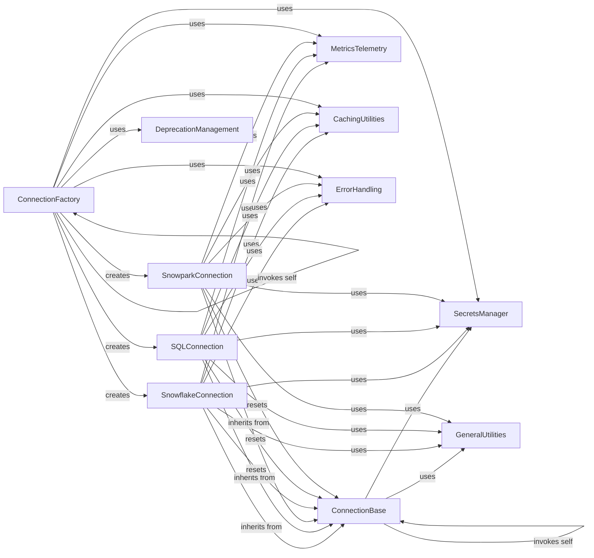

## Component Details

This graph illustrates the architecture of Streamlit's External Data Connectors subsystem. It details how Streamlit applications establish and manage connections to various external data sources like Snowflake and SQL databases. The core flow involves a `ConnectionFactory` creating specific connection instances (`SnowflakeConnection`, `SQLConnection`, `SnowparkConnection`) which inherit from a `ConnectionBase` abstract class. These connections leverage `SecretsManager` for credentials, `CachingUtilities` for performance, `MetricsTelemetry` for usage tracking, and `ErrorHandling` for robust operation, with `GeneralUtilities` providing common helper functions and `DeprecationManagement` handling API evolution.

### ConnectionBase
This component defines the abstract base class for all Streamlit connections, providing a standardized interface for connection authors. It handles common connection lifecycle events like initialization, secrets management, and resetting the connection.

**Related Classes/Methods**:

- <a href="https://github.com/streamlit/streamlit/blob/master/lib/streamlit/connections/base_connection.py#L27-L174" target="_blank" rel="noopener noreferrer">`streamlit.connections.base_connection.BaseConnection` (27:174)</a>
- <a href="https://github.com/streamlit/streamlit/blob/master/lib/streamlit/connections/base_connection.py#L46-L73" target="_blank" rel="noopener noreferrer">`streamlit.connections.base_connection.BaseConnection.__init__` (46:73)</a>
- <a href="https://github.com/streamlit/streamlit/blob/master/lib/streamlit/connections/base_connection.py#L90-L102" target="_blank" rel="noopener noreferrer">`streamlit.connections.base_connection.BaseConnection._on_secrets_changed` (90:102)</a>
- <a href="https://github.com/streamlit/streamlit/blob/master/lib/streamlit/connections/base_connection.py#L105-L119" target="_blank" rel="noopener noreferrer">`streamlit.connections.base_connection.BaseConnection._secrets` (105:119)</a>
- <a href="https://github.com/streamlit/streamlit/blob/master/lib/streamlit/connections/base_connection.py#L149-L154" target="_blank" rel="noopener noreferrer">`streamlit.connections.base_connection.BaseConnection._instance` (149:154)</a>
- <a href="https://github.com/streamlit/streamlit/blob/master/lib/streamlit/connections/base_connection.py#L121-L146" target="_blank" rel="noopener noreferrer">`streamlit.connections.base_connection.BaseConnection.reset` (121:146)</a>
- <a href="https://github.com/streamlit/streamlit/blob/master/lib/streamlit/connections/base_connection.py#L158-L174" target="_blank" rel="noopener noreferrer">`streamlit.connections.base_connection.BaseConnection._connect` (158:174)</a>

### SnowflakeConnection
This component provides a concrete implementation for connecting to Snowflake, extending the ConnectionBase. It includes methods for querying data and managing Snowpark sessions, with specific handling for running in Streamlit in Snowflake (SiS) and integrating with Snowflake Connector for Python.

**Related Classes/Methods**:

- <a href="https://github.com/streamlit/streamlit/blob/master/lib/streamlit/connections/snowflake_connection.py#L49-L563" target="_blank" rel="noopener noreferrer">`streamlit.connections.snowflake_connection.SnowflakeConnection` (49:563)</a>
- <a href="https://github.com/streamlit/streamlit/blob/master/lib/streamlit/connections/snowflake_connection.py#L225-L280" target="_blank" rel="noopener noreferrer">`streamlit.connections.snowflake_connection.SnowflakeConnection._connect` (225:280)</a>
- <a href="https://github.com/streamlit/streamlit/blob/master/lib/streamlit/connections/snowflake_connection.py#L282-L373" target="_blank" rel="noopener noreferrer">`streamlit.connections.snowflake_connection.SnowflakeConnection.query` (282:373)</a>
- <a href="https://github.com/streamlit/streamlit/blob/master/lib/streamlit/connections/snowflake_connection.py#L529-L563" target="_blank" rel="noopener noreferrer">`streamlit.connections.snowflake_connection.SnowflakeConnection.session` (529:563)</a>

### SQLConnection
This component provides a concrete implementation for connecting to generic SQL databases using SQLAlchemy. It handles connection parameters, creates SQLAlchemy engines, and offers a query method for executing SQL queries with caching and error handling.

**Related Classes/Methods**:

- <a href="https://github.com/streamlit/streamlit/blob/master/lib/streamlit/connections/sql_connection.py#L54-L426" target="_blank" rel="noopener noreferrer">`streamlit.connections.sql_connection.SQLConnection` (54:426)</a>
- <a href="https://github.com/streamlit/streamlit/blob/master/lib/streamlit/connections/sql_connection.py#L179-L220" target="_blank" rel="noopener noreferrer">`streamlit.connections.sql_connection.SQLConnection._connect` (179:220)</a>
- <a href="https://github.com/streamlit/streamlit/blob/master/lib/streamlit/connections/sql_connection.py#L222-L353" target="_blank" rel="noopener noreferrer">`streamlit.connections.sql_connection.SQLConnection.query` (222:353)</a>

### SnowparkConnection
This component provides a concrete implementation for connecting to Snowpark, extending the ConnectionBase. It manages Snowpark sessions, handles connection parameters from various sources, and offers a thread-safe query method for executing SQL queries.

**Related Classes/Methods**:

- <a href="https://github.com/streamlit/streamlit/blob/master/lib/streamlit/connections/snowpark_connection.py#L48-L213" target="_blank" rel="noopener noreferrer">`streamlit.connections.snowpark_connection.SnowparkConnection` (48:213)</a>
- <a href="https://github.com/streamlit/streamlit/blob/master/lib/streamlit/connections/snowpark_connection.py#L64-L66" target="_blank" rel="noopener noreferrer">`streamlit.connections.snowpark_connection.SnowparkConnection.__init__` (64:66)</a>
- <a href="https://github.com/streamlit/streamlit/blob/master/lib/streamlit/connections/snowpark_connection.py#L68-L94" target="_blank" rel="noopener noreferrer">`streamlit.connections.snowpark_connection.SnowparkConnection._connect` (68:94)</a>
- <a href="https://github.com/streamlit/streamlit/blob/master/lib/streamlit/connections/snowpark_connection.py#L96-L164" target="_blank" rel="noopener noreferrer">`streamlit.connections.snowpark_connection.SnowparkConnection.query` (96:164)</a>

### ConnectionFactory
This component is responsible for creating and managing connection instances. It acts as the entry point for users to obtain connection objects, inferring connection types and handling caching of connection resources.

**Related Classes/Methods**:

- <a href="https://github.com/streamlit/streamlit/blob/master/lib/streamlit/runtime/connection_factory.py#L64-L104" target="_blank" rel="noopener noreferrer">`streamlit.lib.streamlit.runtime.connection_factory._create_connection` (64:104)</a>
- <a href="https://github.com/streamlit/streamlit/blob/master/lib/streamlit/runtime/connection_factory.py#L107-L114" target="_blank" rel="noopener noreferrer">`streamlit.lib.streamlit.runtime.connection_factory._get_first_party_connection` (107:114)</a>
- <a href="https://github.com/streamlit/streamlit/blob/master/lib/streamlit/runtime/connection_factory.py#L118-L125" target="_blank" rel="noopener noreferrer">`streamlit.lib.streamlit.runtime.connection_factory.connection_factory` (118:125)</a>

### SecretsManager
This component handles the loading, parsing, and access of secrets from secrets.toml files or directories. It provides a dictionary-like interface for accessing secrets and notifies listeners when secret files change.

**Related Classes/Methods**:

- <a href="https://github.com/streamlit/streamlit/blob/master/lib/streamlit/runtime/secrets.py#L211-L226" target="_blank" rel="noopener noreferrer">`streamlit.runtime.secrets.Secrets.load_if_toml_exists` (211:226)</a>
- <a href="https://github.com/streamlit/streamlit/blob/master/lib/streamlit/runtime/secrets.py#L147-L191" target="_blank" rel="noopener noreferrer">`streamlit.runtime.secrets.AttrDict` (147:191)</a>
- <a href="https://github.com/streamlit/streamlit/blob/master/lib/streamlit/runtime/secrets.py#L190-L191" target="_blank" rel="noopener noreferrer">`streamlit.runtime.secrets.AttrDict.to_dict` (190:191)</a>

### MetricsTelemetry
This component is responsible for gathering and reporting usage metrics and telemetry data for various Streamlit commands and operations. It includes decorators to automatically track function calls and their arguments.

**Related Classes/Methods**:

- <a href="https://github.com/streamlit/streamlit/blob/master/lib/streamlit/runtime/metrics_util.py#L346-L349" target="_blank" rel="noopener noreferrer">`streamlit.runtime.metrics_util.gather_metrics` (346:349)</a>
- `streamlit.runtime.metrics_util.gather_metrics.wrapper` (full file reference)

### CachingUtilities
This component provides caching functionalities for Streamlit applications, including data caching (cache_data) and resource caching (cache_resource). It helps in optimizing performance by storing and reusing results of expensive operations.

**Related Classes/Methods**:

- <a href="https://github.com/streamlit/streamlit/blob/master/lib/streamlit/runtime/caching/cache_data_api.py#L324-L602" target="_blank" rel="noopener noreferrer">`streamlit.runtime.caching.cache_data_api.CacheDataAPI` (324:602)</a>
- <a href="https://github.com/streamlit/streamlit/blob/master/lib/streamlit/runtime/caching/cache_resource_api.py#L187-L445" target="_blank" rel="noopener noreferrer">`streamlit.runtime.caching.cache_resource_api.CacheResourceAPI` (187:445)</a>

### ErrorHandling
This component defines and manages various types of exceptions and warnings within the Streamlit ecosystem, providing structured error messages for API misuse and other runtime issues.

**Related Classes/Methods**:

- <a href="https://github.com/streamlit/streamlit/blob/master/lib/streamlit/errors.py#L82-L97" target="_blank" rel="noopener noreferrer">`streamlit.errors.StreamlitAPIException` (82:97)</a>

### GeneralUtilities
This component provides a collection of general-purpose utility functions used across different parts of Streamlit, such as MD5 hashing, and specific utilities for connection management like extracting parameters and loading from SnowSQL config files.

**Related Classes/Methods**:

- <a href="https://github.com/streamlit/streamlit/blob/master/lib/streamlit/util.py#L61-L72" target="_blank" rel="noopener noreferrer">`streamlit.util.calc_md5` (61:72)</a>
- <a href="https://github.com/streamlit/streamlit/blob/master/lib/streamlit/connections/util.py#L88-L97" target="_blank" rel="noopener noreferrer">`streamlit.connections.util.running_in_sis` (88:97)</a>
- <a href="https://github.com/streamlit/streamlit/blob/master/lib/streamlit/connections/util.py#L32-L55" target="_blank" rel="noopener noreferrer">`streamlit.connections.util.extract_from_dict` (32:55)</a>
- <a href="https://github.com/streamlit/streamlit/blob/master/lib/streamlit/connections/util.py#L58-L85" target="_blank" rel="noopener noreferrer">`streamlit.connections.util.load_from_snowsql_config_file` (58:85)</a>

### DeprecationManagement
This component provides utilities for managing deprecated functions and objects within Streamlit. It allows for wrapping old functionalities to issue warnings when they are used, guiding developers towards newer alternatives.

**Related Classes/Methods**:

- <a href="https://github.com/streamlit/streamlit/blob/master/lib/streamlit/deprecation_util.py#L111-L152" target="_blank" rel="noopener noreferrer">`streamlit.deprecation_util.deprecate_obj_name` (111:152)</a>

### [FAQ](https://github.com/CodeBoarding/GeneratedOnBoardings/tree/main?tab=readme-ov-file#faq)