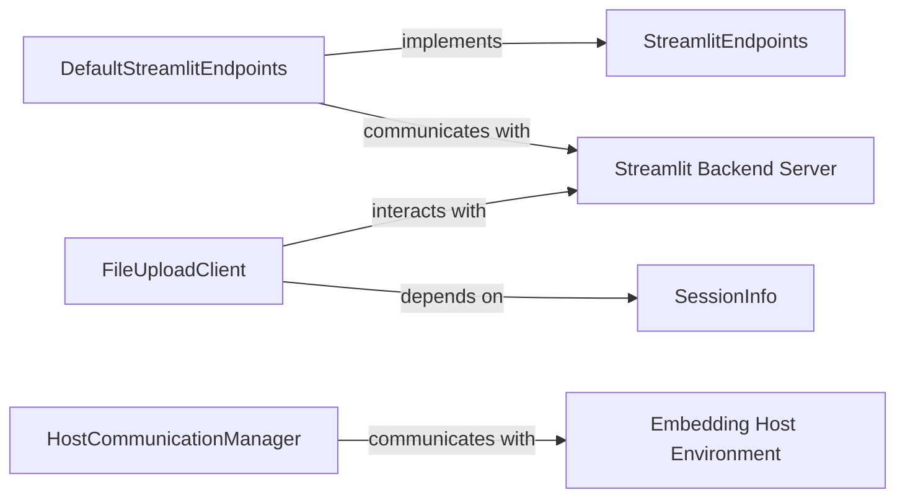

## Details

The Streamlit Frontend Communication subsystem is designed to facilitate robust and secure interaction between the client-side application and the Streamlit backend, as well as external embedding environments. At its core, the `StreamlitEndpoints` interface defines the contract for all backend communication, with `DefaultStreamlitEndpoints` providing the concrete, secure WebSocket implementation. File uploads are handled by `FileUploadClient`, which leverages `SessionInfo` for context. For embedded scenarios, `HostCommunicationManager` ensures seamless communication with the embedding host. This architecture ensures a clear separation of concerns, enabling efficient and reliable data exchange and application lifecycle management.

### StreamlitEndpoints
Defines the abstract interface for all general client-side communication with the Streamlit backend. This includes establishing and maintaining WebSocket connections and handling core application messages, serving as the primary contract for frontend-backend interaction.

**Related Classes/Methods**:

- <a href="https://github.com/streamlit/streamlit/blob/develop/frontend/lib/src/StreamlitEndpoints.ts#L25-L134" target="_blank" rel="noopener noreferrer">`StreamlitEndpoints`:25-134</a>

### DefaultStreamlitEndpoints
Provides the concrete implementation for `StreamlitEndpoints`. It manages the low-level details of secure, authenticated, and reliable WebSocket communication with the Streamlit server, handling message serialization/deserialization and the connection lifecycle.

**Related Classes/Methods**:

- <a href="https://github.com/streamlit/streamlit/blob/develop/frontend/connection/src/DefaultStreamlitEndpoints.ts#L52-L378" target="_blank" rel="noopener noreferrer">`DefaultStreamlitEndpoints`:52-378</a>

### FileUploadClient
Manages the client-side logic for uploading user files to the Streamlit backend and handling file deletion requests. It orchestrates the file transfer process and integrates with session-specific information to ensure correct file association.

**Related Classes/Methods**:

- <a href="https://github.com/streamlit/streamlit/blob/develop/frontend/lib/src/FileUploadClient.ts#L46-L214" target="_blank" rel="noopener noreferrer">`FileUploadClient`:46-214</a>

### HostCommunicationManager
Facilitates secure and structured communication between the Streamlit frontend and an embedding host environment. It manages messages related to embedding scenarios, such as resizing, theme changes, or external events, enabling Streamlit applications to function seamlessly within other web pages.

**Related Classes/Methods**:

- <a href="https://github.com/streamlit/streamlit/blob/develop/frontend/lib/src/hostComm/HostCommunicationManager.tsx#L74-L291" target="_blank" rel="noopener noreferrer">`HostCommunicationManager`:74-291</a>

### SessionInfo
Provides access to current session-specific details and configuration, such as the session ID, script run ID, and other contextual information necessary for various client-side operations, particularly for associating file uploads and other communications with the correct user session.

**Related Classes/Methods**:

- <a href="https://github.com/streamlit/streamlit/blob/develop/frontend/app/src/components/StreamlitDialog/SettingsDialog.tsx" target="_blank" rel="noopener noreferrer">`SessionInfo`</a>

### Streamlit Backend Server
The server-side component of Streamlit responsible for processing application logic, managing sessions, and serving data to the frontend.

**Related Classes/Methods**: _None_

### Embedding Host Environment
An external web application or environment in which a Streamlit application is embedded, communicating with the Streamlit frontend for interactive features and display adjustments.

**Related Classes/Methods**: _None_

### [FAQ](https://github.com/CodeBoarding/GeneratedOnBoardings/tree/main?tab=readme-ov-file#faq)