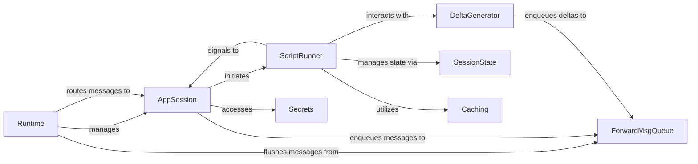

## Details

The Streamlit backend runtime is orchestrated by the `Runtime` component, which manages user sessions and message flow. Each user interaction is handled by an `AppSession`, responsible for initiating script execution via the `ScriptRunner`. The `ScriptRunner` executes the user's Python code, interacting with `DeltaGenerator` to produce UI updates, managing application state through `SessionState`, and optimizing performance with `Caching`. UI updates and other messages are buffered in the `ForwardMsgQueue` before being sent to the frontend. `AppSession` also securely accesses sensitive information through the `Secrets` component. This architecture ensures a clear separation of concerns, enabling efficient and responsive Streamlit application execution.

### Runtime
The central orchestrator of the Streamlit backend. It manages the main event loop, handles incoming connections from the frontend, and coordinates interactions between `AppSession` instances and the `ForwardMsgQueue`.

**Related Classes/Methods**:

- <a href="https://github.com/streamlit/streamlit/blob/develop/lib/streamlit/runtime/runtime.py" target="_blank" rel="noopener noreferrer">`streamlit.runtime.runtime`</a>

### AppSession
Represents a single user's interactive session with a Streamlit application. It manages the session lifecycle, processes messages received from the frontend, initiates script execution, and handles file change detection to trigger reruns.

**Related Classes/Methods**:

- <a href="https://github.com/streamlit/streamlit/blob/develop/lib/streamlit/runtime/app_session.py" target="_blank" rel="noopener noreferrer">`streamlit.runtime.app_session`</a>

### ScriptRunner
Executes the user's Streamlit Python script in a dedicated thread. It controls the script's lifecycle, manages execution flow (reruns, stops), and interacts with other runtime components to update the UI and manage state.

**Related Classes/Methods**:

- <a href="https://github.com/streamlit/streamlit/blob/develop/lib/streamlit/runtime/scriptrunner/script_runner.py" target="_blank" rel="noopener noreferrer">`streamlit.runtime.scriptrunner.script_runner`</a>

### DeltaGenerator
Provides the core `st.*` API functions that users call to generate UI elements and updates (deltas). It manages the current position within the element tree and enqueues UI messages for transmission.

**Related Classes/Methods**:

- <a href="https://github.com/streamlit/streamlit/blob/develop/lib/streamlit/delta_generator.py" target="_blank" rel="noopener noreferrer">`streamlit.delta_generator`</a>

### ForwardMsgQueue
Buffers and manages `ForwardMsg`s (UI updates, session state changes, etc.) that need to be sent from the backend to the frontend. It optimizes message delivery by composing multiple deltas into single messages where possible.

**Related Classes/Methods**:

- <a href="https://github.com/streamlit/streamlit/blob/develop/lib/streamlit/runtime/forward_msg_queue.py" target="_blank" rel="noopener noreferrer">`streamlit.runtime.forward_msg_queue`</a>

### SessionState
Manages the state of widgets and user-defined session variables across script reruns. It provides a dictionary-like interface for accessing and modifying this state.

**Related Classes/Methods**:

- <a href="https://github.com/streamlit/streamlit/blob/develop/lib/streamlit/runtime/state/session_state.py" target="_blank" rel="noopener noreferrer">`streamlit.runtime.state.session_state`</a>

### Caching
Implements Streamlit's caching mechanisms (`st.cache_data` and `st.cache_resource`) to optimize script execution by storing and reusing computation results and resources.

**Related Classes/Methods**:

- <a href="https://github.com/streamlit/streamlit/blob/develop/lib/streamlit/runtime/caching/__init__.py" target="_blank" rel="noopener noreferrer">`streamlit.runtime.caching`</a>

### Secrets
Manages access to user-defined secrets, typically loaded from `secrets.toml` files and environment variables, providing a secure way to access sensitive information within the application.

**Related Classes/Methods**:

- <a href="https://github.com/streamlit/streamlit/blob/develop/lib/streamlit/runtime/secrets.py" target="_blank" rel="noopener noreferrer">`streamlit.runtime.secrets`</a>

### [FAQ](https://github.com/CodeBoarding/GeneratedOnBoardings/tree/main?tab=readme-ov-file#faq)