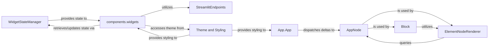

## Details

The Streamlit frontend architecture is centered around the `App.App` component, which acts as the main orchestrator, processing data from the backend and managing the overall UI state. The `AppNode` component forms the core data model, representing the hierarchical structure of UI elements, which is dynamically updated by `App.App` through incoming deltas. The rendering of these UI elements is handled by `ElementNodeRenderer`, which dispatches to specific React components within `components.widgets` based on the element type. Interactive `components.widgets` manage their internal state and communicate updates back to the backend via the `WidgetStateManager`. Communication with the Streamlit backend for various services like file uploads and media URLs is facilitated by `StreamlitEndpoints`. Finally, `Theme and Styling` ensures a consistent visual appearance across all components, providing styling information to both the main `App.App` and individual `components.widgets`. This design promotes a clear separation of concerns, with data management, rendering, and interaction handled by distinct, interconnected components.

### App.App
The top-level orchestrator, responsible for initializing the connection, processing incoming protobuf deltas, managing navigation, and dispatching updates to the UI state.

**Related Classes/Methods**:

- <a href="https://github.com/streamlit/streamlit/blob/develop/frontend/app/src/App.tsx#L234-L657" target="_blank" rel="noopener noreferrer">`App.App`:234-657</a>

### AppNode
Manages the hierarchical tree structure of UI elements, applying deltas to update this tree, which drives the rendering of UI components. It serves as the core data model for the frontend's view.

**Related Classes/Methods**:

- <a href="https://github.com/streamlit/streamlit/blob/develop/frontend/lib/src/AppNode.ts#L102-L160" target="_blank" rel="noopener noreferrer">`AppNode`:102-160</a>

### WidgetStateManager
Manages the state of all interactive widgets, storing values, providing methods for widgets to update their states, and sending updated widget states back to the Streamlit backend, including form submission logic.

**Related Classes/Methods**:

- <a href="https://github.com/streamlit/streamlit/blob/develop/frontend/lib/src/WidgetStateManager.ts#L178-L840" target="_blank" rel="noopener noreferrer">`WidgetStateManager`:178-840</a>

### Block
A foundational component for structuring the Streamlit UI, handling the layout and rendering of child elements and nested blocks (e.g., containers, columns, tabs).

**Related Classes/Methods**:

- <a href="https://github.com/streamlit/streamlit/blob/develop/frontend/app/src/components/AppView/AppView.tsx" target="_blank" rel="noopener noreferrer">`Block`</a>

### ElementNodeRenderer
Responsible for rendering individual UI elements (widgets, charts, text) based on the AppNode structure, acting as a dispatcher to select the appropriate React component for each element type.

**Related Classes/Methods**:

- <a href="https://github.com/streamlit/streamlit/blob/develop/frontend/lib/src/components/core/Block/ElementNodeRenderer.tsx#L689-L727" target="_blank" rel="noopener noreferrer">`ElementNodeRenderer`:689-727</a>

### components.widgets
A collection of individual React components representing interactive UI widgets (e.g., buttons, sliders, text inputs). Each handles its specific UI rendering, user input, and communicates state changes.

**Related Classes/Methods**:

- <a href="https://github.com/streamlit/streamlit/blob/develop/frontend/lib/src/components/widgets/" target="_blank" rel="noopener noreferrer">`components.widgets`</a>

### StreamlitEndpoints
Provides an interface for the frontend to communicate with the Streamlit backend server for operations suchs as building URLs for media files, handling file uploads/downloads, and checking source URL responses.

**Related Classes/Methods**:

- <a href="https://github.com/streamlit/streamlit/blob/develop/frontend/lib/src/StreamlitEndpoints.ts#L25-L134" target="_blank" rel="noopener noreferrer">`StreamlitEndpoints`:25-134</a>

### Theme and Styling
Manages the application's visual theme and styling, providing utilities and hooks for components to access and apply consistent styling.

**Related Classes/Methods**:

- <a href="https://github.com/streamlit/streamlit/blob/develop/frontend/lib/src/components/core/ThemeProvider.tsx" target="_blank" rel="noopener noreferrer">`Theme and Styling`</a>

### [FAQ](https://github.com/CodeBoarding/GeneratedOnBoardings/tree/main?tab=readme-ov-file#faq)