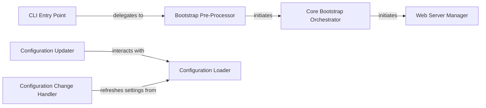

## Details

The Streamlit Server & Bootstrap subsystem is the foundational layer responsible for initializing and launching the Streamlit application. It encompasses the command-line interface, the core bootstrapping logic, the web server startup, and the application's configuration management.

### CLI Entry Point
The primary command-line interface entry point for starting a Streamlit application. It parses initial command-line arguments and orchestrates the delegation to the core bootstrapping process. It can also handle downloading remote scripts.

**Related Classes/Methods**:

- <a href="https://github.com/streamlit/streamlit/blob/develop/lib/streamlit/web/cli.py" target="_blank" rel="noopener noreferrer">`lib.streamlit.web.cli.main_run`</a>

### Bootstrap Pre-Processor
Handles essential pre-server setup routines, such as fixing environment-specific issues (e.g., PyDeck, sys paths, Tornado crashes) and installing configuration watchers. It then initiates the core bootstrap process.

**Related Classes/Methods**:

- <a href="https://github.com/streamlit/streamlit/blob/develop/lib/streamlit/web/bootstrap.py" target="_blank" rel="noopener noreferrer">`lib.streamlit.web.bootstrap.run`</a>

### Core Bootstrap Orchestrator
A central internal function that orchestrates the main sequence of the Streamlit application's bootstrapping process. It is responsible for initiating the server startup.

**Related Classes/Methods**:

- <a href="https://github.com/streamlit/streamlit/blob/develop/lib/streamlit/web/bootstrap.py" target="_blank" rel="noopener noreferrer">`lib.streamlit.web.bootstrap.main`</a>

### Web Server Manager
Manages the actual startup of the Tornado web server. This includes setting up signal handlers for graceful shutdown and executing post-startup routines.

**Related Classes/Methods**:

- <a href="https://github.com/streamlit/streamlit/blob/develop/lib/streamlit/web/bootstrap.py" target="_blank" rel="noopener noreferrer">`lib.streamlit.web.bootstrap.run_server`</a>

### Configuration Loader
Provides a unified interface for retrieving all Streamlit configuration settings. It is responsible for loading and merging configurations from various sources, including default values, environment variables, and TOML files.

**Related Classes/Methods**:

- <a href="https://github.com/streamlit/streamlit/blob/develop/lib/streamlit/config.py" target="_blank" rel="noopener noreferrer">`lib.streamlit.config.get_config_options`</a>

### Configuration Updater
Allows external modules and internal processes to dynamically modify individual Streamlit configuration options, ensuring consistency and proper application of settings.

**Related Classes/Methods**:

- <a href="https://github.com/streamlit/streamlit/blob/develop/lib/streamlit/config.py" target="_blank" rel="noopener noreferrer">`lib.streamlit.config.set_option`</a>

### Configuration Change Handler
An internal function that defines actions to be taken when Streamlit's configuration changes. It ensures that the application reacts appropriately to updates.

**Related Classes/Methods**:

- <a href="https://github.com/streamlit/streamlit/blob/develop/lib/streamlit/web/bootstrap.py" target="_blank" rel="noopener noreferrer">`lib.streamlit.web.bootstrap.on_config_changed`</a>

### [FAQ](https://github.com/CodeBoarding/GeneratedOnBoardings/tree/main?tab=readme-ov-file#faq)