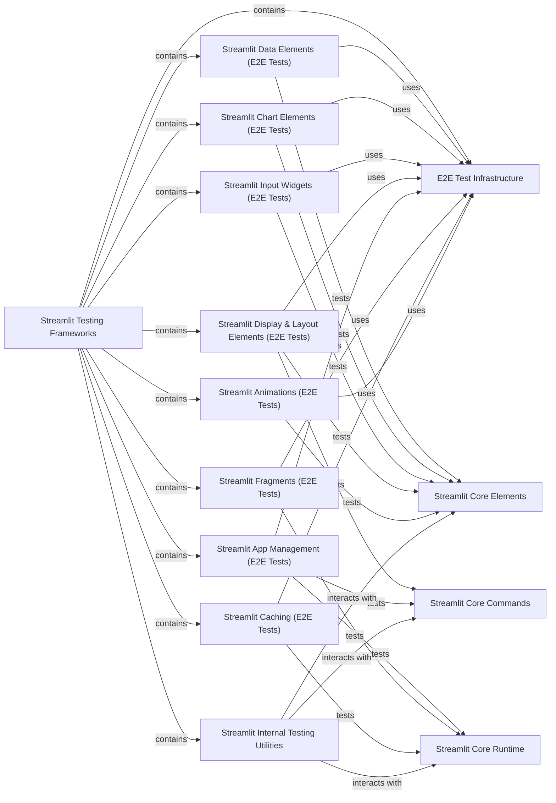

## Component Details

This graph illustrates the architecture of the Streamlit Testing Frameworks, which encompasses a comprehensive suite of internal utilities and end-to-end tests using Playwright. The main flow involves various specialized E2E test components (Data Elements, Chart Elements, Input Widgets, Display & Layout Elements, App Management, Fragments, Caching, Animations) that leverage a shared E2E Test Infrastructure. These E2E tests are designed to verify the correctness, functionality, and performance of core Streamlit components, including Core Commands, Core Elements, and Core Runtime. Additionally, an Internal Testing Utilities component provides tools for script execution and element inspection, interacting with the core Streamlit functionalities.

### Streamlit Testing Frameworks
Provides a comprehensive suite of internal utilities and end-to-end tests (using Playwright) to ensure the correctness, functionality, and performance of the Streamlit application across its various components.

**Related Classes/Methods**:

- `streamlit.e2e_playwright.st_dataframe_interactions_test` (full file reference)
- `streamlit.e2e_playwright.st_number_input_test` (full file reference)
- `streamlit.e2e_playwright.st_pyplot_test` (full file reference)
- `streamlit.e2e_playwright.st_pydeck_chart_select_test` (full file reference)
- `streamlit.e2e_playwright.st_chat_input_test` (full file reference)
- `streamlit.e2e_playwright.st_metric_test` (full file reference)
- `streamlit.e2e_playwright.st_set_page_config` (full file reference)
- `streamlit.e2e_playwright.st_help_test` (full file reference)
- `streamlit.e2e_playwright.st_dataframe_selections_test` (full file reference)
- `streamlit.e2e_playwright.st_heading_test` (full file reference)
- `streamlit.e2e_playwright.st_dataframe_input_data_test` (full file reference)
- `streamlit.e2e_playwright.iframe_resizer_test` (full file reference)
- `streamlit.e2e_playwright.st_line_chart_test` (full file reference)
- `streamlit.e2e_playwright.st_popover_test` (full file reference)
- `streamlit.e2e_playwright.st_plotly_chart_select_test` (full file reference)
- `streamlit.e2e_playwright.st_container_test` (full file reference)
- `streamlit.e2e_playwright.st_map_test` (full file reference)
- `streamlit.e2e_playwright.st_table_test` (full file reference)
- `streamlit.e2e_playwright.st_magic` (full file reference)
- `streamlit.e2e_playwright.st_time_input_test` (full file reference)
- `streamlit.e2e_playwright.st_balloons_test` (full file reference)
- `streamlit.e2e_playwright.st_form_test` (full file reference)
- `streamlit.e2e_playwright.st_segmented_control` (full file reference)
- `streamlit.e2e_playwright.st_segmented_control_test` (full file reference)
- `streamlit.e2e_playwright.st_fragment_run_every` (full file reference)
- `streamlit.e2e_playwright.st_empty_test` (full file reference)
- `streamlit.e2e_playwright.config_static_serving_test` (full file reference)
- `streamlit.e2e_playwright.st_chat_message_test` (full file reference)
- `streamlit.e2e_playwright.st_set_page_config_test` (full file reference)
- `streamlit.e2e_playwright.st_form_container_association_test` (full file reference)
- `streamlit.e2e_playwright.st_tabs_selection` (full file reference)
- `streamlit.e2e_playwright.st_write_stream_test` (full file reference)
- `streamlit.e2e_playwright.st_columns_test` (full file reference)
- `streamlit.e2e_playwright.st_fragment_dynamic_containers_test` (full file reference)
- `streamlit.e2e_playwright.st_cache_resource` (full file reference)
- `streamlit.e2e_playwright.st_select_slider_test` (full file reference)
- `streamlit.e2e_playwright.st_session_state_test` (full file reference)
- `streamlit.e2e_playwright.st_caption_test` (full file reference)
- `streamlit.e2e_playwright.st_cache_data` (full file reference)
- `streamlit.e2e_playwright.st_date_input_test` (full file reference)
- `streamlit.e2e_playwright.st_audio_test` (full file reference)
- `streamlit.e2e_playwright.st_cache_resource_test` (full file reference)
- `streamlit.e2e_playwright.st_code_test` (full file reference)
- `streamlit.e2e_playwright.st_multiselect_test` (full file reference)
- `streamlit.e2e_playwright.st_json_test` (full file reference)
- `streamlit.e2e_playwright.markdown_features_test` (full file reference)
- `streamlit.e2e_playwright.st_alert_test` (full file reference)
- `streamlit.e2e_playwright.st_rerun_test` (full file reference)
- `streamlit.e2e_playwright.st_slider_test` (full file reference)
- `streamlit.e2e_playwright.st_expander_state_test` (full file reference)
- `streamlit.e2e_playwright.st_components_v1_import_via_st_test` (full file reference)
- `streamlit.e2e_playwright.st_radio_test` (full file reference)
- `streamlit.e2e_playwright.st_fragment_multiple_fragments_test` (full file reference)
- `streamlit.e2e_playwright.st_logo` (full file reference)
- `streamlit.e2e_playwright.st_pills` (full file reference)
- `streamlit.e2e_playwright.host_config_test` (full file reference)
- `streamlit.e2e_playwright.st_area_chart_test` (full file reference)
- `streamlit.e2e_playwright.st_toggle_test` (full file reference)
- `streamlit.e2e_playwright.st_cache_data_test` (full file reference)
- `streamlit.e2e_playwright.st_html_test` (full file reference)
- `streamlit.e2e_playwright.st_dialog` (full file reference)
- `streamlit.e2e_playwright.st_dataframe_dimensions_test` (full file reference)
- `streamlit.e2e_playwright.st_button_test` (full file reference)
- `streamlit.e2e_playwright.st_fragment_dynamic_form_test` (full file reference)
- `streamlit.e2e_playwright.help_tooltip_test` (full file reference)
- `streamlit.e2e_playwright.st_toast_test` (full file reference)
- `streamlit.e2e_playwright.st_fragment_chat_response_test` (full file reference)
- `streamlit.e2e_playwright.st_pills_test` (full file reference)
- `streamlit.e2e_playwright.st_progress_test` (full file reference)
- `streamlit.e2e_playwright.st_vega_lite_chart_test` (full file reference)
- `streamlit.e2e_playwright.st_checkbox_test` (full file reference)
- `streamlit.e2e_playwright.st_altair_chart_test` (full file reference)
- `streamlit.e2e_playwright.st_text_test` (full file reference)
- `streamlit.e2e_playwright.st_context_test` (full file reference)
- `streamlit.e2e_playwright.st_rerun` (full file reference)
- `streamlit.e2e_playwright.st_fragment_queue_test` (full file reference)
- `streamlit.e2e_playwright.mega_tester_app_test` (full file reference)
- `streamlit.e2e_playwright.deploy_dialog_test` (full file reference)
- `streamlit.e2e_playwright.st_logo_test` (full file reference)
- `streamlit.e2e_playwright.auth_test` (full file reference)
- `streamlit.e2e_playwright.websocket_reconnects_test` (full file reference)
- `streamlit.e2e_playwright.st_fragment_dynamic_form` (full file reference)
- `streamlit.e2e_playwright.st_image_test` (full file reference)
- `streamlit.e2e_playwright.hello_app_test` (full file reference)
- `streamlit.e2e_playwright.st_selectbox_test` (full file reference)
- `streamlit.e2e_playwright.st_feedback` (full file reference)
- `streamlit.e2e_playwright.st_scatter_chart_test` (full file reference)
- `streamlit.e2e_playwright.websocket_disconnect_test` (full file reference)
- `streamlit.e2e_playwright.widget_state_test` (full file reference)
- `streamlit.e2e_playwright.st_fragment_mixed_execution_flow_test` (full file reference)
- `streamlit.e2e_playwright.st_file_uploader` (full file reference)
- `streamlit.e2e_playwright.fast_rerun_safety_test` (full file reference)
- `streamlit.e2e_playwright.st_camera_input_test` (full file reference)
- `streamlit.e2e_playwright.st_download_button_test` (full file reference)
- `streamlit.e2e_playwright.hostframe_app_test` (full file reference)
- `streamlit.e2e_playwright.st_snow_test` (full file reference)
- `streamlit.e2e_playwright.st_altair_chart_basic_select_test` (full file reference)
- `streamlit.e2e_playwright.st_dataframe_config_test` (full file reference)
- `streamlit.e2e_playwright.st_sidebar_test` (full file reference)
- `streamlit.e2e_playwright.st_dataframe_stable_rendering_test` (full file reference)
- `streamlit.e2e_playwright.st_tabs_test` (full file reference)
- `streamlit.e2e_playwright.st_effects_with_fragment_interactions_test` (full file reference)
- `streamlit.e2e_playwright.st_fragments_nested` (full file reference)
- `streamlit.e2e_playwright.basic_app_test` (full file reference)
- `streamlit.e2e_playwright.st_feedback_test` (full file reference)
- `streamlit.e2e_playwright.st_plotly_chart_test` (full file reference)
- `streamlit.e2e_playwright.st_fragment_basics_test` (full file reference)
- `streamlit.e2e_playwright.st_markdown_test` (full file reference)
- `streamlit.e2e_playwright.st_bar_chart_test` (full file reference)
- `streamlit.e2e_playwright.st_text_area_test` (full file reference)
- `streamlit.e2e_playwright.mega_tester_app` (full file reference)
- `streamlit.e2e_playwright.st_file_uploader_test` (full file reference)
- `streamlit.e2e_playwright.app_hotkeys_test` (full file reference)
- `streamlit.e2e_playwright.st_graphviz_chart_test` (full file reference)
- `streamlit.e2e_playwright.st_chat_input_file_uploader_regression_test` (full file reference)
- `streamlit.e2e_playwright.st_color_picker_test` (full file reference)
- `streamlit.e2e_playwright.st_audio_input_test` (full file reference)
- `streamlit.e2e_playwright.forward_msg_cache_test` (full file reference)
- `streamlit.e2e_playwright.st_data_editor_config_test` (full file reference)
- `streamlit.e2e_playwright.st_components_v1_test` (full file reference)
- `streamlit.e2e_playwright.st_fragments_nested_test` (full file reference)
- `streamlit.e2e_playwright.st_pydeck_chart_test` (full file reference)
- `streamlit.e2e_playwright.st_link_button_test` (full file reference)
- `streamlit.e2e_playwright.st_tabs_selection_test` (full file reference)
- `streamlit.e2e_playwright.st_exception_test` (full file reference)
- `streamlit.e2e_playwright.st_audio_input` (full file reference)
- `streamlit.e2e_playwright.st_video_test` (full file reference)
- `streamlit.e2e_playwright.conftest` (full file reference)
- `streamlit.e2e_playwright.st_text_input_test` (full file reference)
- `streamlit.e2e_playwright.st_expander_test` (full file reference)
- `streamlit.e2e_playwright.st_spinner_test` (full file reference)
- `streamlit.e2e_playwright.st_divider_test` (full file reference)
- `streamlit.e2e_playwright.st_dialog_test` (full file reference)
- `streamlit.e2e_playwright.multipage_apps_v2.mpa_v2_basics_test` (full file reference)
- `streamlit.e2e_playwright.multipage_apps_v2.mpa_v2_basics` (full file reference)
- `streamlit.e2e_playwright.multipage_apps_v2.mpa_v2_initial_load_test` (full file reference)
- `streamlit.e2e_playwright.multipage_apps_v2.mpa_v2_title_test` (full file reference)
- `streamlit.e2e_playwright.theming.theme_tester_app` (full file reference)
- `streamlit.e2e_playwright.theming.font_style_test` (full file reference)
- `streamlit.e2e_playwright.theming.snowflake_light_theme_test` (full file reference)
- `streamlit.e2e_playwright.theming.snowflake_dark_theme_test` (full file reference)
- `streamlit.e2e_playwright.theming.font_style` (full file reference)
- `streamlit.e2e_playwright.config.script_level_config_test` (full file reference)
- `streamlit.e2e_playwright.custom_components.component_errors_test` (full file reference)
- `streamlit.e2e_playwright.custom_components.popular_components_test` (full file reference)
- `streamlit.e2e_playwright.shared.animation_utils` (full file reference)
- `streamlit.e2e_playwright.shared.performance` (full file reference)
- `streamlit.e2e_playwright.shared.app_utils` (full file reference)
- `streamlit.e2e_playwright.shared.dataframe_utils` (full file reference)
- `streamlit.e2e_playwright.shared.react18_utils` (full file reference)
- `streamlit.e2e_playwright.shared.toolbar_utils` (full file reference)
- `streamlit.e2e_playwright.shared.oidc_mock_server` (full file reference)
- `streamlit.e2e_playwright.multipage_apps.mpa_v2_custom_theme_test` (full file reference)
- `streamlit.e2e_playwright.multipage_apps.mpa_basics_test` (full file reference)
- `streamlit.e2e_playwright.multipage_apps.mpa_configure_sidebar_test` (full file reference)
- `frontend.app.performance.apps.multipage.multipage_app` (full file reference)
- `streamlit.lib.streamlit.testing.v1.app_test` (full file reference)
- `streamlit.lib.streamlit.testing.v1.element_tree` (full file reference)
- `streamlit.lib.streamlit.testing.v1.local_script_runner` (full file reference)
- `streamlit.lib.streamlit.testing.v1.util` (full file reference)

### E2E Test Infrastructure
This component provides shared utilities and fixtures for end-to-end testing of Streamlit applications using Playwright. It includes functions for interacting with the browser, managing application state, and asserting visual stability and content.

**Related Classes/Methods**:

- <a href="https://github.com/streamlit/streamlit/blob/master/e2e_playwright/shared/dataframe_utils.py#L346-L397" target="_blank" rel="noopener noreferrer">`streamlit.e2e_playwright.shared.dataframe_utils.expect_canvas_to_be_stable` (346:397)</a>
- <a href="https://github.com/streamlit/streamlit/blob/master/e2e_playwright/shared/react18_utils.py#L84-L108" target="_blank" rel="noopener noreferrer">`streamlit.e2e_playwright.shared.react18_utils.take_stable_snapshot` (84:108)</a>
- <a href="https://github.com/streamlit/streamlit/blob/master/e2e_playwright/shared/react18_utils.py#L25-L81" target="_blank" rel="noopener noreferrer">`streamlit.e2e_playwright.shared.react18_utils.wait_for_react_stability` (25:81)</a>
- <a href="https://github.com/streamlit/streamlit/blob/master/e2e_playwright/shared/dataframe_utils.py#L96-L104" target="_blank" rel="noopener noreferrer">`streamlit.e2e_playwright.shared.dataframe_utils.unfocus_dataframe` (96:104)</a>
- <a href="https://github.com/streamlit/streamlit/blob/master/e2e_playwright/shared/dataframe_utils.py#L173-L228" target="_blank" rel="noopener noreferrer">`streamlit.e2e_playwright.shared.dataframe_utils.click_on_cell` (173:228)</a>
- <a href="https://github.com/streamlit/streamlit/blob/master/e2e_playwright/shared/toolbar_utils.py#L29-L84" target="_blank" rel="noopener noreferrer">`streamlit.e2e_playwright.shared.toolbar_utils.assert_fullscreen_toolbar_button_interactions` (29:84)</a>
- <a href="https://github.com/streamlit/streamlit/blob/master/e2e_playwright/shared/dataframe_utils.py#L403-L414" target="_blank" rel="noopener noreferrer">`streamlit.e2e_playwright.shared.dataframe_utils.expect_canvas_to_be_visible` (403:414)</a>
- <a href="https://github.com/streamlit/streamlit/blob/master/e2e_playwright/shared/dataframe_utils.py#L325-L343" target="_blank" rel="noopener noreferrer">`streamlit.e2e_playwright.shared.dataframe_utils.get_open_cell_overlay` (325:343)</a>
- <a href="https://github.com/streamlit/streamlit/blob/master/e2e_playwright/shared/app_utils.py#L278-L323" target="_blank" rel="noopener noreferrer">`streamlit.e2e_playwright.shared.app_utils.expect_prefixed_markdown` (278:323)</a>
- <a href="https://github.com/streamlit/streamlit/blob/master/e2e_playwright/shared/app_utils.py#L610-L629" target="_blank" rel="noopener noreferrer">`streamlit.e2e_playwright.shared.app_utils.get_element_by_key` (610:629)</a>
- <a href="https://github.com/streamlit/streamlit/blob/master/e2e_playwright/shared/dataframe_utils.py#L46-L93" target="_blank" rel="noopener noreferrer">`streamlit.e2e_playwright.shared.dataframe_utils.calc_middle_cell_position` (46:93)</a>
- <a href="https://github.com/streamlit/streamlit/blob/master/e2e_playwright/shared/dataframe_utils.py#L107-L170" target="_blank" rel="noopener noreferrer">`streamlit.e2e_playwright.shared.dataframe_utils.open_column_menu` (107:170)</a>
- <a href="https://github.com/streamlit/streamlit/blob/master/e2e_playwright/shared/dataframe_utils.py#L417-L469" target="_blank" rel="noopener noreferrer">`streamlit.e2e_playwright.shared.dataframe_utils.retry_interaction` (417:469)</a>
- <a href="https://github.com/streamlit/streamlit/blob/master/e2e_playwright/shared/app_utils.py#L530-L566" target="_blank" rel="noopener noreferrer">`streamlit.e2e_playwright.shared.app_utils.expect_help_tooltip` (530:566)</a>
- <a href="https://github.com/streamlit/streamlit/blob/master/e2e_playwright/shared/app_utils.py#L434-L457" target="_blank" rel="noopener noreferrer">`streamlit.e2e_playwright.shared.app_utils.fill_number_input` (434:457)</a>
- <a href="https://github.com/streamlit/streamlit/blob/master/e2e_playwright/shared/app_utils.py#L326-L345" target="_blank" rel="noopener noreferrer">`streamlit.e2e_playwright.shared.app_utils.expect_markdown` (326:345)</a>
- <a href="https://github.com/streamlit/streamlit/blob/master/e2e_playwright/shared/app_utils.py#L646-L660" target="_blank" rel="noopener noreferrer">`streamlit.e2e_playwright.shared.app_utils.check_top_level_class` (646:660)</a>
- <a href="https://github.com/streamlit/streamlit/blob/master/e2e_playwright/shared/app_utils.py#L377-L392" target="_blank" rel="noopener noreferrer">`streamlit.e2e_playwright.shared.app_utils.expect_warning` (377:392)</a>
- <a href="https://github.com/streamlit/streamlit/blob/master/e2e_playwright/shared/app_utils.py#L490-L507" target="_blank" rel="noopener noreferrer">`streamlit.e2e_playwright.shared.app_utils.click_button` (490:507)</a>
- <a href="https://github.com/streamlit/streamlit/blob/master/e2e_playwright/shared/pydeck_utils.py#L92-L96" target="_blank" rel="noopener noreferrer">`streamlit.e2e_playwright.shared.pydeck_utils.click_point` (92:96)</a>
- <a href="https://github.com/streamlit/streamlit/blob/master/e2e_playwright/shared/pydeck_utils.py#L72-L81" target="_blank" rel="noopener noreferrer">`streamlit.e2e_playwright.shared.pydeck_utils.wait_for_chart` (72:81)</a>
- <a href="https://github.com/streamlit/streamlit/blob/master/e2e_playwright/shared/pydeck_utils.py#L84-L89" target="_blank" rel="noopener noreferrer">`streamlit.e2e_playwright.shared.pydeck_utils.get_click_handling_div` (84:89)</a>
- <a href="https://github.com/streamlit/streamlit/blob/master/e2e_playwright/shared/app_utils.py#L510-L527" target="_blank" rel="noopener noreferrer">`streamlit.e2e_playwright.shared.app_utils.click_form_button` (510:527)</a>
- <a href="https://github.com/streamlit/streamlit/blob/master/e2e_playwright/shared/dataframe_utils.py#L231-L252" target="_blank" rel="noopener noreferrer">`streamlit.e2e_playwright.shared.dataframe_utils.select_row` (231:252)</a>
- <a href="https://github.com/streamlit/streamlit/blob/master/e2e_playwright/shared/dataframe_utils.py#L255-L286" target="_blank" rel="noopener noreferrer">`streamlit.e2e_playwright.shared.dataframe_utils.sort_column` (255:286)</a>
- <a href="https://github.com/streamlit/streamlit/blob/master/e2e_playwright/shared/dataframe_utils.py#L289-L322" target="_blank" rel="noopener noreferrer">`streamlit.e2e_playwright.shared.dataframe_utils.select_column` (289:322)</a>
- <a href="https://github.com/streamlit/streamlit/blob/master/e2e_playwright/shared/app_utils.py#L135-L153" target="_blank" rel="noopener noreferrer">`streamlit.e2e_playwright.shared.app_utils.get_popover` (135:153)</a>
- <a href="https://github.com/streamlit/streamlit/blob/master/e2e_playwright/shared/app_utils.py#L156-L175" target="_blank" rel="noopener noreferrer">`streamlit.e2e_playwright.shared.app_utils.open_popover` (156:175)</a>
- <a href="https://github.com/streamlit/streamlit/blob/master/e2e_playwright/shared/app_utils.py#L395-L413" target="_blank" rel="noopener noreferrer">`streamlit.e2e_playwright.shared.app_utils.click_checkbox` (395:413)</a>
- <a href="https://github.com/streamlit/streamlit/blob/master/e2e_playwright/shared/app_utils.py#L416-L431" target="_blank" rel="noopener noreferrer">`streamlit.e2e_playwright.shared.app_utils.click_toggle` (416:431)</a>
- <a href="https://github.com/streamlit/streamlit/blob/master/e2e_playwright/shared/app_utils.py#L30-L48" target="_blank" rel="noopener noreferrer">`streamlit.e2e_playwright.shared.app_utils.get_checkbox` (30:48)</a>
- <a href="https://github.com/streamlit/streamlit/blob/master/e2e_playwright/shared/app_utils.py#L870-L886" target="_blank" rel="noopener noreferrer">`streamlit.e2e_playwright.shared.app_utils.get_button_group` (870:886)</a>
- <a href="https://github.com/streamlit/streamlit/blob/master/e2e_playwright/shared/app_utils.py#L889-L907" target="_blank" rel="noopener noreferrer">`streamlit.e2e_playwright.shared.app_utils.get_segment_button` (889:907)</a>
- <a href="https://github.com/streamlit/streamlit/blob/master/e2e_playwright/shared/app_utils.py#L249-L275" target="_blank" rel="noopener noreferrer">`streamlit.e2e_playwright.shared.app_utils.get_markdown` (249:275)</a>
- <a href="https://github.com/streamlit/streamlit/blob/master/e2e_playwright/shared/app_utils.py#L205-L225" target="_blank" rel="noopener noreferrer">`streamlit.e2e_playwright.shared.app_utils.get_expander` (205:225)</a>
- <a href="https://github.com/streamlit/streamlit/blob/master/e2e_playwright/shared/app_utils.py#L791-L797" target="_blank" rel="noopener noreferrer">`streamlit.e2e_playwright.shared.app_utils.wait_for_all_images_to_be_loaded` (791:797)</a>
- <a href="https://github.com/streamlit/streamlit/blob/master/e2e_playwright/shared/app_utils.py#L372-L374" target="_blank" rel="noopener noreferrer">`streamlit.e2e_playwright.shared.app_utils.expect_no_exception` (372:374)</a>
- <a href="https://github.com/streamlit/streamlit/blob/master/e2e_playwright/shared/app_utils.py#L460-L487" target="_blank" rel="noopener noreferrer">`streamlit.e2e_playwright.shared.app_utils.select_radio_option` (460:487)</a>
- <a href="https://github.com/streamlit/streamlit/blob/master/e2e_playwright/shared/app_utils.py#L710-L788" target="_blank" rel="noopener noreferrer">`streamlit.e2e_playwright.shared.app_utils.expect_connection_status` (710:788)</a>
- <a href="https://github.com/streamlit/streamlit/blob/master/e2e_playwright/shared/app_utils.py#L663-L695" target="_blank" rel="noopener noreferrer">`streamlit.e2e_playwright.shared.app_utils.register_connection_status_observer` (663:695)</a>
- <a href="https://github.com/streamlit/streamlit/blob/master/e2e_playwright/shared/app_utils.py#L698-L707" target="_blank" rel="noopener noreferrer">`streamlit.e2e_playwright.shared.app_utils.get_observed_connection_statuses` (698:707)</a>
- <a href="https://github.com/streamlit/streamlit/blob/master/e2e_playwright/shared/app_utils.py#L88-L109" target="_blank" rel="noopener noreferrer">`streamlit.e2e_playwright.shared.app_utils.get_image` (88:109)</a>
- <a href="https://github.com/streamlit/streamlit/blob/master/e2e_playwright/shared/animation_utils.py#L91-L111" target="_blank" rel="noopener noreferrer">`streamlit.e2e_playwright.shared.animation_utils.wait_for_animation_to_be_hidden` (91:111)</a>
- <a href="https://github.com/streamlit/streamlit/blob/master/e2e_playwright/shared/animation_utils.py#L114-L131" target="_blank" rel="noopener noreferrer">`streamlit.e2e_playwright.shared.animation_utils.assert_animation_is_hidden` (114:131)</a>
- <a href="https://github.com/streamlit/streamlit/blob/master/e2e_playwright/shared/git_utils.py#L19-L28" target="_blank" rel="noopener noreferrer">`streamlit.e2e_playwright.shared.git_utils.get_git_root` (19:28)</a>
- <a href="https://github.com/streamlit/streamlit/blob/master/e2e_playwright/shared/performance.py#L75-L78" target="_blank" rel="noopener noreferrer">`streamlit.e2e_playwright.shared.performance.start_capture_traces` (75:78)</a>
- <a href="https://github.com/streamlit/streamlit/blob/master/e2e_playwright/shared/performance.py#L67-L72" target="_blank" rel="noopener noreferrer">`streamlit.e2e_playwright.shared.performance.is_supported_browser` (67:72)</a>
- <a href="https://github.com/streamlit/streamlit/blob/master/e2e_playwright/shared/performance.py#L98-L230" target="_blank" rel="noopener noreferrer">`streamlit.e2e_playwright.shared.performance.measure_performance` (98:230)</a>
- <a href="https://github.com/streamlit/streamlit/blob/master/e2e_playwright/shared/react18_utils.py#L84-L108" target="_blank" rel="noopener noreferrer">`streamlit.e2e_playwright.shared.react18_utils.take_stable_snapshot` (84:108)</a>
- <a href="https://github.com/streamlit/streamlit/blob/master/e2e_playwright/shared/react18_utils.py#L25-L81" target="_blank" rel="noopener noreferrer">`streamlit.e2e_playwright.shared.react18_utils.wait_for_react_stability` (25:81)</a>
- <a href="https://github.com/streamlit/streamlit/blob/master/e2e_playwright/shared/app_utils.py#L569-L579" target="_blank" rel="noopener noreferrer">`streamlit.e2e_playwright.shared.app_utils.reset_hovering` (569:579)</a>
- <a href="https://github.com/streamlit/streamlit/blob/master/e2e_playwright/shared/app_utils.py#L832-L867" target="_blank" rel="noopener noreferrer">`streamlit.e2e_playwright.shared.app_utils.is_child_bounding_box_inside_parent` (832:867)</a>

### Streamlit Data Elements (E2E Tests)
This component focuses on end-to-end tests for Streamlit's data display elements, particularly dataframes and data editors. It verifies interactions, selections, configurations, and rendering stability.

**Related Classes/Methods**:

- `streamlit.e2e_playwright.st_dataframe_interactions_test` (full file reference)
- `streamlit.e2e_playwright.st_dataframe_selections_test` (full file reference)
- `streamlit.e2e_playwright.st_dataframe_input_data_test` (full file reference)
- `streamlit.e2e_playwright.st_dataframe_config_test` (full file reference)
- `streamlit.e2e_playwright.st_dataframe_dimensions_test` (full file reference)
- `streamlit.e2e_playwright.st_dataframe_stable_rendering_test` (full file reference)

### Streamlit Chart Elements (E2E Tests)
This component contains end-to-end tests for various charting and visualization elements in Streamlit, including Pydeck, Plotly, Line, Area, Scatter, Bar, Vega-Lite, Altair, Map, and Graphviz charts. It validates rendering, interactions, and selections.

**Related Classes/Methods**:

- `streamlit.e2e_playwright.st_pydeck_chart_select_test` (full file reference)
- `streamlit.e2e_playwright.st_plotly_chart_select_test` (full file reference)
- `streamlit.e2e_playwright.st_line_chart_test` (full file reference)
- `streamlit.e2e_playwright.st_area_chart_test` (full file reference)
- `streamlit.e2e_playwright.st_scatter_chart_test` (full file reference)
- `streamlit.e2e_playwright.st_bar_chart_test` (full file reference)
- `streamlit.e2e_playwright.st_vega_lite_chart_test` (full file reference)
- `streamlit.e2e_playwright.st_altair_chart_test` (full file reference)
- `streamlit.e2e_playwright.st_altair_chart_basic_select_test` (full file reference)
- `streamlit.e2e_playwright.st_pydeck_chart_test` (full file reference)
- `streamlit.e2e_playwright.st_map_test` (full file reference)
- `streamlit.e2e_playwright.st_graphviz_chart_test` (full file reference)
- `streamlit.e2e_playwright.st_plotly_chart_test` (full file reference)
- `streamlit.e2e_playwright.st_pyplot_test` (full file reference)

### Streamlit Input Widgets (E2E Tests)
This component covers end-to-end tests for various user input widgets in Streamlit, such as number inputs, chat inputs, time inputs, sliders, date inputs, multiselects, radio buttons, toggles, checkboxes, text areas, file uploaders, color pickers, audio inputs, camera inputs, and selectboxes. It ensures their functionality and behavior are as expected.

**Related Classes/Methods**:

- `streamlit.e2e_playwright.st_number_input_test` (full file reference)
- `streamlit.e2e_playwright.st_chat_input_test` (full file reference)
- `streamlit.e2e_playwright.st_time_input_test` (full file reference)
- `streamlit.e2e_playwright.st_select_slider_test` (full file reference)
- `streamlit.e2e_playwright.st_date_input_test` (full file reference)
- `streamlit.e2e_playwright.st_multiselect_test` (full file reference)
- `streamlit.e2e_playwright.st_slider_test` (full file reference)
- `streamlit.e2e_playwright.st_radio_test` (full file reference)
- `streamlit.e2e_playwright.st_toggle_test` (full file reference)
- `streamlit.e2e_playwright.st_checkbox_test` (full file reference)
- `streamlit.e2e_playwright.st_text_area_test` (full file reference)
- `streamlit.e2e_playwright.st_file_uploader_test` (full file reference)
- `streamlit.e2e_playwright.st_color_picker_test` (full file reference)
- `streamlit.e2e_playwright.st_audio_input_test` (full file reference)
- `streamlit.e2e_playwright.st_camera_input_test` (full file reference)
- `streamlit.e2e_playwright.st_selectbox_test` (full file reference)
- `streamlit.e2e_playwright.st_text_input_test` (full file reference)
- `streamlit.e2e_playwright.st_chat_input_file_uploader_regression_test` (full file reference)
- `streamlit.e2e_playwright.st_file_uploader` (full file reference)
- `streamlit.e2e_playwright.st_audio_input` (full file reference)

### Streamlit Display & Layout Elements (E2E Tests)
This component includes end-to-end tests for various display and layout elements in Streamlit, such as Matplotlib plots, metrics, help tooltips, headings, popovers, containers, magic commands, forms, segmented controls, empty elements, chat messages, stream writing, columns, captions, audio players, code blocks, JSON displays, alerts, progress bars, expanders, custom components, logos, pills, HTML elements, dialogs, buttons, toasts, text, images, dividers, spinners, link buttons, video players, download buttons, and feedback widgets. It validates their rendering and behavior.

**Related Classes/Methods**:

- `streamlit.e2e_playwright.st_metric_test` (full file reference)
- `streamlit.e2e_playwright.st_help_test` (full file reference)
- `streamlit.e2e_playwright.st_heading_test` (full file reference)
- `streamlit.e2e_playwright.st_popover_test` (full file reference)
- `streamlit.e2e_playwright.st_container_test` (full file reference)
- `streamlit.e2e_playwright.st_magic` (full file reference)
- `streamlit.e2e_playwright.st_form_test` (full file reference)
- `streamlit.e2e_playwright.st_segmented_control_test` (full file reference)
- `streamlit.e2e_playwright.st_empty_test` (full file reference)
- `streamlit.e2e_playwright.st_chat_message_test` (full file reference)
- `streamlit.e2e_playwright.st_write_stream_test` (full file reference)
- `streamlit.e2e_playwright.st_columns_test` (full file reference)
- `streamlit.e2e_playwright.st_caption_test` (full file reference)
- `streamlit.e2e_playwright.st_audio_test` (full file reference)
- `streamlit.e2e_playwright.st_code_test` (full file reference)
- `streamlit.e2e_playwright.st_json_test` (full file reference)
- `streamlit.e2e_playwright.st_alert_test` (full file reference)
- `streamlit.e2e_playwright.st_progress_test` (full file reference)
- `streamlit.e2e_playwright.st_expander_state_test` (full file reference)
- `streamlit.e2e_playwright.st_components_v1_import_via_st_test` (full file reference)
- `streamlit.e2e_playwright.st_logo_test` (full file reference)
- `streamlit.e2e_playwright.st_pills_test` (full file reference)
- `streamlit.e2e_playwright.st_html_test` (full file reference)
- `streamlit.e2e_playwright.st_dialog_test` (full file reference)
- `streamlit.e2e_playwright.st_button_test` (full file reference)
- `streamlit.e2e_playwright.st_toast_test` (full file reference)
- `streamlit.e2e_playwright.st_text_test` (full file reference)
- `streamlit.e2e_playwright.st_image_test` (full file reference)
- `streamlit.e2e_playwright.st_divider_test` (full file reference)
- `streamlit.e2e_playwright.st_spinner_test` (full file reference)
- `streamlit.e2e_playwright.st_link_button_test` (full file reference)
- `streamlit.e2e_playwright.st_video_test` (full file reference)
- `streamlit.e2e_playwright.st_download_button_test` (full file reference)
- `streamlit.e2e_playwright.st_feedback_test` (full file reference)
- `streamlit.e2e_playwright.st_tabs_test` (full file reference)
- `streamlit.e2e_playwright.markdown_features_test` (full file reference)
- `streamlit.e2e_playwright.st_markdown_test` (full file reference)
- `streamlit.e2e_playwright.st_segmented_control` (full file reference)
- `streamlit.e2e_playwright.st_pills` (full file reference)
- `streamlit.e2e_playwright.st_logo` (full file reference)
- `streamlit.e2e_playwright.st_dialog` (full file reference)
- `streamlit.e2e_playwright.st_feedback` (full file reference)
- `streamlit.e2e_playwright.help_tooltip_test` (full file reference)
- `streamlit.e2e_playwright.st_expander_test` (full file reference)
- `streamlit.e2e_playwright.st_table_test` (full file reference)

### Streamlit App Management (E2E Tests)
This component focuses on end-to-end tests related to the overall Streamlit application lifecycle, state management, and host interactions. This includes tests for page configuration, iframe resizing, static serving, form-container associations, tab selections, reruns, session state, context, multi-page apps, deployment dialogs, authentication, websocket reconnections, widget state persistence, fast rerun safety, host frame interactions, and hotkeys.

**Related Classes/Methods**:

- `streamlit.e2e_playwright.st_set_page_config` (full file reference)
- `streamlit.e2e_playwright.iframe_resizer_test` (full file reference)
- `streamlit.e2e_playwright.config_static_serving_test` (full file reference)
- `streamlit.e2e_playwright.st_set_page_config_test` (full file reference)
- `streamlit.e2e_playwright.st_form_container_association_test` (full file reference)
- `streamlit.e2e_playwright.st_tabs_selection` (full file reference)
- `streamlit.e2e_playwright.st_tabs_selection_test` (full file reference)
- `streamlit.e2e_playwright.st_rerun_test` (full file reference)
- `streamlit.e2e_playwright.st_session_state_test` (full file reference)
- `streamlit.e2e_playwright.st_context_test` (full file reference)
- `streamlit.e2e_playwright.st_rerun` (full file reference)
- `streamlit.e2e_playwright.mega_tester_app_test` (full file reference)
- `streamlit.e2e_playwright.deploy_dialog_test` (full file reference)
- `streamlit.e2e_playwright.auth_test` (full file reference)
- `streamlit.e2e_playwright.websocket_reconnects_test` (full file reference)
- `streamlit.e2e_playwright.hello_app_test` (full file reference)
- `streamlit.e2e_playwright.websocket_disconnect_test` (full file reference)
- `streamlit.e2e_playwright.widget_state_test` (full file reference)
- `streamlit.e2e_playwright.fast_rerun_safety_test` (full file reference)
- `streamlit.e2e_playwright.hostframe_app_test` (full file reference)
- `streamlit.e2e_playwright.app_hotkeys_test` (full file reference)
- `streamlit.e2e_playwright.forward_msg_cache_test` (full file reference)
- `streamlit.e2e_playwright.st_components_v1_test` (full file reference)
- `streamlit.e2e_playwright.st_exception_test` (full file reference)
- `streamlit.e2e_playwright.st_sidebar_test` (full file reference)
- `streamlit.e2e_playwright.multipage_apps_v2.mpa_v2_basics_test` (full file reference)
- `streamlit.e2e_playwright.multipage_apps_v2.mpa_v2_basics` (full file reference)
- `streamlit.e2e_playwright.multipage_apps_v2.mpa_v2_initial_load_test` (full file reference)
- `streamlit.e2e_playwright.multipage_apps_v2.mpa_v2_title_test` (full file reference)
- `streamlit.e2e_playwright.theming.theme_tester_app` (full file reference)
- `streamlit.e2e_playwright.theming.font_style_test` (full file reference)
- `streamlit.e2e_playwright.theming.snowflake_light_theme_test` (full file reference)
- `streamlit.e2e_playwright.theming.snowflake_dark_theme_test` (full file reference)
- `streamlit.e2e_playwright.theming.font_style` (full file reference)
- `streamlit.e2e_playwright.config.script_level_config_test` (full file reference)
- `streamlit.e2e_playwright.custom_components.component_errors_test` (full file reference)
- `streamlit.e2e_playwright.custom_components.popular_components_test` (full file reference)
- `streamlit.e2e_playwright.multipage_apps.mpa_v2_custom_theme_test` (full file reference)
- `streamlit.e2e_playwright.multipage_apps.mpa_basics_test` (full file reference)
- `streamlit.e2e_playwright.multipage_apps.mpa_configure_sidebar_test` (full file reference)
- `streamlit.e2e_playwright.mega_tester_app` (full file reference)
- `streamlit.e2e_playwright.conftest` (full file reference)
- `streamlit.e2e_playwright.host_config_test` (full file reference)

### Streamlit Fragments (E2E Tests)
This component is dedicated to end-to-end testing of Streamlit's experimental fragment feature. It verifies the independent execution, state management, and interactions of fragments within a Streamlit application, including nested fragments and their behavior with various widgets.

**Related Classes/Methods**:

- `streamlit.e2e_playwright.st_fragment_run_every` (full file reference)
- `streamlit.e2e_playwright.st_fragment_dynamic_containers_test` (full file reference)
- `streamlit.e2e_playwright.st_fragment_multiple_fragments_test` (full file reference)
- `streamlit.e2e_playwright.st_fragment_chat_response_test` (full file reference)
- `streamlit.e2e_playwright.st_fragment_mixed_execution_flow_test` (full file reference)
- `streamlit.e2e_playwright.st_fragment_basics_test` (full file reference)
- `streamlit.e2e_playwright.st_fragments_nested` (full file reference)
- `streamlit.e2e_playwright.st_fragments_nested_test` (full file reference)
- `streamlit.e2e_playwright.st_fragment_queue_test` (full file reference)
- `streamlit.e2e_playwright.st_fragment_dynamic_form_test` (full file reference)
- `streamlit.e2e_playwright.st_fragment_dynamic_form` (full file reference)

### Streamlit Caching (E2E Tests)
This component contains end-to-end tests for Streamlit's caching mechanisms (`st.cache_data` and `st.cache_resource`). It verifies that caching works as expected, including handling of cached widget warnings and replay of elements.

**Related Classes/Methods**:

- `streamlit.e2e_playwright.st_cache_resource` (full file reference)
- `streamlit.e2e_playwright.st_cache_data` (full file reference)
- `streamlit.e2e_playwright.st_cache_resource_test` (full file reference)
- `streamlit.e2e_playwright.st_cache_data_test` (full file reference)

### Streamlit Animations (E2E Tests)
This component provides end-to-end tests for Streamlit's animation features, specifically `st.balloons` and `st.snow`. It verifies the visibility and behavior of these animations, including their interactions with fragments.

**Related Classes/Methods**:

- `streamlit.e2e_playwright.st_balloons_test` (full file reference)
- `streamlit.e2e_playwright.st_snow_test` (full file reference)
- `streamlit.e2e_playwright.st_effects_with_fragment_interactions_test` (full file reference)

### Streamlit Internal Testing Utilities
Provides internal utilities for testing Streamlit applications, including tools for running scripts, inspecting the element tree, and managing test application state.

**Related Classes/Methods**:

- `streamlit.lib.streamlit.testing.v1.app_test` (full file reference)
- `streamlit.lib.streamlit.testing.v1.element_tree` (full file reference)
- `streamlit.lib.streamlit.testing.v1.local_script_runner` (full file reference)
- `streamlit.lib.streamlit.testing.v1.util` (full file reference)

### Streamlit Core Commands
This component represents core Streamlit commands that control application behavior and page configuration. These commands are often invoked by the E2E tests to set up specific test scenarios.

**Related Classes/Methods**:

- <a href="https://github.com/streamlit/streamlit/blob/master/lib/streamlit/commands/page_config.py#L110-L251" target="_blank" rel="noopener noreferrer">`streamlit.commands.page_config.set_page_config` (110:251)</a>
- <a href="https://github.com/streamlit/streamlit/blob/master/lib/streamlit/commands/execution_control.py#L103-L154" target="_blank" rel="noopener noreferrer">`streamlit.commands.execution_control.rerun` (103:154)</a>
- <a href="https://github.com/streamlit/streamlit/blob/master/lib/streamlit/commands/logo.py#L38-L194" target="_blank" rel="noopener noreferrer">`streamlit.commands.logo.logo` (38:194)</a>
- <a href="https://github.com/streamlit/streamlit/blob/master/lib/streamlit/navigation/page.py#L30-L125" target="_blank" rel="noopener noreferrer">`streamlit.navigation.page.Page` (30:125)</a>
- <a href="https://github.com/streamlit/streamlit/blob/master/lib/streamlit/commands/navigation.py#L83-L262" target="_blank" rel="noopener noreferrer">`streamlit.commands.navigation.navigation` (83:262)</a>

### Streamlit Core Elements
This component represents core Streamlit elements that are fundamental building blocks for displaying content and interacting with users. The E2E tests interact with these elements to verify their rendering and functionality.

**Related Classes/Methods**:

- <a href="https://github.com/streamlit/streamlit/blob/master/lib/streamlit/elements/lib/column_types.py#L248-L347" target="_blank" rel="noopener noreferrer">`streamlit.elements.lib.column_types.Column` (248:347)</a>
- <a href="https://github.com/streamlit/streamlit/blob/master/lib/streamlit/elements/dialog_decorator.py#L118-L120" target="_blank" rel="noopener noreferrer">`streamlit.elements.dialog_decorator.dialog_decorator` (118:120)</a>
- <a href="https://github.com/streamlit/streamlit/blob/master/lib/streamlit/elements/dialog_decorator.py#L228-L230" target="_blank" rel="noopener noreferrer">`streamlit.elements.dialog_decorator.experimental_dialog_decorator` (228:230)</a>

### Streamlit Core Runtime
This component represents core Streamlit runtime functionalities, including script execution context, session management, fragments, and caching. The E2E tests often interact with or rely on these runtime aspects to simulate user interactions and verify application behavior.

**Related Classes/Methods**:

- <a href="https://github.com/streamlit/streamlit/blob/master/lib/streamlit/runtime/scriptrunner_utils/script_run_context.py#L258-L284" target="_blank" rel="noopener noreferrer">`streamlit.runtime.scriptrunner_utils.script_run_context.get_script_run_ctx` (258:284)</a>
- <a href="https://github.com/streamlit/streamlit/blob/master/lib/streamlit/runtime/fragment.py#L454-L458" target="_blank" rel="noopener noreferrer">`streamlit.runtime.fragment.experimental_fragment` (454:458)</a>
- <a href="https://github.com/streamlit/streamlit/blob/master/lib/streamlit/runtime/fragment.py#L289-L293" target="_blank" rel="noopener noreferrer">`streamlit.runtime.fragment.fragment` (289:293)</a>
- `streamlit.runtime.caching.cache_data_api` (full file reference)
- `streamlit.runtime.caching.cache_resource_api` (full file reference)

### [FAQ](https://github.com/CodeBoarding/GeneratedOnBoardings/tree/main?tab=readme-ov-file#faq)