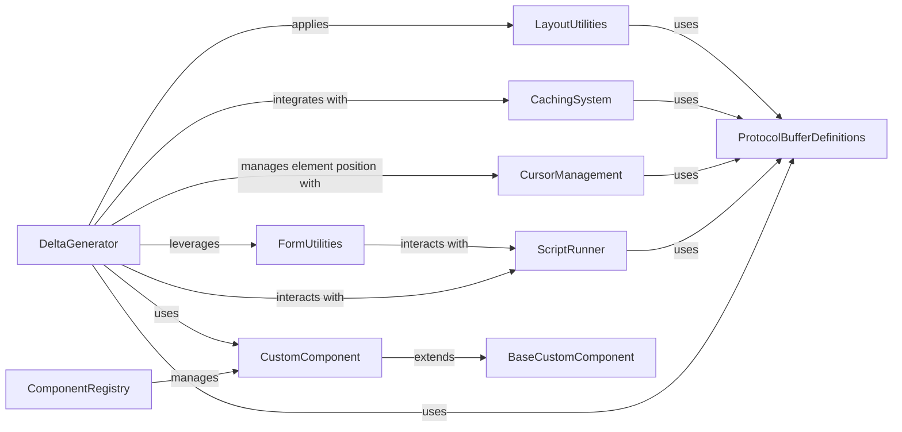

## Component Details

This graph provides an overview of the core components within Streamlit's User Interface API subsystem. It illustrates how central components like `DeltaGenerator` interact with various utilities, protocol buffer definitions, and runtime elements to enable the creation, management, and display of interactive UI elements and custom components in Streamlit applications.

### DeltaGenerator
The central component in Streamlit responsible for generating and managing UI elements. It provides methods for adding various widgets and displays to the application, handling their updates and interactions with the frontend.

**Related Classes/Methods**:

- <a href="https://github.com/streamlit/streamlit/blob/master/lib/streamlit/delta_generator.py#L170-L598" target="_blank" rel="noopener noreferrer">`streamlit.delta_generator.DeltaGenerator` (170:598)</a>
- `streamlit.delta_generator._enqueue` (full file reference)
- `streamlit.delta_generator._block` (full file reference)

### ProtocolBufferDefinitions
This component encompasses the protobuf message definitions used for structured communication between the Streamlit backend and the frontend. These definitions dictate the format of data sent for rendering UI elements, updates, and application state.

**Related Classes/Methods**:

- `streamlit.proto.ForwardMsg_pb2` (full file reference)
- `streamlit.proto.Block_pb2` (full file reference)
- `streamlit.proto.RootContainer_pb2` (full file reference)

### ScriptRunner
Manages the execution lifecycle of Streamlit scripts. It is responsible for enqueuing messages generated by the DeltaGenerator to the frontend and maintaining the current script execution context, which is crucial for state management and element placement.

**Related Classes/Methods**:

- `streamlit.runtime.scriptrunner.enqueue_message` (full file reference)
- `streamlit.runtime.scriptrunner.get_script_run_ctx` (full file reference)

### CursorManagement
Handles the logical positioning and hierarchy of UI elements within the Streamlit application's frontend. It provides a mechanism to track where new elements should be inserted and allows for locking positions for persistent elements.

**Related Classes/Methods**:

- <a href="https://github.com/streamlit/streamlit/blob/master/lib/streamlit/cursor.py#L56-L104" target="_blank" rel="noopener noreferrer">`streamlit.cursor.Cursor` (56:104)</a>
- <a href="https://github.com/streamlit/streamlit/blob/master/lib/streamlit/cursor.py#L32-L53" target="_blank" rel="noopener noreferrer">`streamlit.cursor.get_container_cursor` (32:53)</a>
- <a href="https://github.com/streamlit/streamlit/blob/master/lib/streamlit/cursor.py#L107-L153" target="_blank" rel="noopener noreferrer">`streamlit.cursor.RunningCursor` (107:153)</a>

### CachingSystem
Implements caching mechanisms for Streamlit applications, optimizing performance by storing and replaying previously generated element messages and resources. It integrates with the DeltaGenerator to capture and store element creation calls.

**Related Classes/Methods**:

- `streamlit.runtime.caching.save_element_message` (full file reference)
- `streamlit.runtime.caching.save_block_message` (full file reference)

### FormUtilities
Provides helper functions and data structures for managing forms and their state within the Streamlit application. It ensures that elements within a form are correctly associated and that form submissions are handled appropriately.

**Related Classes/Methods**:

- <a href="https://github.com/streamlit/streamlit/blob/master/lib/streamlit/elements/lib/form_utils.py#L26-L30" target="_blank" rel="noopener noreferrer">`streamlit.elements.lib.form_utils.FormData` (26:30)</a>
- <a href="https://github.com/streamlit/streamlit/blob/master/lib/streamlit/elements/lib/form_utils.py#L62-L72" target="_blank" rel="noopener noreferrer">`streamlit.elements.lib.form_utils.current_form_id` (62:72)</a>

### LayoutUtilities
Offers a set of utilities for controlling the visual layout of Streamlit elements, including their height and width configurations.

**Related Classes/Methods**:

- <a href="https://github.com/streamlit/streamlit/blob/master/lib/streamlit/elements/lib/layout_utils.py#L107-L115" target="_blank" rel="noopener noreferrer">`streamlit.elements.lib.layout_utils.get_height_config` (107:115)</a>
- <a href="https://github.com/streamlit/streamlit/blob/master/lib/streamlit/elements/lib/layout_utils.py#L96-L104" target="_blank" rel="noopener noreferrer">`streamlit.elements.lib.layout_utils.get_width_config` (96:104)</a>

### CustomComponent
Provides the base class and utilities for creating custom Streamlit components, extending the built-in UI capabilities.

**Related Classes/Methods**:

- `streamlit.components.v1.custom_component` (full file reference)

### ComponentRegistry
Manages the registration and lookup of custom components, allowing Streamlit to discover and render them.

**Related Classes/Methods**:

- `streamlit.components.v1.component_registry` (full file reference)

### BaseCustomComponent
Defines the fundamental interface and properties for all custom Streamlit components.

**Related Classes/Methods**:

- `streamlit.components.types.base_custom_component` (full file reference)

### [FAQ](https://github.com/CodeBoarding/GeneratedOnBoardings/tree/main?tab=readme-ov-file#faq)