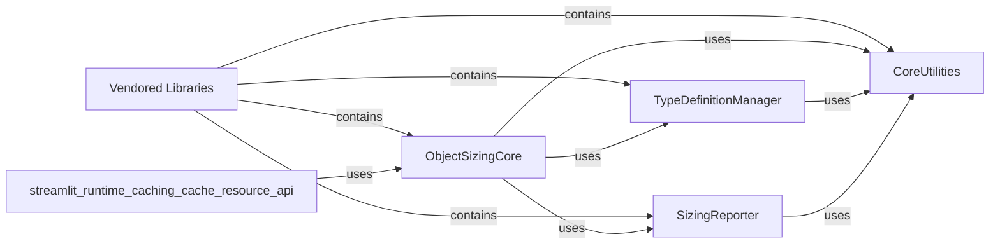

## Component Details

This component overview details the structure, flow, and purpose of the `Vendored Libraries` subsystem within the Streamlit project. It primarily focuses on the `pympler.asizeof` module, which is vendored to provide memory profiling capabilities. The core functionality revolves around calculating the size of Python objects, managing type definitions for accurate sizing, reporting various statistics, and utilizing a set of core utility functions. The `ObjectSizingCore` orchestrates the sizing process, relying on `TypeDefinitionManager` for type-specific sizing rules and `SizingReporter` for outputting results. `CoreUtilities` provides foundational helper functions used across these components. The `Vendored Libraries` component acts as a container for these functionalities, ensuring their availability and specific versioning within the Streamlit application. The `streamlit.runtime.caching.cache_resource_api` interacts with `ObjectSizingCore` to leverage its object sizing capabilities.

### Vendored Libraries
Includes third-party Python libraries that are directly bundled within the Streamlit project, rather than being installed separately, to ensure specific versions or functionalities are available (e.g., `pympler` for memory profiling).

**Related Classes/Methods**:

- <a href="https://github.com/streamlit/streamlit/blob/master/lib/streamlit/vendor/pympler/asizeof.py#L2590-L2671" target="_blank" rel="noopener noreferrer">`streamlit.lib.streamlit.vendor.pympler.asizeof` (2590:2671)</a>

### ObjectSizingCore
This component provides the primary functionality for calculating the size of Python objects, including handling object graphs, duplicates, and recursion limits. It orchestrates the sizing process and relies on type definitions for accurate size calculations.

**Related Classes/Methods**:

- <a href="https://github.com/streamlit/streamlit/blob/master/lib/streamlit/vendor/pympler/asizeof.py#L1797-L2518" target="_blank" rel="noopener noreferrer">`streamlit.lib.streamlit.vendor.pympler.asizeof.Asizer` (1797:2518)</a>
- <a href="https://github.com/streamlit/streamlit/blob/master/lib/streamlit/vendor/pympler/asizeof.py#L1920-L1985" target="_blank" rel="noopener noreferrer">`streamlit.lib.streamlit.vendor.pympler.asizeof.Asizer._sizer` (1920:1985)</a>
- <a href="https://github.com/streamlit/streamlit/blob/master/lib/streamlit/vendor/pympler/asizeof.py#L2590-L2671" target="_blank" rel="noopener noreferrer">`streamlit.lib.streamlit.vendor.pympler.asizeof.asizeof` (2590:2671)</a>
- <a href="https://github.com/streamlit/streamlit/blob/master/lib/streamlit/vendor/pympler/asizeof.py#L2541-L2587" target="_blank" rel="noopener noreferrer">`streamlit.lib.streamlit.vendor.pympler.asizeof.asized` (2541:2587)</a>
- <a href="https://github.com/streamlit/streamlit/blob/master/lib/streamlit/vendor/pympler/asizeof.py#L2674-L2716" target="_blank" rel="noopener noreferrer">`streamlit.lib.streamlit.vendor.pympler.asizeof.asizesof` (2674:2716)</a>
- <a href="https://github.com/streamlit/streamlit/blob/master/lib/streamlit/vendor/pympler/asizeof.py#L1705-L1714" target="_blank" rel="noopener noreferrer">`streamlit.lib.streamlit.vendor.pympler.asizeof._Seen` (1705:1714)</a>
- <a href="https://github.com/streamlit/streamlit/blob/master/lib/streamlit/vendor/pympler/asizeof.py#L1826-L1833" target="_blank" rel="noopener noreferrer">`streamlit.lib.streamlit.vendor.pympler.asizeof.Asizer.__init__` (1826:1833)</a>
- <a href="https://github.com/streamlit/streamlit/blob/master/lib/streamlit/vendor/pympler/asizeof.py#L1841-L1866" target="_blank" rel="noopener noreferrer">`streamlit.lib.streamlit.vendor.pympler.asizeof.Asizer._clear` (1841:1866)</a>
- <a href="https://github.com/streamlit/streamlit/blob/master/lib/streamlit/vendor/pympler/asizeof.py#L1868-L1870" target="_blank" rel="noopener noreferrer">`streamlit.lib.streamlit.vendor.pympler.asizeof.Asizer._nameof` (1868:1870)</a>
- <a href="https://github.com/streamlit/streamlit/blob/master/lib/streamlit/vendor/pympler/asizeof.py#L1872-L1874" target="_blank" rel="noopener noreferrer">`streamlit.lib.streamlit.vendor.pympler.asizeof.Asizer._prepr` (1872:1874)</a>
- <a href="https://github.com/streamlit/streamlit/blob/master/lib/streamlit/vendor/pympler/asizeof.py#L1876-L1886" target="_blank" rel="noopener noreferrer">`streamlit.lib.streamlit.vendor.pympler.asizeof.Asizer._printf` (1876:1886)</a>
- <a href="https://github.com/streamlit/streamlit/blob/master/lib/streamlit/vendor/pympler/asizeof.py#L1888-L1894" target="_blank" rel="noopener noreferrer">`streamlit.lib.streamlit.vendor.pympler.asizeof.Asizer._prof` (1888:1894)</a>
- <a href="https://github.com/streamlit/streamlit/blob/master/lib/streamlit/vendor/pympler/asizeof.py#L1896-L1914" target="_blank" rel="noopener noreferrer">`streamlit.lib.streamlit.vendor.pympler.asizeof.Asizer._rank` (1896:1914)</a>
- <a href="https://github.com/streamlit/streamlit/blob/master/lib/streamlit/vendor/pympler/asizeof.py#L1916-L1918" target="_blank" rel="noopener noreferrer">`streamlit.lib.streamlit.vendor.pympler.asizeof.Asizer._repr` (1916:1918)</a>
- <a href="https://github.com/streamlit/streamlit/blob/master/lib/streamlit/vendor/pympler/asizeof.py#L1987-L2002" target="_blank" rel="noopener noreferrer">`streamlit.lib.streamlit.vendor.pympler.asizeof.Asizer._sizes` (1987:2002)</a>
- <a href="https://github.com/streamlit/streamlit/blob/master/lib/streamlit/vendor/pympler/asizeof.py#L2014-L2026" target="_blank" rel="noopener noreferrer">`streamlit.lib.streamlit.vendor.pympler.asizeof.Asizer.asized` (2014:2026)</a>
- <a href="https://github.com/streamlit/streamlit/blob/master/lib/streamlit/vendor/pympler/asizeof.py#L2028-L2035" target="_blank" rel="noopener noreferrer">`streamlit.lib.streamlit.vendor.pympler.asizeof.Asizer.asizeof` (2028:2035)</a>
- <a href="https://github.com/streamlit/streamlit/blob/master/lib/streamlit/vendor/pympler/asizeof.py#L2037-L2045" target="_blank" rel="noopener noreferrer">`streamlit.lib.streamlit.vendor.pympler.asizeof.Asizer.asizesof` (2037:2045)</a>
- <a href="https://github.com/streamlit/streamlit/blob/master/lib/streamlit/vendor/pympler/asizeof.py#L2073-L2075" target="_blank" rel="noopener noreferrer">`streamlit.lib.streamlit.vendor.pympler.asizeof.Asizer.duplicate` (2073:2075)</a>
- <a href="https://github.com/streamlit/streamlit/blob/master/lib/streamlit/vendor/pympler/asizeof.py#L2092-L2102" target="_blank" rel="noopener noreferrer">`streamlit.lib.streamlit.vendor.pympler.asizeof.Asizer.exclude_types` (2092:2102)</a>
- <a href="https://github.com/streamlit/streamlit/blob/master/lib/streamlit/vendor/pympler/asizeof.py#L2105-L2107" target="_blank" rel="noopener noreferrer">`streamlit.lib.streamlit.vendor.pympler.asizeof.Asizer.excluded` (2105:2107)</a>
- <a href="https://github.com/streamlit/streamlit/blob/master/lib/streamlit/vendor/pympler/asizeof.py#L2366-L2434" target="_blank" rel="noopener noreferrer">`streamlit.lib.streamlit.vendor.pympler.asizeof.Asizer.reset` (2366:2434)</a>
- <a href="https://github.com/streamlit/streamlit/blob/master/lib/streamlit/vendor/pympler/asizeof.py#L2437-L2439" target="_blank" rel="noopener noreferrer">`streamlit.lib.streamlit.vendor.pympler.asizeof.Asizer.seen` (2437:2439)</a>
- <a href="https://github.com/streamlit/streamlit/blob/master/lib/streamlit/vendor/pympler/asizeof.py#L2441-L2503" target="_blank" rel="noopener noreferrer">`streamlit.lib.streamlit.vendor.pympler.asizeof.Asizer.set` (2441:2503)</a>
- <a href="https://github.com/streamlit/streamlit/blob/master/lib/streamlit/vendor/pympler/asizeof.py#L2506-L2508" target="_blank" rel="noopener noreferrer">`streamlit.lib.streamlit.vendor.pympler.asizeof.Asizer.sized` (2506:2508)</a>

### TypeDefinitionManager
This component is responsible for defining and managing how different Python types are sized. It stores basic sizes, item sizes, length calculation functions, and referent extraction functions for various built-in and custom types. It also handles the derivation and inference of type definitions.

**Related Classes/Methods**:

- <a href="https://github.com/streamlit/streamlit/blob/master/lib/streamlit/vendor/pympler/asizeof.py#L1001-L1167" target="_blank" rel="noopener noreferrer">`streamlit.lib.streamlit.vendor.pympler.asizeof._Typedef` (1001:1167)</a>
- <a href="https://github.com/streamlit/streamlit/blob/master/lib/streamlit/vendor/pympler/asizeof.py#L1535-L1605" target="_blank" rel="noopener noreferrer">`streamlit.lib.streamlit.vendor.pympler.asizeof._typedef` (1535:1605)</a>
- <a href="https://github.com/streamlit/streamlit/blob/master/lib/streamlit/vendor/pympler/asizeof.py#L2719-L2727" target="_blank" rel="noopener noreferrer">`streamlit.lib.streamlit.vendor.pympler.asizeof._typedefof` (2719:2727)</a>
- <a href="https://github.com/streamlit/streamlit/blob/master/lib/streamlit/vendor/pympler/asizeof.py#L293-L308" target="_blank" rel="noopener noreferrer">`streamlit.lib.streamlit.vendor.pympler.asizeof._basicsize` (293:308)</a>
- <a href="https://github.com/streamlit/streamlit/blob/master/lib/streamlit/vendor/pympler/asizeof.py#L425-L428" target="_blank" rel="noopener noreferrer">`streamlit.lib.streamlit.vendor.pympler.asizeof._itemsize` (425:428)</a>
- <a href="https://github.com/streamlit/streamlit/blob/master/lib/streamlit/vendor/pympler/asizeof.py#L1258-L1260" target="_blank" rel="noopener noreferrer">`streamlit.lib.streamlit.vendor.pympler.asizeof._len_array` (1258:1260)</a>
- <a href="https://github.com/streamlit/streamlit/blob/master/lib/streamlit/vendor/pympler/asizeof.py#L784-L786" target="_blank" rel="noopener noreferrer">`streamlit.lib.streamlit.vendor.pympler.asizeof._len_bytearray` (784:786)</a>
- <a href="https://github.com/streamlit/streamlit/blob/master/lib/streamlit/vendor/pympler/asizeof.py#L789-L797" target="_blank" rel="noopener noreferrer">`streamlit.lib.streamlit.vendor.pympler.asizeof._len_code` (789:797)</a>
- <a href="https://github.com/streamlit/streamlit/blob/master/lib/streamlit/vendor/pympler/asizeof.py#L800-L807" target="_blank" rel="noopener noreferrer">`streamlit.lib.streamlit.vendor.pympler.asizeof._len_dict` (800:807)</a>
- <a href="https://github.com/streamlit/streamlit/blob/master/lib/streamlit/vendor/pympler/asizeof.py#L810-L813" target="_blank" rel="noopener noreferrer">`streamlit.lib.streamlit.vendor.pympler.asizeof._len_frame` (810:813)</a>
- <a href="https://github.com/streamlit/streamlit/blob/master/lib/streamlit/vendor/pympler/asizeof.py#L822-L825" target="_blank" rel="noopener noreferrer">`streamlit.lib.streamlit.vendor.pympler.asizeof._len_int` (822:825)</a>
- <a href="https://github.com/streamlit/streamlit/blob/master/lib/streamlit/vendor/pympler/asizeof.py#L828-L831" target="_blank" rel="noopener noreferrer">`streamlit.lib.streamlit.vendor.pympler.asizeof._len_iter` (828:831)</a>
- <a href="https://github.com/streamlit/streamlit/blob/master/lib/streamlit/vendor/pympler/asizeof.py#L834-L842" target="_blank" rel="noopener noreferrer">`streamlit.lib.streamlit.vendor.pympler.asizeof._len_list` (834:842)</a>
- <a href="https://github.com/streamlit/streamlit/blob/master/lib/streamlit/vendor/pympler/asizeof.py#L845-L847" target="_blank" rel="noopener noreferrer">`streamlit.lib.streamlit.vendor.pympler.asizeof._len_module` (845:847)</a>
- <a href="https://github.com/streamlit/streamlit/blob/master/lib/streamlit/vendor/pympler/asizeof.py#L850-L857" target="_blank" rel="noopener noreferrer">`streamlit.lib.streamlit.vendor.pympler.asizeof._len_set` (850:857)</a>
- <a href="https://github.com/streamlit/streamlit/blob/master/lib/streamlit/vendor/pympler/asizeof.py#L860-L865" target="_blank" rel="noopener noreferrer">`streamlit.lib.streamlit.vendor.pympler.asizeof._len_slice` (860:865)</a>
- <a href="https://github.com/streamlit/streamlit/blob/master/lib/streamlit/vendor/pympler/asizeof.py#L875-L880" target="_blank" rel="noopener noreferrer">`streamlit.lib.streamlit.vendor.pympler.asizeof._len_struct` (875:880)</a>
- <a href="https://github.com/streamlit/streamlit/blob/master/lib/streamlit/vendor/pympler/asizeof.py#L883-L885" target="_blank" rel="noopener noreferrer">`streamlit.lib.streamlit.vendor.pympler.asizeof._len_unicode` (883:885)</a>
- <a href="https://github.com/streamlit/streamlit/blob/master/lib/streamlit/vendor/pympler/asizeof.py#L576-L583" target="_blank" rel="noopener noreferrer">`streamlit.lib.streamlit.vendor.pympler.asizeof._cell_refs` (576:583)</a>
- <a href="https://github.com/streamlit/streamlit/blob/master/lib/streamlit/vendor/pympler/asizeof.py#L586-L598" target="_blank" rel="noopener noreferrer">`streamlit.lib.streamlit.vendor.pympler.asizeof._class_refs` (586:598)</a>
- <a href="https://github.com/streamlit/streamlit/blob/master/lib/streamlit/vendor/pympler/asizeof.py#L601-L603" target="_blank" rel="noopener noreferrer">`streamlit.lib.streamlit.vendor.pympler.asizeof._co_refs` (601:603)</a>
- <a href="https://github.com/streamlit/streamlit/blob/master/lib/streamlit/vendor/pympler/asizeof.py#L606-L620" target="_blank" rel="noopener noreferrer">`streamlit.lib.streamlit.vendor.pympler.asizeof._dict_refs` (606:620)</a>
- <a href="https://github.com/streamlit/streamlit/blob/master/lib/streamlit/vendor/pympler/asizeof.py#L623-L625" target="_blank" rel="noopener noreferrer">`streamlit.lib.streamlit.vendor.pympler.asizeof._enum_refs` (623:625)</a>
- <a href="https://github.com/streamlit/streamlit/blob/master/lib/streamlit/vendor/pympler/asizeof.py#L628-L633" target="_blank" rel="noopener noreferrer">`streamlit.lib.streamlit.vendor.pympler.asizeof._exc_refs` (628:633)</a>
- <a href="https://github.com/streamlit/streamlit/blob/master/lib/streamlit/vendor/pympler/asizeof.py#L636-L638" target="_blank" rel="noopener noreferrer">`streamlit.lib.streamlit.vendor.pympler.asizeof._file_refs` (636:638)</a>
- <a href="https://github.com/streamlit/streamlit/blob/master/lib/streamlit/vendor/pympler/asizeof.py#L641-L643" target="_blank" rel="noopener noreferrer">`streamlit.lib.streamlit.vendor.pympler.asizeof._frame_refs` (641:643)</a>
- <a href="https://github.com/streamlit/streamlit/blob/master/lib/streamlit/vendor/pympler/asizeof.py#L646-L657" target="_blank" rel="noopener noreferrer">`streamlit.lib.streamlit.vendor.pympler.asizeof._func_refs` (646:657)</a>
- <a href="https://github.com/streamlit/streamlit/blob/master/lib/streamlit/vendor/pympler/asizeof.py#L660-L665" target="_blank" rel="noopener noreferrer">`streamlit.lib.streamlit.vendor.pympler.asizeof._gen_refs` (660:665)</a>
- <a href="https://github.com/streamlit/streamlit/blob/master/lib/streamlit/vendor/pympler/asizeof.py#L668-L670" target="_blank" rel="noopener noreferrer">`streamlit.lib.streamlit.vendor.pympler.asizeof._im_refs` (668:670)</a>
- <a href="https://github.com/streamlit/streamlit/blob/master/lib/streamlit/vendor/pympler/asizeof.py#L673-L675" target="_blank" rel="noopener noreferrer">`streamlit.lib.streamlit.vendor.pympler.asizeof._inst_refs` (673:675)</a>
- <a href="https://github.com/streamlit/streamlit/blob/master/lib/streamlit/vendor/pympler/asizeof.py#L678-L681" target="_blank" rel="noopener noreferrer">`streamlit.lib.streamlit.vendor.pympler.asizeof._iter_refs` (678:681)</a>
- <a href="https://github.com/streamlit/streamlit/blob/master/lib/streamlit/vendor/pympler/asizeof.py#L684-L688" target="_blank" rel="noopener noreferrer">`streamlit.lib.streamlit.vendor.pympler.asizeof._module_refs` (684:688)</a>
- <a href="https://github.com/streamlit/streamlit/blob/master/lib/streamlit/vendor/pympler/asizeof.py#L691-L696" target="_blank" rel="noopener noreferrer">`streamlit.lib.streamlit.vendor.pympler.asizeof._namedtuple_refs` (691:696)</a>
- <a href="https://github.com/streamlit/streamlit/blob/master/lib/streamlit/vendor/pympler/asizeof.py#L699-L701" target="_blank" rel="noopener noreferrer">`streamlit.lib.streamlit.vendor.pympler.asizeof._prop_refs` (699:701)</a>
- <a href="https://github.com/streamlit/streamlit/blob/master/lib/streamlit/vendor/pympler/asizeof.py#L709-L711" target="_blank" rel="noopener noreferrer">`streamlit.lib.streamlit.vendor.pympler.asizeof._stat_refs` (709:711)</a>
- <a href="https://github.com/streamlit/streamlit/blob/master/lib/streamlit/vendor/pympler/asizeof.py#L714-L716" target="_blank" rel="noopener noreferrer">`streamlit.lib.streamlit.vendor.pympler.asizeof._statvfs_refs` (714:716)</a>
- <a href="https://github.com/streamlit/streamlit/blob/master/lib/streamlit/vendor/pympler/asizeof.py#L719-L721" target="_blank" rel="noopener noreferrer">`streamlit.lib.streamlit.vendor.pympler.asizeof._tb_refs` (719:721)</a>
- <a href="https://github.com/streamlit/streamlit/blob/master/lib/streamlit/vendor/pympler/asizeof.py#L724-L735" target="_blank" rel="noopener noreferrer">`streamlit.lib.streamlit.vendor.pympler.asizeof._type_refs` (724:735)</a>
- <a href="https://github.com/streamlit/streamlit/blob/master/lib/streamlit/vendor/pympler/asizeof.py#L738-L743" target="_blank" rel="noopener noreferrer">`streamlit.lib.streamlit.vendor.pympler.asizeof._weak_refs` (738:743)</a>
- <a href="https://github.com/streamlit/streamlit/blob/master/lib/streamlit/vendor/pympler/asizeof.py#L2730-L2746" target="_blank" rel="noopener noreferrer">`streamlit.lib.streamlit.vendor.pympler.asizeof.basicsize` (2730:2746)</a>
- <a href="https://github.com/streamlit/streamlit/blob/master/lib/streamlit/vendor/pympler/asizeof.py#L2749-L2766" target="_blank" rel="noopener noreferrer">`streamlit.lib.streamlit.vendor.pympler.asizeof.flatsize` (2749:2766)</a>
- <a href="https://github.com/streamlit/streamlit/blob/master/lib/streamlit/vendor/pympler/asizeof.py#L2769-L2781" target="_blank" rel="noopener noreferrer">`streamlit.lib.streamlit.vendor.pympler.asizeof.itemsize` (2769:2781)</a>
- <a href="https://github.com/streamlit/streamlit/blob/master/lib/streamlit/vendor/pympler/asizeof.py#L2784-L2798" target="_blank" rel="noopener noreferrer">`streamlit.lib.streamlit.vendor.pympler.asizeof.leng` (2784:2798)</a>
- <a href="https://github.com/streamlit/streamlit/blob/master/lib/streamlit/vendor/pympler/asizeof.py#L2801-L2819" target="_blank" rel="noopener noreferrer">`streamlit.lib.streamlit.vendor.pympler.asizeof.named_refs` (2801:2819)</a>
- <a href="https://github.com/streamlit/streamlit/blob/master/lib/streamlit/vendor/pympler/asizeof.py#L2822-L2832" target="_blank" rel="noopener noreferrer">`streamlit.lib.streamlit.vendor.pympler.asizeof.refs` (2822:2832)</a>
- <a href="https://github.com/streamlit/streamlit/blob/master/lib/streamlit/vendor/pympler/asizeof.py#L316-L319" target="_blank" rel="noopener noreferrer">`streamlit.lib.streamlit.vendor.pympler.asizeof._derive_typedef` (316:319)</a>
- <a href="https://github.com/streamlit/streamlit/blob/master/lib/streamlit/vendor/pympler/asizeof.py#L1014-L1015" target="_blank" rel="noopener noreferrer">`streamlit.lib.streamlit.vendor.pympler.asizeof._Typedef:__init__` (1014:1015)</a>
- <a href="https://github.com/streamlit/streamlit/blob/master/lib/streamlit/vendor/pympler/asizeof.py#L1020-L1021" target="_blank" rel="noopener noreferrer">`streamlit.lib.streamlit.vendor.pympler.asizeof._Typedef:__repr__` (1020:1021)</a>
- <a href="https://github.com/streamlit/streamlit/blob/master/lib/streamlit/vendor/pympler/asizeof.py#L1023-L1029" target="_blank" rel="noopener noreferrer">`streamlit.lib.streamlit.vendor.pympler.asizeof._Typedef:__str__` (1023:1029)</a>
- <a href="https://github.com/streamlit/streamlit/blob/master/lib/streamlit/vendor/pympler/asizeof.py#L1044-L1049" target="_blank" rel="noopener noreferrer">`streamlit.lib.streamlit.vendor.pympler.asizeof._Typedef:dup` (1044:1049)</a>
- <a href="https://github.com/streamlit/streamlit/blob/master/lib/streamlit/vendor/pympler/asizeof.py#L1067-L1076" target="_blank" rel="noopener noreferrer">`streamlit.lib.streamlit.vendor.pympler.asizeof._Typedef:format` (1067:1076)</a>
- <a href="https://github.com/streamlit/streamlit/blob/master/lib/streamlit/vendor/pympler/asizeof.py#L1092-L1137" target="_blank" rel="noopener noreferrer">`streamlit.lib.streamlit.vendor.pympler.asizeof._Typedef:reset` (1092:1137)</a>
- <a href="https://github.com/streamlit/streamlit/blob/master/lib/streamlit/vendor/pympler/asizeof.py#L1139-L1158" target="_blank" rel="noopener noreferrer">`streamlit.lib.streamlit.vendor.pympler.asizeof._Typedef:save` (1139:1158)</a>
- <a href="https://github.com/streamlit/streamlit/blob/master/lib/streamlit/vendor/pympler/asizeof.py#L1160-L1167" target="_blank" rel="noopener noreferrer">`streamlit.lib.streamlit.vendor.pympler.asizeof._Typedef:set` (1160:1167)</a>
- <a href="https://github.com/streamlit/streamlit/blob/master/lib/streamlit/vendor/pympler/asizeof.py#L1173-L1195" target="_blank" rel="noopener noreferrer">`streamlit.lib.streamlit.vendor.pympler.asizeof._typedef_both` (1173:1195)</a>
- <a href="https://github.com/streamlit/streamlit/blob/master/lib/streamlit/vendor/pympler/asizeof.py#L1198-L1204" target="_blank" rel="noopener noreferrer">`streamlit.lib.streamlit.vendor.pympler.asizeof._typedef_code` (1198:1204)</a>
- <a href="https://github.com/streamlit/streamlit/blob/master/lib/streamlit/vendor/pympler/asizeof.py#L1263-L1274" target="_blank" rel="noopener noreferrer">`streamlit.lib.streamlit.vendor.pympler.asizeof._array_kwds` (1263:1274)</a>

### SizingReporter
This component handles the generation and printing of various statistics and profiles related to object sizes. It can report on the largest objects, type profiles, and detailed summaries of the sizing process.

**Related Classes/Methods**:

- <a href="https://github.com/streamlit/streamlit/blob/master/lib/streamlit/vendor/pympler/asizeof.py#L2134-L2163" target="_blank" rel="noopener noreferrer">`streamlit.lib.streamlit.vendor.pympler.asizeof.Asizer.print_largest` (2134:2163)</a>
- <a href="https://github.com/streamlit/streamlit/blob/master/lib/streamlit/vendor/pympler/asizeof.py#L2165-L2216" target="_blank" rel="noopener noreferrer">`streamlit.lib.streamlit.vendor.pympler.asizeof.Asizer.print_profiles` (2165:2216)</a>
- <a href="https://github.com/streamlit/streamlit/blob/master/lib/streamlit/vendor/pympler/asizeof.py#L2218-L2281" target="_blank" rel="noopener noreferrer">`streamlit.lib.streamlit.vendor.pympler.asizeof.Asizer.print_stats` (2218:2281)</a>
- <a href="https://github.com/streamlit/streamlit/blob/master/lib/streamlit/vendor/pympler/asizeof.py#L2283-L2324" target="_blank" rel="noopener noreferrer">`streamlit.lib.streamlit.vendor.pympler.asizeof.Asizer.print_summary` (2283:2324)</a>
- <a href="https://github.com/streamlit/streamlit/blob/master/lib/streamlit/vendor/pympler/asizeof.py#L2326-L2359" target="_blank" rel="noopener noreferrer">`streamlit.lib.streamlit.vendor.pympler.asizeof.Asizer.print_typedefs` (2326:2359)</a>
- <a href="https://github.com/streamlit/streamlit/blob/master/lib/streamlit/vendor/pympler/asizeof.py#L1608-L1661" target="_blank" rel="noopener noreferrer">`streamlit.lib.streamlit.vendor.pympler.asizeof._Prof` (1608:1661)</a>
- <a href="https://github.com/streamlit/streamlit/blob/master/lib/streamlit/vendor/pympler/asizeof.py#L1664-L1702" target="_blank" rel="noopener noreferrer">`streamlit.lib.streamlit.vendor.pympler.asizeof._Rank` (1664:1702)</a>
- <a href="https://github.com/streamlit/streamlit/blob/master/lib/streamlit/vendor/pympler/asizeof.py#L1720-L1794" target="_blank" rel="noopener noreferrer">`streamlit.lib.streamlit.vendor.pympler.asizeof.Asized` (1720:1794)</a>
- <a href="https://github.com/streamlit/streamlit/blob/master/lib/streamlit/vendor/pympler/asizeof.py#L1628-L1629" target="_blank" rel="noopener noreferrer">`streamlit.lib.streamlit.vendor.pympler.asizeof._Prof:__lt__` (1628:1629)</a>
- <a href="https://github.com/streamlit/streamlit/blob/master/lib/streamlit/vendor/pympler/asizeof.py#L1631-L1650" target="_blank" rel="noopener noreferrer">`streamlit.lib.streamlit.vendor.pympler.asizeof._Prof:format` (1631:1650)</a>
- <a href="https://github.com/streamlit/streamlit/blob/master/lib/streamlit/vendor/pympler/asizeof.py#L1686-L1702" target="_blank" rel="noopener noreferrer">`streamlit.lib.streamlit.vendor.pympler.asizeof._Rank:format` (1686:1702)</a>

### CoreUtilities
This component provides fundamental helper functions used across the sizing module, including string formatting, object introspection, and basic data manipulation.

**Related Classes/Methods**:

- <a href="https://github.com/streamlit/streamlit/blob/master/lib/streamlit/vendor/pympler/asizeof.py#L452-L454" target="_blank" rel="noopener noreferrer">`streamlit.lib.streamlit.vendor.pympler.asizeof._nameof` (452:454)</a>
- <a href="https://github.com/streamlit/streamlit/blob/master/lib/streamlit/vendor/pympler/asizeof.py#L447-L449" target="_blank" rel="noopener noreferrer">`streamlit.lib.streamlit.vendor.pympler.asizeof._moduleof` (447:449)</a>
- <a href="https://github.com/streamlit/streamlit/blob/master/lib/streamlit/vendor/pympler/asizeof.py#L544-L554" target="_blank" rel="noopener noreferrer">`streamlit.lib.streamlit.vendor.pympler.asizeof._repr` (544:554)</a>
- <a href="https://github.com/streamlit/streamlit/blob/master/lib/streamlit/vendor/pympler/asizeof.py#L502-L504" target="_blank" rel="noopener noreferrer">`streamlit.lib.streamlit.vendor.pympler.asizeof._prepr` (502:504)</a>
- <a href="https://github.com/streamlit/streamlit/blob/master/lib/streamlit/vendor/pympler/asizeof.py#L557-L565" target="_blank" rel="noopener noreferrer">`streamlit.lib.streamlit.vendor.pympler.asizeof._SI` (557:565)</a>
- <a href="https://github.com/streamlit/streamlit/blob/master/lib/streamlit/vendor/pympler/asizeof.py#L568-L570" target="_blank" rel="noopener noreferrer">`streamlit.lib.streamlit.vendor.pympler.asizeof._SI2` (568:570)</a>
- <a href="https://github.com/streamlit/streamlit/blob/master/lib/streamlit/vendor/pympler/asizeof.py#L489-L491" target="_blank" rel="noopener noreferrer">`streamlit.lib.streamlit.vendor.pympler.asizeof._plural` (489:491)</a>
- <a href="https://github.com/streamlit/streamlit/blob/master/lib/streamlit/vendor/pympler/asizeof.py#L431-L433" target="_blank" rel="noopener noreferrer">`streamlit.lib.streamlit.vendor.pympler.asizeof._kwdstr` (431:433)</a>
- <a href="https://github.com/streamlit/streamlit/blob/master/lib/streamlit/vendor/pympler/asizeof.py#L436-L444" target="_blank" rel="noopener noreferrer">`streamlit.lib.streamlit.vendor.pympler.asizeof._lengstr` (436:444)</a>
- <a href="https://github.com/streamlit/streamlit/blob/master/lib/streamlit/vendor/pympler/asizeof.py#L472-L475" target="_blank" rel="noopener noreferrer">`streamlit.lib.streamlit.vendor.pympler.asizeof._OptionError` (472:475)</a>
- <a href="https://github.com/streamlit/streamlit/blob/master/lib/streamlit/vendor/pympler/asizeof.py#L457-L469" target="_blank" rel="noopener noreferrer">`streamlit.lib.streamlit.vendor.pympler.asizeof._objs_opts_x` (457:469)</a>
- `streamlit.lib.streamlit.vendor.pympler.asizeof._c100` (full file reference)
- <a href="https://github.com/streamlit/streamlit/blob/master/lib/streamlit/vendor/pympler/asizeof.py#L507-L524" target="_blank" rel="noopener noreferrer">`streamlit.lib.streamlit.vendor.pympler.asizeof._printf` (507:524)</a>
- <a href="https://github.com/streamlit/streamlit/blob/master/lib/streamlit/vendor/pympler/asizeof.py#L494-L499" target="_blank" rel="noopener noreferrer">`streamlit.lib.streamlit.vendor.pympler.asizeof._power_of_2` (494:499)</a>
- <a href="https://github.com/streamlit/streamlit/blob/master/lib/streamlit/vendor/pympler/asizeof.py#L266-L269" target="_blank" rel="noopener noreferrer">`streamlit.lib.streamlit.vendor.pympler.asizeof._items` (266:269)</a>
- <a href="https://github.com/streamlit/streamlit/blob/master/lib/streamlit/vendor/pympler/asizeof.py#L272-L275" target="_blank" rel="noopener noreferrer">`streamlit.lib.streamlit.vendor.pympler.asizeof._keys` (272:275)</a>
- <a href="https://github.com/streamlit/streamlit/blob/master/lib/streamlit/vendor/pympler/asizeof.py#L278-L281" target="_blank" rel="noopener noreferrer">`streamlit.lib.streamlit.vendor.pympler.asizeof._values` (278:281)</a>
- <a href="https://github.com/streamlit/streamlit/blob/master/lib/streamlit/vendor/pympler/asizeof.py#L208-L210" target="_blank" rel="noopener noreferrer">`streamlit.lib.streamlit.vendor.pympler.asizeof._calcsize` (208:210)</a>
- <a href="https://github.com/streamlit/streamlit/blob/master/lib/streamlit/vendor/pympler/asizeof.py#L365-L368" target="_blank" rel="noopener noreferrer">`streamlit.lib.streamlit.vendor.pympler.asizeof._isbuiltin2` (365:368)</a>
- <a href="https://github.com/streamlit/streamlit/blob/master/lib/streamlit/vendor/pympler/asizeof.py#L371-L373" target="_blank" rel="noopener noreferrer">`streamlit.lib.streamlit.vendor.pympler.asizeof._iscell` (371:373)</a>
- <a href="https://github.com/streamlit/streamlit/blob/master/lib/streamlit/vendor/pympler/asizeof.py#L376-L380" target="_blank" rel="noopener noreferrer">`streamlit.lib.streamlit.vendor.pympler.asizeof._isdictype` (376:380)</a>
- <a href="https://github.com/streamlit/streamlit/blob/master/lib/streamlit/vendor/pympler/asizeof.py#L383-L388" target="_blank" rel="noopener noreferrer">`streamlit.lib.streamlit.vendor.pympler.asizeof._isframe` (383:388)</a>
- <a href="https://github.com/streamlit/streamlit/blob/master/lib/streamlit/vendor/pympler/asizeof.py#L391-L393" target="_blank" rel="noopener noreferrer">`streamlit.lib.streamlit.vendor.pympler.asizeof._isignored` (391:393)</a>
- <a href="https://github.com/streamlit/streamlit/blob/master/lib/streamlit/vendor/pympler/asizeof.py#L396-L400" target="_blank" rel="noopener noreferrer">`streamlit.lib.streamlit.vendor.pympler.asizeof._isnamedtuple` (396:400)</a>
- <a href="https://github.com/streamlit/streamlit/blob/master/lib/streamlit/vendor/pympler/asizeof.py#L403-L410" target="_blank" rel="noopener noreferrer">`streamlit.lib.streamlit.vendor.pympler.asizeof._isNULL` (403:410)</a>
- <a href="https://github.com/streamlit/streamlit/blob/master/lib/streamlit/vendor/pympler/asizeof.py#L413-L422" target="_blank" rel="noopener noreferrer">`streamlit.lib.streamlit.vendor.pympler.asizeof._issubclass` (413:422)</a>
- <a href="https://github.com/streamlit/streamlit/blob/master/lib/streamlit/vendor/pympler/asizeof.py#L322-L353" target="_blank" rel="noopener noreferrer">`streamlit.lib.streamlit.vendor.pympler.asizeof._dir2` (322:353)</a>
- <a href="https://github.com/streamlit/streamlit/blob/master/lib/streamlit/vendor/pympler/asizeof.py#L356-L362" target="_blank" rel="noopener noreferrer">`streamlit.lib.streamlit.vendor.pympler.asizeof._infer_dict` (356:362)</a>
- <a href="https://github.com/streamlit/streamlit/blob/master/lib/streamlit/vendor/pympler/asizeof.py#L912-L926" target="_blank" rel="noopener noreferrer">`streamlit.lib.streamlit.vendor.pympler.asizeof._Claskey` (912:926)</a>
- <a href="https://github.com/streamlit/streamlit/blob/master/lib/streamlit/vendor/pympler/asizeof.py#L951-L954" target="_blank" rel="noopener noreferrer">`streamlit.lib.streamlit.vendor.pympler.asizeof._key2tuple` (951:954)</a>
- <a href="https://github.com/streamlit/streamlit/blob/master/lib/streamlit/vendor/pympler/asizeof.py#L957-L962" target="_blank" rel="noopener noreferrer">`streamlit.lib.streamlit.vendor.pympler.asizeof._objkey` (957:962)</a>
- <a href="https://github.com/streamlit/streamlit/blob/master/lib/streamlit/vendor/pympler/asizeof.py#L965-L974" target="_blank" rel="noopener noreferrer">`streamlit.lib.streamlit.vendor.pympler.asizeof._NamedRef` (965:974)</a>
- <a href="https://github.com/streamlit/streamlit/blob/master/lib/streamlit/vendor/pympler/asizeof.py#L2521-L2534" target="_blank" rel="noopener noreferrer">`streamlit.lib.streamlit.vendor.pympler.asizeof.amapped` (2521:2534)</a>
- <a href="https://github.com/streamlit/streamlit/blob/master/lib/streamlit/vendor/pympler/asizeof.py#L527-L541" target="_blank" rel="noopener noreferrer">`streamlit.lib.streamlit.vendor.pympler.asizeof._refs` (527:541)</a>

### [FAQ](https://github.com/CodeBoarding/GeneratedOnBoardings/tree/main?tab=readme-ov-file#faq)