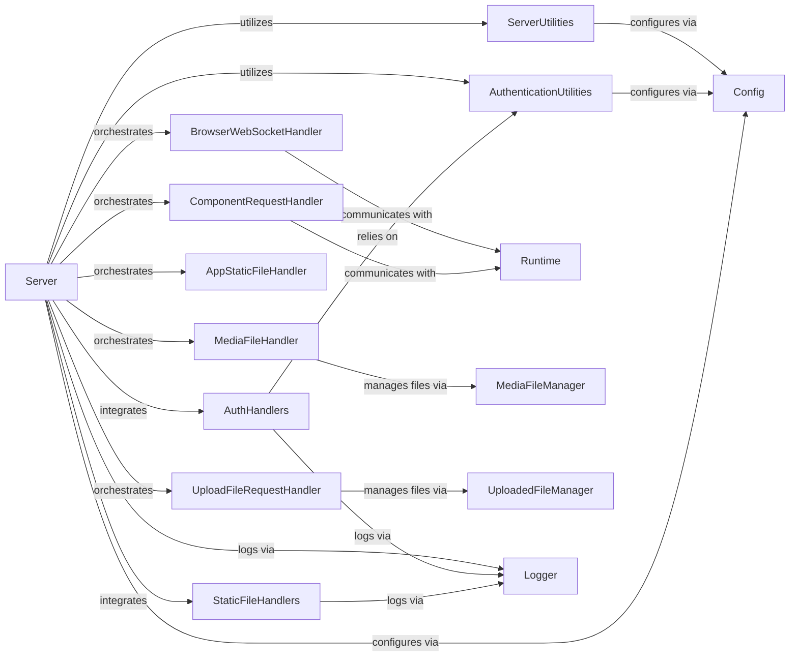

## Component Details

The Web Communication component in Streamlit is responsible for managing all network interactions between the Streamlit backend and the client browser. This includes handling HTTP requests for serving the application, static files, media, and custom components, as well as establishing and maintaining WebSocket connections for real-time updates. It also integrates with authentication mechanisms to secure user access and manages file uploads and downloads. The core of this component is the Server, which orchestrates various handlers to fulfill different communication needs.

### Server
The central web server responsible for setting up and managing HTTP and WebSocket connections, defining routes, and integrating with the Streamlit Runtime.

**Related Classes/Methods**:

- `streamlit.web.server.server` (full file reference)

### BrowserWebSocketHandler
Manages the WebSocket communication channel between the Streamlit backend and the client browser, handling message exchange for application updates.

**Related Classes/Methods**:

- `streamlit.web.server.browser_websocket_handler` (full file reference)

### ComponentRequestHandler
Handles HTTP requests specifically for custom Streamlit components, allowing them to communicate with the backend.

**Related Classes/Methods**:

- `streamlit.web.server.component_request_handler` (full file reference)

### MediaFileHandler
Serves media files (images, audio, video) that are part of the Streamlit application, managing their storage and delivery.

**Related Classes/Methods**:

- `streamlit.web.server.media_file_handler` (full file reference)

### UploadFileRequestHandler
Manages the process of uploading files from the client browser to the Streamlit backend, including handling file data and temporary storage.

**Related Classes/Methods**:

- `streamlit.web.server.upload_file_request_handler` (full file reference)

### AppStaticFileHandler
Serves static files specific to the Streamlit application, such as those in the 'static' directory.

**Related Classes/Methods**:

- `streamlit.web.server.app_static_file_handler` (full file reference)

### AuthHandlers
Manages authentication-related routes and callbacks, integrating with external authentication providers like OAuth2.

**Related Classes/Methods**:

- `streamlit.web.server.oauth_authlib_routes` (full file reference)
- `streamlit.web.server.oidc_mixin` (full file reference)
- `streamlit.web.server.authlib_tornado_integration` (full file reference)

### StaticFileHandlers
Handles the serving of general static files (e.g., Streamlit's frontend assets) and manages URL routing, including redirects for trailing slashes.

**Related Classes/Methods**:

- `streamlit.web.server.routes` (full file reference)

### ServerUtilities
Provides utility functions and constants used across the web server, such as port management, URL path regex creation, and XSRF token handling.

**Related Classes/Methods**:

- `streamlit.web.server.server_util` (full file reference)
- `streamlit.web.server.websocket_headers` (full file reference)

### AuthenticationUtilities
Provides core authentication utilities and user information management, used by the server for securing access.

**Related Classes/Methods**:

- `streamlit.lib.streamlit.auth_util` (full file reference)
- `streamlit.lib.streamlit.user_info` (full file reference)
- `streamlit.lib.streamlit.runtime.credentials` (full file reference)

### [FAQ](https://github.com/CodeBoarding/GeneratedOnBoardings/tree/main?tab=readme-ov-file#faq)