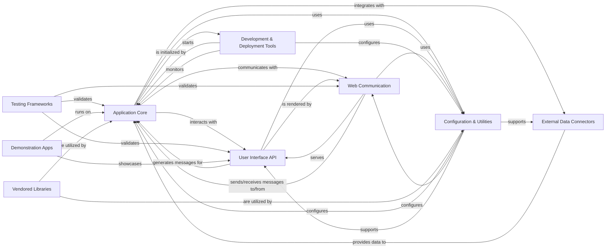

## Component Details

The Streamlit architecture is designed to enable rapid development of interactive data applications. The core functionality revolves around the Application Core, which manages the execution of user scripts, application state, and data caching. This core interacts with the User Interface API, allowing developers to define and render various UI elements and widgets. Communication between the backend (Application Core) and the frontend (browser) is handled by the Web Communication component, which uses HTTP and WebSockets. A robust Configuration & Utilities layer provides essential services like settings management, logging, and general helper functions. External Data Connectors enable seamless integration with various data sources. Development & Deployment Tools assist in the application lifecycle, including CLI operations and live reloading. The entire system is validated through comprehensive Testing Frameworks, and demonstrated via built-in Demonstration Apps. Finally, Vendored Libraries provide specific third-party functionalities.

### Application Core
The central execution environment of a Streamlit application. It manages session lifecycle, script execution, state persistence, data caching, and the flow of messages between the backend and frontend. It orchestrates how user scripts are run and how their outputs are processed and prepared for display.

**Related Classes/Methods**:

- `streamlit.runtime.runtime` (full file reference)
- `streamlit.runtime.app_session` (full file reference)
- `streamlit.runtime.session_manager` (full file reference)
- `streamlit.runtime.websocket_session_manager` (full file reference)
- `streamlit.runtime.scriptrunner` (full file reference)
- `streamlit.runtime.scriptrunner.exec_code` (full file reference)
- `streamlit.runtime.scriptrunner.magic` (full file reference)
- `streamlit.runtime.scriptrunner.script_cache` (full file reference)
- `streamlit.runtime.scriptrunner.script_runner` (full file reference)
- `streamlit.runtime.scriptrunner_utils.script_run_context` (full file reference)
- `streamlit.runtime.scriptrunner_utils.script_requests` (full file reference)
- `streamlit.runtime.scriptrunner_utils.exceptions` (full file reference)
- `streamlit.runtime.forward_msg_queue` (full file reference)
- `streamlit.runtime.forward_msg_cache` (full file reference)
- `streamlit.runtime.media_file_manager` (full file reference)
- `streamlit.runtime.memory_media_file_storage` (full file reference)
- `streamlit.runtime.memory_uploaded_file_manager` (full file reference)
- `streamlit.runtime.memory_session_storage` (full file reference)
- `streamlit.runtime.runtime_util` (full file reference)
- `streamlit.runtime.pages_manager` (full file reference)
- `streamlit.runtime.context` (full file reference)
- `streamlit.runtime.context_util` (full file reference)
- `streamlit.runtime.script_data` (full file reference)
- `streamlit.lib.streamlit.runtime.state.session_state` (full file reference)
- `streamlit.lib.streamlit.runtime.state.query_params` (full file reference)
- `streamlit.lib.streamlit.runtime.state.widgets` (full file reference)
- `streamlit.lib.streamlit.runtime.state.session_state_proxy` (full file reference)
- `streamlit.lib.streamlit.runtime.state.query_params_proxy` (full file reference)
- `streamlit.lib.streamlit.runtime.state.safe_session_state` (full file reference)
- `streamlit.lib.streamlit.runtime.state.common` (full file reference)
- `streamlit.lib.streamlit.runtime.caching.cache_data_api` (full file reference)
- `streamlit.lib.streamlit.runtime.caching.cache_resource_api` (full file reference)
- `streamlit.lib.streamlit.runtime.caching.cache_errors` (full file reference)
- `streamlit.lib.streamlit.runtime.caching.cache_utils` (full file reference)
- `streamlit.lib.streamlit.runtime.caching.cached_message_replay` (full file reference)
- `streamlit.lib.streamlit.runtime.caching.hashing` (full file reference)
- `streamlit.lib.streamlit.runtime.caching.legacy_cache_api` (full file reference)
- `streamlit.lib.streamlit.runtime.caching.storage.cache_storage_protocol` (full file reference)
- `streamlit.lib.streamlit.runtime.caching.storage.dummy_cache_storage` (full file reference)
- `streamlit.lib.streamlit.runtime.caching.storage.in_memory_cache_storage_wrapper` (full file reference)
- `streamlit.lib.streamlit.runtime.caching.storage.local_disk_cache_storage` (full file reference)

### User Interface API
Provides the high-level Python API for building Streamlit applications, including functions for displaying various UI elements (text, media, charts), interactive widgets (buttons, sliders, inputs), and managing layout. It also supports extending Streamlit with custom components.

**Related Classes/Methods**:

- `streamlit.lib.streamlit.delta_generator` (full file reference)
- `streamlit.lib.streamlit.elements.alert` (full file reference)
- `streamlit.lib.streamlit.elements.arrow` (full file reference)
- `streamlit.lib.streamlit.elements.balloons` (full file reference)
- `streamlit.lib.streamlit.elements.bokeh_chart` (full file reference)
- `streamlit.lib.streamlit.elements.code` (full file reference)
- `streamlit.lib.streamlit.elements.deck_gl_json_chart` (full file reference)
- `streamlit.lib.streamlit.elements.doc_string` (full file reference)
- `streamlit.lib.streamlit.elements.empty` (full file reference)
- `streamlit.lib.streamlit.elements.exception` (full file reference)
- `streamlit.lib.streamlit.elements.form` (full file reference)
- `streamlit.lib.streamlit.elements.graphviz_chart` (full file reference)
- `streamlit.lib.streamlit.elements.heading` (full file reference)
- `streamlit.lib.streamlit.elements.html` (full file reference)
- `streamlit.lib.streamlit.elements.iframe` (full file reference)
- `streamlit.lib.streamlit.elements.image` (full file reference)
- `streamlit.lib.streamlit.elements.json` (full file reference)
- `streamlit.lib.streamlit.elements.layouts` (full file reference)
- `streamlit.lib.streamlit.elements.map` (full file reference)
- `streamlit.lib.streamlit.elements.markdown` (full file reference)
- `streamlit.lib.streamlit.elements.media` (full file reference)
- `streamlit.lib.streamlit.elements.metric` (full file reference)
- `streamlit.lib.streamlit.elements.plotly_chart` (full file reference)
- `streamlit.lib.streamlit.elements.progress` (full file reference)
- `streamlit.lib.streamlit.elements.pyplot` (full file reference)
- `streamlit.lib.streamlit.elements.snow` (full file reference)
- <a href="https://github.com/streamlit/streamlit/blob/master/lib/streamlit/elements/spinner.py#L33-L114" target="_blank" rel="noopener noreferrer">`streamlit.lib.streamlit.elements.spinner` (33:114)</a>
- `streamlit.lib.streamlit.elements.text` (full file reference)
- `streamlit.lib.streamlit.elements.toast` (full file reference)
- `streamlit.lib.streamlit.elements.vega_charts` (full file reference)
- `streamlit.lib.streamlit.elements.write` (full file reference)
- <a href="https://github.com/streamlit/streamlit/blob/master/lib/streamlit/elements/dialog_decorator.py#L118-L120" target="_blank" rel="noopener noreferrer">`streamlit.lib.streamlit.elements.dialog_decorator` (118:120)</a>
- `streamlit.lib.streamlit.elements.widgets.audio_input` (full file reference)
- `streamlit.lib.streamlit.elements.widgets.button` (full file reference)
- `streamlit.lib.streamlit.elements.widgets.button_group` (full file reference)
- `streamlit.lib.streamlit.elements.widgets.camera_input` (full file reference)
- `streamlit.lib.streamlit.elements.widgets.chat` (full file reference)
- `streamlit.lib.streamlit.elements.widgets.checkbox` (full file reference)
- `streamlit.lib.streamlit.elements.widgets.color_picker` (full file reference)
- `streamlit.lib.streamlit.elements.widgets.data_editor` (full file reference)
- `streamlit.lib.streamlit.elements.widgets.file_uploader` (full file reference)
- `streamlit.lib.streamlit.elements.widgets.multiselect` (full file reference)
- `streamlit.lib.streamlit.elements.widgets.number_input` (full file reference)
- `streamlit.lib.streamlit.elements.widgets.radio` (full file reference)
- `streamlit.lib.streamlit.elements.widgets.select_slider` (full file reference)
- `streamlit.lib.streamlit.elements.widgets.selectbox` (full file reference)
- `streamlit.lib.streamlit.elements.widgets.slider` (full file reference)
- `streamlit.lib.streamlit.elements.widgets.text_widgets` (full file reference)
- `streamlit.lib.streamlit.elements.widgets.time_widgets` (full file reference)
- <a href="https://github.com/streamlit/streamlit/blob/master/lib/streamlit/commands/echo.py#L35-L104" target="_blank" rel="noopener noreferrer">`streamlit.lib.streamlit.commands.echo` (35:104)</a>
- `streamlit.lib.streamlit.commands.execution_control` (full file reference)
- `streamlit.lib.streamlit.commands.experimental_query_params` (full file reference)
- <a href="https://github.com/streamlit/streamlit/blob/master/lib/streamlit/commands/logo.py#L38-L194" target="_blank" rel="noopener noreferrer">`streamlit.lib.streamlit.commands.logo` (38:194)</a>
- <a href="https://github.com/streamlit/streamlit/blob/master/lib/streamlit/commands/navigation.py#L83-L262" target="_blank" rel="noopener noreferrer">`streamlit.lib.streamlit.commands.navigation` (83:262)</a>
- `streamlit.lib.streamlit.commands.page_config` (full file reference)
- `streamlit.lib.streamlit.components.v1.component_arrow` (full file reference)
- `streamlit.lib.streamlit.components.v1.component_registry` (full file reference)
- `streamlit.lib.streamlit.components.v1.custom_component` (full file reference)
- `streamlit.lib.streamlit.components.lib.local_component_registry` (full file reference)
- `streamlit.lib.streamlit.components.types.base_custom_component` (full file reference)

### Web Communication
Manages the HTTP and WebSocket communication between the Streamlit backend and the client browser. It handles serving the application, routing requests, managing static files, and integrating with authentication mechanisms to secure user access.

**Related Classes/Methods**:

- `streamlit.web.server.server` (full file reference)
- `streamlit.web.server.browser_websocket_handler` (full file reference)
- `streamlit.web.server.component_request_handler` (full file reference)
- `streamlit.web.server.media_file_handler` (full file reference)
- `streamlit.web.server.oauth_authlib_routes` (full file reference)
- `streamlit.web.server.oidc_mixin` (full file reference)
- `streamlit.web.server.routes` (full file reference)
- `streamlit.web.server.server_util` (full file reference)
- `streamlit.web.server.stats_request_handler` (full file reference)
- `streamlit.web.server.upload_file_request_handler` (full file reference)
- `streamlit.web.server.websocket_headers` (full file reference)
- `streamlit.web.server.app_static_file_handler` (full file reference)
- `streamlit.web.server.authlib_tornado_integration` (full file reference)
- `streamlit.lib.streamlit.auth_util` (full file reference)
- `streamlit.lib.streamlit.user_info` (full file reference)
- `streamlit.lib.streamlit.runtime.credentials` (full file reference)

### Configuration & Utilities
Provides a foundational layer for managing application-wide settings, general-purpose helper functions (e.g., file operations, type checking, network utilities), and a centralized system for error reporting and logging.

**Related Classes/Methods**:

- `streamlit.lib.streamlit.config` (full file reference)
- `streamlit.lib.streamlit.config_option` (full file reference)
- `streamlit.lib.streamlit.config_util` (full file reference)
- `streamlit.lib.streamlit.util` (full file reference)
- `streamlit.lib.streamlit.string_util` (full file reference)
- `streamlit.lib.streamlit.file_util` (full file reference)
- `streamlit.lib.streamlit.type_util` (full file reference)
- `streamlit.lib.streamlit.time_util` (full file reference)
- `streamlit.lib.streamlit.net_util` (full file reference)
- `streamlit.lib.streamlit.cli_util` (full file reference)
- `streamlit.lib.streamlit.env_util` (full file reference)
- `streamlit.lib.streamlit.git_util` (full file reference)
- `streamlit.lib.streamlit.temporary_directory` (full file reference)
- `streamlit.lib.streamlit.errors` (full file reference)
- `streamlit.lib.streamlit.logger` (full file reference)
- `streamlit.lib.streamlit.error_util` (full file reference)

### External Data Connectors
Facilitates establishing and managing connections to various external data sources, such as databases (Snowflake, SQL) and other services, allowing Streamlit applications to interact with and retrieve data from these sources.

**Related Classes/Methods**:

- `streamlit.lib.streamlit.connections.base_connection` (full file reference)
- `streamlit.lib.streamlit.connections.snowflake_connection` (full file reference)
- `streamlit.lib.streamlit.connections.snowpark_connection` (full file reference)
- `streamlit.lib.streamlit.connections.sql_connection` (full file reference)
- <a href="https://github.com/streamlit/streamlit/blob/master/lib/streamlit/runtime/connection_factory.py#L118-L125" target="_blank" rel="noopener noreferrer">`streamlit.lib.streamlit.runtime.connection_factory` (118:125)</a>

### Development & Deployment Tools
Encompasses tools and modules that support the development and deployment lifecycle of Streamlit applications, including the command-line interface for running apps, file system watchers for live reloading, and the initial bootstrap process for starting the web application.

**Related Classes/Methods**:

- `streamlit.lib.streamlit.watcher.event_based_path_watcher` (full file reference)
- `streamlit.lib.streamlit.watcher.folder_black_list` (full file reference)
- `streamlit.lib.streamlit.watcher.local_sources_watcher` (full file reference)
- `streamlit.lib.streamlit.watcher.path_watcher` (full file reference)
- `streamlit.lib.streamlit.watcher.polling_path_watcher` (full file reference)
- `streamlit.lib.streamlit.watcher.util` (full file reference)
- `streamlit.lib.streamlit.web.cli` (full file reference)
- `streamlit.lib.streamlit.web.bootstrap` (full file reference)

### Testing Frameworks
Provides a comprehensive suite of internal utilities and end-to-end tests (using Playwright) to ensure the correctness, functionality, and performance of the Streamlit application across its various components.

**Related Classes/Methods**:

- `streamlit.e2e_playwright.st_dataframe_interactions_test` (full file reference)
- `streamlit.e2e_playwright.st_number_input_test` (full file reference)
- `streamlit.e2e_playwright.st_pyplot_test` (full file reference)
- `streamlit.e2e_playwright.st_pydeck_chart_select_test` (full file reference)
- `streamlit.e2e_playwright.st_chat_input_test` (full file reference)
- `streamlit.e2e_playwright.st_metric_test` (full file reference)
- `streamlit.e2e_playwright.st_set_page_config` (full file reference)
- `streamlit.e2e_playwright.st_help_test` (full file reference)
- `streamlit.e2e_playwright.st_dataframe_selections_test` (full file reference)
- `streamlit.e2e_playwright.st_heading_test` (full file reference)
- `streamlit.e2e_playwright.st_dataframe_input_data_test` (full file reference)
- `streamlit.e2e_playwright.iframe_resizer_test` (full file reference)
- `streamlit.e2e_playwright.st_line_chart_test` (full file reference)
- `streamlit.e2e_playwright.st_popover_test` (full file reference)
- `streamlit.e2e_playwright.st_plotly_chart_select_test` (full file reference)
- `streamlit.e2e_playwright.st_container_test` (full file reference)
- `streamlit.e2e_playwright.st_map_test` (full file reference)
- `streamlit.e2e_playwright.st_table_test` (full file reference)
- `streamlit.e2e_playwright.st_magic` (full file reference)
- `streamlit.e2e_playwright.st_time_input_test` (full file reference)
- `streamlit.e2e_playwright.st_balloons_test` (full file reference)
- `streamlit.e2e_playwright.st_form_test` (full file reference)
- `streamlit.e2e_playwright.st_segmented_control` (full file reference)
- `streamlit.e2e_playwright.st_segmented_control_test` (full file reference)
- `streamlit.e2e_playwright.st_fragment_run_every` (full file reference)
- `streamlit.e2e_playwright.st_empty_test` (full file reference)
- `streamlit.e2e_playwright.config_static_serving_test` (full file reference)
- `streamlit.e2e_playwright.st_chat_message_test` (full file reference)
- `streamlit.e2e_playwright.st_set_page_config_test` (full file reference)
- `streamlit.e2e_playwright.st_form_container_association_test` (full file reference)
- `streamlit.e2e_playwright.st_tabs_selection` (full file reference)
- `streamlit.e2e_playwright.st_write_stream_test` (full file reference)
- `streamlit.e2e_playwright.st_columns_test` (full file reference)
- `streamlit.e2e_playwright.st_fragment_dynamic_containers_test` (full file reference)
- `streamlit.e2e_playwright.st_cache_resource` (full file reference)
- `streamlit.e2e_playwright.st_select_slider_test` (full file reference)
- `streamlit.e2e_playwright.st_session_state_test` (full file reference)
- `streamlit.e2e_playwright.st_caption_test` (full file reference)
- `streamlit.e2e_playwright.st_cache_data` (full file reference)
- `streamlit.e2e_playwright.st_date_input_test` (full file reference)
- `streamlit.e2e_playwright.st_audio_test` (full file reference)
- `streamlit.e2e_playwright.st_cache_resource_test` (full file reference)
- `streamlit.e2e_playwright.st_code_test` (full file reference)
- `streamlit.e2e_playwright.st_multiselect_test` (full file reference)
- `streamlit.e2e_playwright.st_json_test` (full file reference)
- `streamlit.e2e_playwright.markdown_features_test` (full file reference)
- `streamlit.e2e_playwright.st_alert_test` (full file reference)
- `streamlit.e2e_playwright.st_rerun_test` (full file reference)
- `streamlit.e2e_playwright.st_slider_test` (full file reference)
- `streamlit.e2e_playwright.st_expander_state_test` (full file reference)
- `streamlit.e2e_playwright.st_components_v1_import_via_st_test` (full file reference)
- `streamlit.e2e_playwright.st_radio_test` (full file reference)
- `streamlit.e2e_playwright.st_fragment_multiple_fragments_test` (full file reference)
- `streamlit.e2e_playwright.st_logo` (full file reference)
- `streamlit.e2e_playwright.st_pills` (full file reference)
- `streamlit.e2e_playwright.host_config_test` (full file reference)
- `streamlit.e2e_playwright.st_area_chart_test` (full file reference)
- `streamlit.e2e_playwright.st_toggle_test` (full file reference)
- `streamlit.e2e_playwright.st_cache_data_test` (full file reference)
- `streamlit.e2e_playwright.st_html_test` (full file reference)
- `streamlit.e2e_playwright.st_dialog` (full file reference)
- `streamlit.e2e_playwright.st_dataframe_dimensions_test` (full file reference)
- `streamlit.e2e_playwright.st_button_test` (full file reference)
- `streamlit.e2e_playwright.st_fragment_dynamic_form_test` (full file reference)
- `streamlit.e2e_playwright.help_tooltip_test` (full file reference)
- `streamlit.e2e_playwright.st_toast_test` (full file reference)
- `streamlit.e2e_playwright.st_fragment_chat_response_test` (full file reference)
- `streamlit.e2e_playwright.st_pills_test` (full file reference)
- `streamlit.e2e_playwright.st_progress_test` (full file reference)
- `streamlit.e2e_playwright.st_vega_lite_chart_test` (full file reference)
- `streamlit.e2e_playwright.st_checkbox_test` (full file reference)
- `streamlit.e2e_playwright.st_altair_chart_test` (full file reference)
- `streamlit.e2e_playwright.st_text_test` (full file reference)
- `streamlit.e2e_playwright.st_context_test` (full file reference)
- `streamlit.e2e_playwright.st_rerun` (full file reference)
- `streamlit.e2e_playwright.st_fragment_queue_test` (full file reference)
- `streamlit.e2e_playwright.mega_tester_app_test` (full file reference)
- `streamlit.e2e_playwright.deploy_dialog_test` (full file reference)
- `streamlit.e2e_playwright.st_logo_test` (full file reference)
- `streamlit.e2e_playwright.auth_test` (full file reference)
- `streamlit.e2e_playwright.websocket_reconnects_test` (full file reference)
- `streamlit.e2e_playwright.st_fragment_dynamic_form` (full file reference)
- `streamlit.e2e_playwright.st_image_test` (full file reference)
- `streamlit.e2e_playwright.hello_app_test` (full file reference)
- `streamlit.e2e_playwright.st_selectbox_test` (full file reference)
- `streamlit.e2e_playwright.st_feedback` (full file reference)
- `streamlit.e2e_playwright.st_scatter_chart_test` (full file reference)
- `streamlit.e2e_playwright.websocket_disconnect_test` (full file reference)
- `streamlit.e2e_playwright.widget_state_test` (full file reference)
- `streamlit.e2e_playwright.st_fragment_mixed_execution_flow_test` (full file reference)
- `streamlit.e2e_playwright.st_file_uploader` (full file reference)
- `streamlit.e2e_playwright.fast_rerun_safety_test` (full file reference)
- `streamlit.e2e_playwright.st_camera_input_test` (full file reference)
- `streamlit.e2e_playwright.st_download_button_test` (full file reference)
- `streamlit.e2e_playwright.hostframe_app_test` (full file reference)
- `streamlit.e2e_playwright.st_snow_test` (full file reference)
- `streamlit.e2e_playwright.st_altair_chart_basic_select_test` (full file reference)
- `streamlit.e2e_playwright.st_dataframe_config_test` (full file reference)
- `streamlit.e2e_playwright.st_sidebar_test` (full file reference)
- `streamlit.e2e_playwright.st_dataframe_stable_rendering_test` (full file reference)
- `streamlit.e2e_playwright.st_tabs_test` (full file reference)
- `streamlit.e2e_playwright.st_effects_with_fragment_interactions_test` (full file reference)
- `streamlit.e2e_playwright.st_fragments_nested` (full file reference)
- `streamlit.e2e_playwright.basic_app_test` (full file reference)
- `streamlit.e2e_playwright.st_feedback_test` (full file reference)
- `streamlit.e2e_playwright.st_plotly_chart_test` (full file reference)
- `streamlit.e2e_playwright.st_fragment_basics_test` (full file reference)
- `streamlit.e2e_playwright.st_markdown_test` (full file reference)
- `streamlit.e2e_playwright.st_bar_chart_test` (full file reference)
- `streamlit.e2e_playwright.st_text_area_test` (full file reference)
- `streamlit.e2e_playwright.mega_tester_app` (full file reference)
- `streamlit.e2e_playwright.st_file_uploader_test` (full file reference)
- `streamlit.e2e_playwright.app_hotkeys_test` (full file reference)
- `streamlit.e2e_playwright.st_graphviz_chart_test` (full file reference)
- `streamlit.e2e_playwright.st_chat_input_file_uploader_regression_test` (full file reference)
- `streamlit.e2e_playwright.st_color_picker_test` (full file reference)
- `streamlit.e2e_playwright.st_audio_input_test` (full file reference)
- `streamlit.e2e_playwright.forward_msg_cache_test` (full file reference)
- `streamlit.e2e_playwright.st_data_editor_config_test` (full file reference)
- `streamlit.e2e_playwright.st_components_v1_test` (full file reference)
- `streamlit.e2e_playwright.st_fragments_nested_test` (full file reference)
- `streamlit.e2e_playwright.st_pydeck_chart_test` (full file reference)
- `streamlit.e2e_playwright.st_link_button_test` (full file reference)
- `streamlit.e2e_playwright.st_tabs_selection_test` (full file reference)
- `streamlit.e2e_playwright.st_exception_test` (full file reference)
- `streamlit.e2e_playwright.st_audio_input` (full file reference)
- `streamlit.e2e_playwright.st_video_test` (full file reference)
- `streamlit.e2e_playwright.conftest` (full file reference)
- `streamlit.e2e_playwright.st_text_input_test` (full file reference)
- `streamlit.e2e_playwright.st_expander_test` (full file reference)
- `streamlit.e2e_playwright.st_spinner_test` (full file reference)
- `streamlit.e2e_playwright.st_divider_test` (full file reference)
- `streamlit.e2e_playwright.st_dialog_test` (full file reference)
- `streamlit.e2e_playwright.multipage_apps_v2.mpa_v2_basics_test` (full file reference)
- `streamlit.e2e_playwright.multipage_apps_v2.mpa_v2_basics` (full file reference)
- `streamlit.e2e_playwright.multipage_apps_v2.mpa_v2_initial_load_test` (full file reference)
- `streamlit.e2e_playwright.multipage_apps_v2.mpa_v2_title_test` (full file reference)
- `streamlit.e2e_playwright.theming.theme_tester_app` (full file reference)
- `streamlit.e2e_playwright.theming.font_style_test` (full file reference)
- `streamlit.e2e_playwright.theming.snowflake_light_theme_test` (full file reference)
- `streamlit.e2e_playwright.theming.snowflake_dark_theme_test` (full file reference)
- `streamlit.e2e_playwright.theming.font_style` (full file reference)
- `streamlit.e2e_playwright.config.script_level_config_test` (full file reference)
- `streamlit.e2e_playwright.custom_components.component_errors_test` (full file reference)
- `streamlit.e2e_playwright.custom_components.popular_components_test` (full file reference)
- `streamlit.e2e_playwright.shared.animation_utils` (full file reference)
- `streamlit.e2e_playwright.shared.performance` (full file reference)
- `streamlit.e2e_playwright.shared.app_utils` (full file reference)
- `streamlit.e2e_playwright.shared.dataframe_utils` (full file reference)
- `streamlit.e2e_playwright.shared.react18_utils` (full file reference)
- `streamlit.e2e_playwright.shared.toolbar_utils` (full file reference)
- `streamlit.e2e_playwright.shared.oidc_mock_server` (full file reference)
- `streamlit.e2e_playwright.multipage_apps.mpa_v2_custom_theme_test` (full file reference)
- `streamlit.e2e_playwright.multipage_apps.mpa_basics_test` (full file reference)
- `streamlit.e2e_playwright.multipage_apps.mpa_configure_sidebar_test` (full file reference)
- `frontend.app.performance.apps.multipage.multipage_app` (full file reference)
- `streamlit.lib.streamlit.testing.v1.app_test` (full file reference)
- `streamlit.lib.streamlit.testing.v1.element_tree` (full file reference)
- `streamlit.lib.streamlit.testing.v1.local_script_runner` (full file reference)
- `streamlit.lib.streamlit.testing.v1.util` (full file reference)

### Demonstration Apps
Contains a collection of example Streamlit applications and associated utility functions, serving as practical demonstrations and templates for users to understand and learn how to build Streamlit applications.

**Related Classes/Methods**:

- <a href="https://github.com/streamlit/streamlit/blob/master/lib/streamlit/hello/animation_demo.py#L23-L69" target="_blank" rel="noopener noreferrer">`streamlit.lib.streamlit.hello.animation_demo` (23:69)</a>
- `streamlit.lib.streamlit.hello.dataframe_demo` (full file reference)
- `streamlit.lib.streamlit.hello.hello` (full file reference)
- <a href="https://github.com/streamlit/streamlit/blob/master/lib/streamlit/hello/mapping_demo.py#L24-L102" target="_blank" rel="noopener noreferrer">`streamlit.lib.streamlit.hello.mapping_demo` (24:102)</a>
- <a href="https://github.com/streamlit/streamlit/blob/master/lib/streamlit/hello/plotting_demo.py#L23-L42" target="_blank" rel="noopener noreferrer">`streamlit.lib.streamlit.hello.plotting_demo` (23:42)</a>
- `streamlit.lib.streamlit.hello.streamlit_app` (full file reference)
- `streamlit.lib.streamlit.hello.utils` (full file reference)

### Vendored Libraries
Includes third-party Python libraries that are directly bundled within the Streamlit project, rather than being installed separately, to ensure specific versions or functionalities are available (e.g., `pympler` for memory profiling).

**Related Classes/Methods**:

- <a href="https://github.com/streamlit/streamlit/blob/master/lib/streamlit/vendor/pympler/asizeof.py#L2590-L2671" target="_blank" rel="noopener noreferrer">`streamlit.lib.streamlit.vendor.pympler.asizeof` (2590:2671)</a>

### [FAQ](https://github.com/CodeBoarding/GeneratedOnBoardings/tree/main?tab=readme-ov-file#faq)