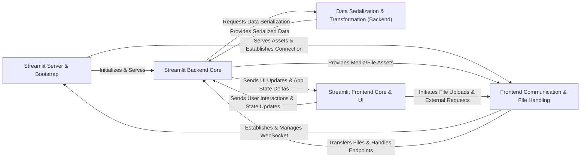

## Details

The Streamlit architecture is divided into distinct, interacting components that facilitate the rapid development and deployment of data applications. The Streamlit Server & Bootstrap component acts as the entry point, initializing the application, configuring the environment, and setting up the web server. It serves static frontend assets and establishes the initial communication channels. The Streamlit Backend Core is the server-side Python engine, responsible for executing user scripts, managing application sessions, and orchestrating UI updates. It leverages the Data Serialization & Transformation (Backend) component to efficiently convert Python data into optimized formats for network transmission. On the client-side, the Streamlit Frontend Core & UI renders the user interface based on messages received from the backend, handling interactive elements and displaying data. All client-side network operations, including WebSocket communication, file uploads, and host communication, are managed by the Frontend Communication & File Handling component. This clear separation of concerns allows for efficient data flow and modular development, making it suitable for both detailed documentation and clear visual diagram generation.

### Streamlit Server & Bootstrap [[Expand]](./Streamlit_Server_Bootstrap.md)
The foundational component responsible for initiating the Streamlit application. It handles command-line arguments, loads configuration, initializes the backend web server (Tornado), serves static frontend assets, and establishes initial communication channels.

**Related Classes/Methods**:

- <a href="https://github.com/streamlit/streamlit/blob/develop/lib/streamlit/web/cli.py" target="_blank" rel="noopener noreferrer">`lib/streamlit/web/cli.py`</a>
- <a href="https://github.com/streamlit/streamlit/blob/develop/lib/streamlit/web/bootstrap.py" target="_blank" rel="noopener noreferrer">`lib/streamlit/web/bootstrap.py`</a>
- <a href="https://github.com/streamlit/streamlit/blob/develop/lib/streamlit/config.py" target="_blank" rel="noopener noreferrer">`lib/streamlit/config.py`</a>

### Streamlit Backend Core [[Expand]](./Streamlit_Backend_Core.md)
The central Python engine on the server-side. It executes user scripts, manages application sessions, handles script reruns, and orchestrates the flow of UI updates (deltas) to the frontend. This component also encompasses the core `st.*` API functions (Delta Generator), manages widget and session state, and provides caching and secrets management.

**Related Classes/Methods**:

- <a href="https://github.com/streamlit/streamlit/blob/develop/lib/streamlit/delta_generator.py" target="_blank" rel="noopener noreferrer">`lib/streamlit/delta_generator.py`</a>
- <a href="https://github.com/streamlit/streamlit/blob/develop/lib/streamlit/runtime/secrets.py" target="_blank" rel="noopener noreferrer">`lib/streamlit/runtime/secrets.py`</a>

### Data Serialization & Transformation (Backend) [[Expand]](./Data_Serialization_Transformation_Backend_.md)
A specialized backend component for efficiently converting Python data structures (e.g., Pandas DataFrames, NumPy arrays, images) into optimized, transportable formats (like Apache Arrow, Protobuf) for network transmission to the frontend.

**Related Classes/Methods**:

- <a href="https://github.com/streamlit/streamlit/blob/develop/lib/streamlit/dataframe_util.py" target="_blank" rel="noopener noreferrer">`lib/streamlit/dataframe_util.py`</a>
- <a href="https://github.com/streamlit/streamlit/blob/develop/lib/streamlit/elements/media.py" target="_blank" rel="noopener noreferrer">`lib/streamlit/elements/media.py`</a>
- <a href="https://github.com/streamlit/streamlit/blob/develop/lib/streamlit/elements/lib/image_utils.py" target="_blank" rel="noopener noreferrer">`lib/streamlit/elements/lib/image_utils.py`</a>

### Streamlit Frontend Core & UI [[Expand]](./Streamlit_Frontend_Core_UI.md)
The primary client-side application, built with React, responsible for rendering the user interface. It interprets protobuf messages (deltas) from the backend, renders corresponding UI elements and widgets, manages interactive widget behavior, and displays complex data structures and visualizations.

**Related Classes/Methods**:

- <a href="https://github.com/streamlit/streamlit/blob/develop/frontend/lib/src/WidgetStateManager.ts" target="_blank" rel="noopener noreferrer">`frontend/lib/src/WidgetStateManager.ts`</a>

### Frontend Communication & File Handling [[Expand]](./Frontend_Communication_File_Handling.md)
Manages all client-side network operations. This includes establishing and maintaining the WebSocket connection with the backend, handling file uploads from the user to the server, retrieving media assets, and managing host communication for embedding scenarios.

**Related Classes/Methods**:

- <a href="https://github.com/streamlit/streamlit/blob/develop/frontend/lib/src/StreamlitEndpoints.ts" target="_blank" rel="noopener noreferrer">`frontend/lib/src/StreamlitEndpoints.ts`</a>
- <a href="https://github.com/streamlit/streamlit/blob/develop/frontend/lib/src/FileUploadClient.ts" target="_blank" rel="noopener noreferrer">`frontend/lib/src/FileUploadClient.ts`</a>
- <a href="https://github.com/streamlit/streamlit/blob/develop/frontend/lib/src/hostComm/HostCommunicationManager.ts" target="_blank" rel="noopener noreferrer">`frontend/lib/src/hostComm/HostCommunicationManager.ts`</a>

### [FAQ](https://github.com/CodeBoarding/GeneratedOnBoardings/tree/main?tab=readme-ov-file#faq)