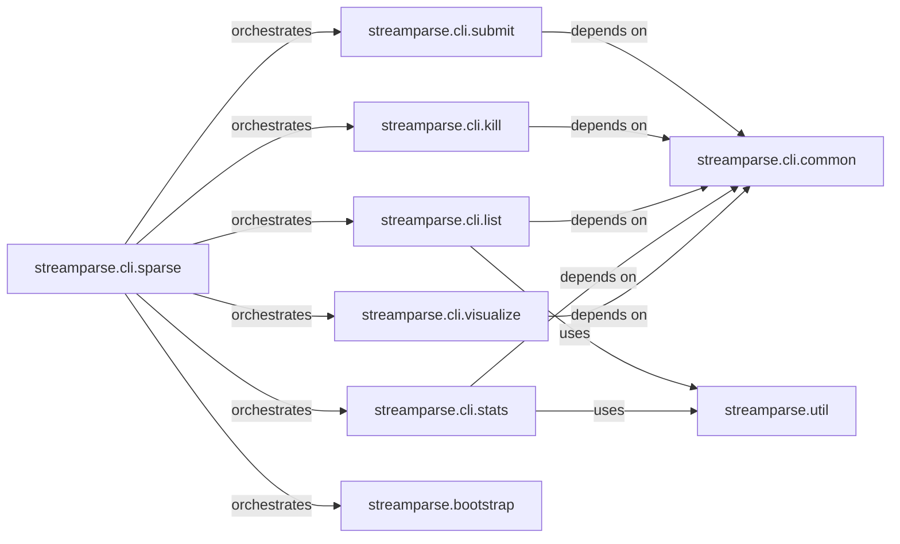

## Details

The `CLI Management Interface` subsystem serves as the primary user-facing component of `streamparse`, responsible for parsing command-line inputs and orchestrating various operations related to managing topologies on an Apache Storm cluster. It acts as the central control point for users to interact with the `streamparse` framework.

### streamparse.cli.sparse
The core command-line interface component, responsible for parsing top-level commands and dispatching control to specific subcommand handlers. It acts as the central orchestrator for all `streamparse` CLI operations.

**Related Classes/Methods**:

- <a href="https://github.com/pystorm/streamparse/blob/main/streamparse/cli/sparse.py" target="_blank" rel="noopener noreferrer">`streamparse.cli.sparse`</a>

### streamparse.cli.submit
Manages the complete lifecycle of submitting a `streamparse` topology to an Apache Storm cluster, including pre-submission validation, JAR packaging and upload, and post-submission actions.

**Related Classes/Methods**:

- <a href="https://github.com/pystorm/streamparse/blob/main/streamparse/cli/submit.py" target="_blank" rel="noopener noreferrer">`streamparse.cli.submit`</a>

### streamparse.cli.kill
Handles the graceful termination of a running `streamparse` topology on the Storm cluster, ensuring proper shutdown procedures.

**Related Classes/Methods**:

- <a href="https://github.com/pystorm/streamparse/blob/main/streamparse/cli/kill.py" target="_blank" rel="noopener noreferrer">`streamparse.cli.kill`</a>

### streamparse.cli.list
Retrieves and displays a summary of all active `streamparse` topologies currently deployed on the Storm cluster, providing an overview of running jobs.

**Related Classes/Methods**:

- <a href="https://github.com/pystorm/streamparse/blob/main/streamparse/cli/list.py" target="_blank" rel="noopener noreferrer">`streamparse.cli.list`</a>

### streamparse.cli.stats
Fetches and presents detailed runtime statistics for deployed topologies, including cluster-wide, topology-specific, and component-level metrics (spouts and bolts), crucial for monitoring.

**Related Classes/Methods**:

- <a href="https://github.com/pystorm/streamparse/blob/main/streamparse/cli/stats.py" target="_blank" rel="noopener noreferrer">`streamparse.cli.stats`</a>

### streamparse.cli.visualize
Generates visual representations (e.g., Graphviz diagrams) of `streamparse` topologies, aiding developers in understanding the data flow and structure of their stream processing pipelines.

**Related Classes/Methods**:

- <a href="https://github.com/pystorm/streamparse/blob/main/streamparse/cli/visualize.py" target="_blank" rel="noopener noreferrer">`streamparse.cli.visualize`</a>

### streamparse.bootstrap
Facilitates the quick creation of new `streamparse` projects by generating the necessary directory structure and boilerplate files, streamlining the initial setup process for users.

**Related Classes/Methods**:

- <a href="https://github.com/pystorm/streamparse/blob/main/streamparse/bootstrap" target="_blank" rel="noopener noreferrer">`streamparse.bootstrap`</a>

### streamparse.cli.common
Provides shared argument parsing and utility functions for various CLI commands.

**Related Classes/Methods**:

- <a href="https://github.com/pystorm/streamparse/blob/main/streamparse/cli/common.py" target="_blank" rel="noopener noreferrer">`streamparse.cli.common`</a>

### streamparse.util
Provides general utility functions used across the `streamparse` project.

**Related Classes/Methods**:

- <a href="https://github.com/pystorm/streamparse/blob/main/streamparse/util.py" target="_blank" rel="noopener noreferrer">`streamparse.util`</a>

### [FAQ](https://github.com/CodeBoarding/GeneratedOnBoardings/tree/main?tab=readme-ov-file#faq)