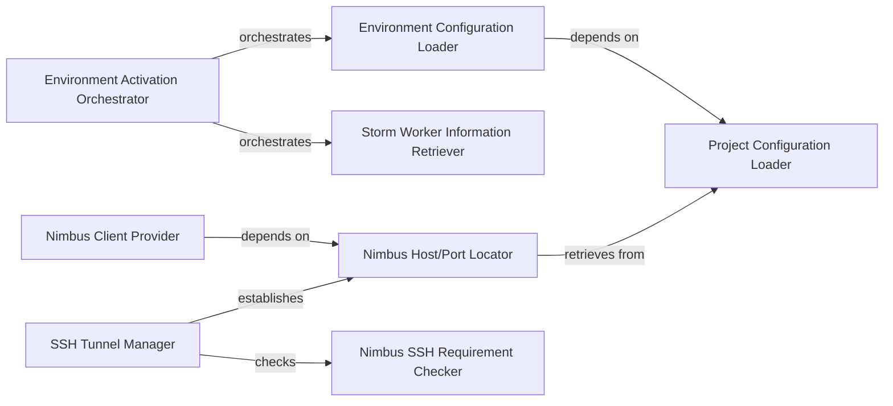

## Details

The `streamparse` utility subsystem is designed to facilitate seamless interaction with Apache Storm clusters. Its core functionality revolves around a set of specialized components responsible for environment setup, Nimbus service discovery, and secure communication. The `Environment Activation Orchestrator` serves as the central entry point for preparing the application's operational context, relying on the `Environment Configuration Loader` to retrieve deployment-specific settings and the `Storm Worker Information Retriever` to gather cluster worker details. For connecting to the Storm Nimbus service, the `Nimbus Client Provider` leverages the `Nimbus Host/Port Locator` to identify the correct service endpoint. In scenarios requiring secure access, the `SSH Tunnel Manager` dynamically establishes SSH tunnels, guided by the `Nimbus SSH Requirement Checker` and also utilizing the `Nimbus Host/Port Locator` for target information. All configuration-related components ultimately depend on the `Project Configuration Loader` to access the foundational `config.json` settings, ensuring a unified and flexible configuration management approach.

### Nimbus Host/Port Locator
Identifies the network address (host and port) of the Storm Nimbus service, which is the central entry point for cluster management.

**Related Classes/Methods**:

- <a href="https://github.com/pystorm/streamparse/blob/main/streamparse/util.py#L255-L275" target="_blank" rel="noopener noreferrer">`streamparse.util.get_nimbus_host_port`:255-275</a>

### Nimbus Client Provider
Creates and provides a Thrift RPC client object for programmatic interaction with the Storm Nimbus service, enabling remote calls for cluster operations.

**Related Classes/Methods**:

- <a href="https://github.com/pystorm/streamparse/blob/main/streamparse/util.py#L278-L305" target="_blank" rel="noopener noreferrer">`streamparse.util.get_nimbus_client`:278-305</a>

### SSH Tunnel Manager
Establishes and manages secure SSH tunnels to the Storm cluster, ensuring secure communication, especially when `use_ssh_for_nimbus` is enabled.

**Related Classes/Methods**:

- <a href="https://github.com/pystorm/streamparse/blob/main/streamparse/util.py#L50-L110" target="_blank" rel="noopener noreferrer">`streamparse.util.ssh_tunnel`:50-110</a>

### Project Configuration Loader
Parses and loads the main `config.json` file for the `streamparse` project, providing access to global project settings.

**Related Classes/Methods**:

- <a href="https://github.com/pystorm/streamparse/blob/main/streamparse/util.py#L159-L185" target="_blank" rel="noopener noreferrer">`streamparse.util.get_config`:159-185</a>

### Storm Worker Information Retriever
Gathers and provides information about the active worker nodes within the Storm cluster, essential for understanding resource allocation and health.

**Related Classes/Methods**:

- <a href="https://github.com/pystorm/streamparse/blob/main/streamparse/util.py#L311-L334" target="_blank" rel="noopener noreferrer">`streamparse.util.get_storm_workers`:311-334</a>

### Environment Activation Orchestrator
Orchestrates the retrieval of necessary Storm cluster configurations and worker details to prepare the `streamparse` environment for operations, acting as a setup coordinator.

**Related Classes/Methods**:

- <a href="https://github.com/pystorm/streamparse/blob/main/streamparse/util.py#L113-L144" target="_blank" rel="noopener noreferrer">`streamparse.util.activate_env`:113-144</a>

### Environment Configuration Loader
Fetches environment-specific configurations from the loaded project configuration, allowing for flexible deployment across different setups.

**Related Classes/Methods**:

- <a href="https://github.com/pystorm/streamparse/blob/main/streamparse/util.py#L227-L252" target="_blank" rel="noopener noreferrer">`streamparse.util.get_env_config`:227-252</a>

### Nimbus SSH Requirement Checker
Determines if an SSH connection is required for communicating with the Nimbus service based on environment configuration, guiding the connection strategy.

**Related Classes/Methods**:

- <a href="https://github.com/pystorm/streamparse/blob/main/streamparse/util.py#L358-L360" target="_blank" rel="noopener noreferrer">`streamparse.util.is_ssh_for_nimbus`:358-360</a>

### [FAQ](https://github.com/CodeBoarding/GeneratedOnBoardings/tree/main?tab=readme-ov-file#faq)